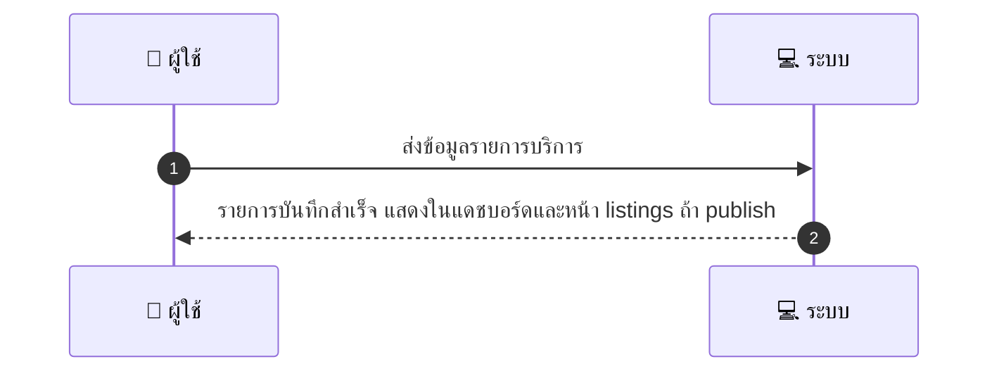
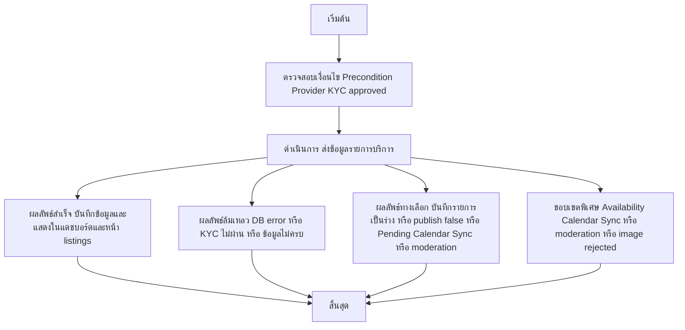

# MCC002 - Create Service Listing

## 👤 บทบาท
- ผู้ให้บริการ

## 🎯 เป้าหมายของเคส
- ในฐานะ ผู้ให้บริการ
- ต้องการ สร้างรายการบริการ title price duration buffer images tags
- เพื่อ เพื่อให้ลูกค้าจองบริการ

## ⚙️ เงื่อนไขก่อนเริ่ม (Precondition)
- Provider KYC approved

## 🧭 ผลลัพธ์และสถานการณ์
- ✅ ผลลัพธ์ที่คาดหวัง (Success Flow): ระบบบันทึกรายการและแสดงบน provider dashboard และหน้า listings ถ้า publish
- ❌ ผลลัพธ์ที่ Failure:
  - ระบบล้มเหลวในการบันทึกรายการบริการลงฐานข้อมูล DB error ระหว่างขั้นตอนบันทึกข้อมูล
  - KYC ของผู้ให้บริการยังไม่ผ่านหรือหมดอายุ ทำให้ไม่สามารถสร้างรายการได้
  - ข้อมูลรายการไม่ครบถ้วนหรือมีค่าผิดรูปแบบ เช่น title description price duration buffer
  - อัปโหลดรูปภาพล้มเหลว เนื่องจากจำนวนไฟล์เกินประเภทไฟล์ไม่รองรับขนาดไฟล์เกิน
  - ปัญหาการเผยแพร่ Publish flag ไม่ถูกต้อง ทำให้รายการไม่สามารถเผยแพร่ได้ชั่วคราว
- 🔄 ผลลัพธ์ทางเลือก:
  - บันทึกรายการเป็นร่าง Draft แสดงในแดชบอร์ดผู้ให้บริการ
  - บันทึกเสร็จแต่ยังไม่เผยแพร่ เนื่องจาก Publish flag = false
  - Availability ถูกบันทึกแต่ยังรอการซิงค์กับปฏิทินภายนอก Pending Calendar Sync
  - บางไฟล์รูปภาพถูกปฏิเสธ ต้องอัปโหลดใหม่ก่อนเผยแพร่
  - รายการผ่านการตรวจสอบข้อมูลแล้ว แต่ยังต้องรออนุมัติจากระบบ moderation
- ⚠️ ผลลัพธ์ขอบเขตพิเศษ:
  - บันทึกรายการเป็นร่าง Draft แสดงในแดชบอร์ดผู้ให้บริการ
  - บันทึกเสร็จแต่ยังไม่เผยแพร่ เนื่องจาก Publish flag false
  - Availability ถูกบันทึกแต่ยังรอการซิงค์กับปฏิทินภายนอก Pending Calendar Sync
  - บางไฟล์รูปภาพถูกปฏิเสธ ต้องอัปโหลดใหม่ก่อนเผยแพร่
  - รายการผ่านการตรวจสอบข้อมูลแล้ว แต่ยังต้องรออนุมัติจากระบบ moderation

## ✅ เกณฑ์การยอมรับ (Acceptance Criteria)
- Required fields title description priceTHB durationmin buffer_before_after
- Availability linked to calendar
- Can mark voucher-eligible
- Publish flag

## ⏱ ลำดับความสำคัญ / SLA
- Priority: P0
- SLA: N/A

---

## 🔁 Sequence Diagram  
> แสดงลำดับเหตุการณ์ระหว่าง ผู้ใช้ กับ ระบบ

---

## 🧭 Flowchart Diagram
> แสดงขั้นตอนการทำงานของระบบอย่างเข้าใจง่าย

