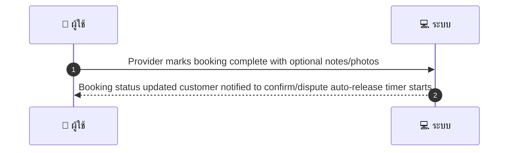
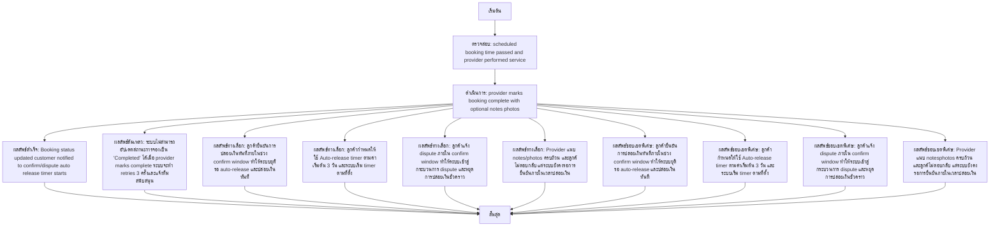

# MCC003 - Provider Marks Service Complete

## 👤 บทบาท
- ผู้ให้บริการ

## 🎯 เป้าหมายของเคส
- ในฐานะ: ผู้ให้บริการ
- ต้องการ: บันทึกว่างานเสร็จแล้วเพื่อเริ่มกระบวนการปล่อยเงิน
- เพื่อ: เพื่อให้ลูกค้ายืนยันหรือเริ่ม auto release timer

## ⚙️ เงื่อนไขก่อนเริ่ม (Precondition)
- Scheduled booking time passed and provider performed service

## 🧭 ผลลัพธ์และสถานการณ์
- ✅ ผลลัพธ์ที่คาดหวัง (Success Flow): Booking status updated customer notified to confirm/dispute auto-release timer starts
- ❌ ผลลัพธ์ที่ Failure:
  - ระบบไม่สามารถอัปเดตสถานะการจองเป็น 'Completed' ได้เมื่อ provider marks complete ระบบจะทำ retries 3 ครั้งและแจ้งทีมสนับสนุน
  - การส่งการแจ้งเตือนไปยังลูกค้า (Push/SMS/Email) ล้มเหลวทั้งหมด หรือไม่สำเร็จภายในระยะเวลาที่กำหนด
  - หมายเหตุ/ภาพที่แนบไม่ถูกต้องหรือไฟล์เสียหาย ทำให้บันทึกข้อมูลไม่สำเร็จ
  - auto-release timer ไม่เริ่มต้น due to invalid booking time data หรือข้อผิดพลาดระบบ
- 🔄 ผลลัพธ์ทางเลือก:
  - ลูกค้ายืนยันการปล่อยเงินทันทีภายในช่วง confirm window ทำให้ระบบยุติรอ auto-release และปล่อยเงินทันที
  - ลูกค้ากำหนดให้ใช้ Auto-release timer ตามค่าเริ่มต้น 3 วัน และระบบเริ่ม timer ตามที่ตั้ง
  - ลูกค้าแจ้ง dispute ภายใน confirm window ทำให้ระบบเข้าสู่กระบวนการ dispute และหยุดการปล่อยเงินชั่วคราว
  - Provider แนบ notes/photos ครบถ้วน และลูกค้ไม่ตอบกลับ แต่ระบบยังคงรอการยืนยันภายในเวลาปล่อยเงิน
- ⚠️ ผลลัพธ์ขอบเขตพิเศษ:
  - ลูกค้ายืนยันการปล่อยเงินทันทีภายในช่วง confirm window ทำให้ระบบยุติรอ auto-release และปล่อยเงินทันที
  - ลูกค้ากำหนดให้ใช้ Auto-release timer ตามค่าเริ่มต้น 3 วัน และระบบเริ่ม timer ตามที่ตั้ง
  - ลูกค้าแจ้ง dispute ภายใน confirm window ทำให้ระบบเข้าสู่กระบวนการ dispute และหยุดการปล่อยเงินชั่วคราว
  - Provider แนบ notes/photos ครบถ้วน และลูกค้ไม่ตอบกลับ แต่ระบบยังคงรอการยืนยันภายในเวลาปล่อยเงิน

## ✅ เกณฑ์การยอมรับ (Acceptance Criteria)
- Provider action timestamped
- notification sent
- auto-confirm window default 3 days

## ⏱ ลำดับความสำคัญ / SLA
- Priority: P0
- SLA: Customer confirm window 3 days

---

## 🔁 Sequence Diagram  
> แสดงลำดับเหตุการณ์ระหว่าง "ผู้ใช้" กับ "ระบบ"

---

## 🧭 Flowchart Diagram
> แสดงขั้นตอนการทำงานของระบบอย่างเข้าใจง่าย

