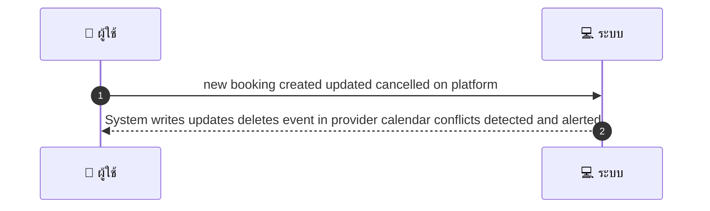
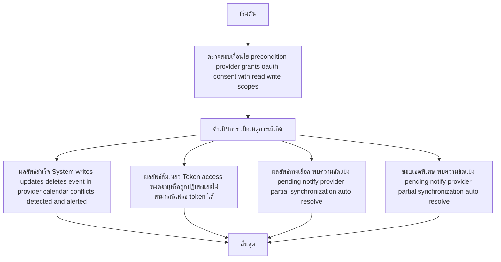

# MCC006 - Google Calendar Sync Provider

## 👤 บทบาท
- ผู้ให้บริการ

## 🎯 เป้าหมายของเคส
- ในฐานะ ผู้ให้บริการ
- ต้องการ เชื่อม Google Calendar OAuth เพื่อ sync booking แบบ 2-way
- เพื่อ เพื่อลด double-booking และเพิ่มสะดวก

## ⚙️ เงื่อนไขก่อนเริ่ม (Precondition)
- Provider grants OAuth consent with read write scopes

## 🧭 ผลลัพธ์และสถานการณ์
- ✅ ผลลัพธ์ที่คาดหวัง (Success Flow): System writes updates deletes event in provider calendar conflicts detected and alerted
- ❌ ผลลัพธ์ที่ Failure:
  - Token access หมดอายุหรือถูกปฏิเสธและไม่สามารถรีเฟรช token ได้
  - Google Calendar API คืนข้อผิดพลาด 4xx/5xx ระหว่างการสร้าง/อัปเดต/ลบเหตุการณ์
  - การบันทึกข้อมูลเหตุการณ์ลงฐานข้อมูลแพลตฟอร์มล้มเหลว
  - หลังการ retries 3 ครั้งยังไม่สำเร็จและต้องแจ้งผู้ดูแล
  - ข้อผิดพลาดในการเขียนล็อก/บันทึกเหตุผลล้มเหลวเพื่อการวิเคราะห์
- 🔄 ผลลัพธ์ทางเลือก:
  - พบความขัดแย้งของเวลาจองระหว่างแพลตฟอร์มกับ Google Calendar ระบบจะประกาศสถานะ Pending และแจ้ง provider ตามนโยบาย
  - Partial synchronization เหตุการณ์ถูกสร้าง/อัปเดตบางส่วนใน Google Calendar แต่ข้อมูลบางฟิลด์ เช่น attendees, reminders ไม่ถูกซิงค์
  - ระบบเปิดโหมด auto-resolve ตามนโยบายองค์กร โดยเลือกข้อมูลจากแพลตฟอร์มเมื่อเกิด conflict
  - ผู้ดูแลสามารถเลือกยืนยันการแก้ไขผ่าน UI หรือให้แพลตฟอร์มเป็นแหล่งข้อมูลหลักในการซิงค์
- ⚠️ ผลลัพธ์ขอบเขตพิเศษ:
  - พบความขัดแย้งของเวลาจองระหว่างแพลตฟอร์มกับ Google Calendar ระบบจะประกาศสถานะ Pending และแจ้ง provider ตามนโยบาย
  - Partial synchronization เหตุการณ์ถูกสร้าง/อัปเดตบางส่วนใน Google Calendar แต่ข้อมูลบางฟิลด์ เช่น attendees, reminders ไม่ถูกซิงค์
  - ระบบเปิดโหมด auto-resolve ตามนโยบายองค์กร โดยเลือกข้อมูลจากแพลตฟอร์มเมื่อเกิด conflict
  - ผู้ดูแลสามารถเลือกยืนยันการแก้ไขผ่าน UI หรือให้แพลตฟอร์มเป็นแหล่งข้อมูลหลักในการซิงค์

## ✅ เกณฑ์การยอมรับ (Acceptance Criteria)
- Store refresh tokens encrypted
- on conflict mark booking pending and notify provider
- retry policy 3 attempts with backoff
- logs for failures

## ⏱ ลำดับความสำคัญ / SLA
- Priority: P0
- SLA:
  - Immediate write attempt
  - retries up to 3

---

## 🔁 Sequence Diagram  
> แสดงลำดับเหตุการณ์ระหว่าง "ผู้ใช้" กับ "ระบบ"

---

## 🧭 Flowchart Diagram
> แสดงขั้นตอนการทำงานของระบบอย่างเข้าใจง่าย

