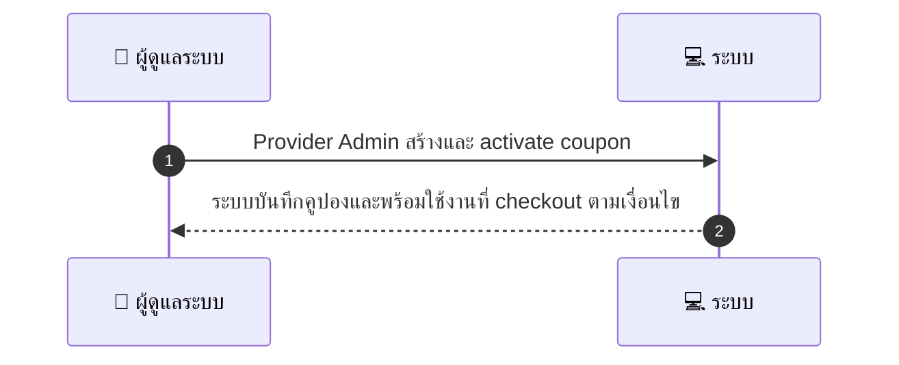
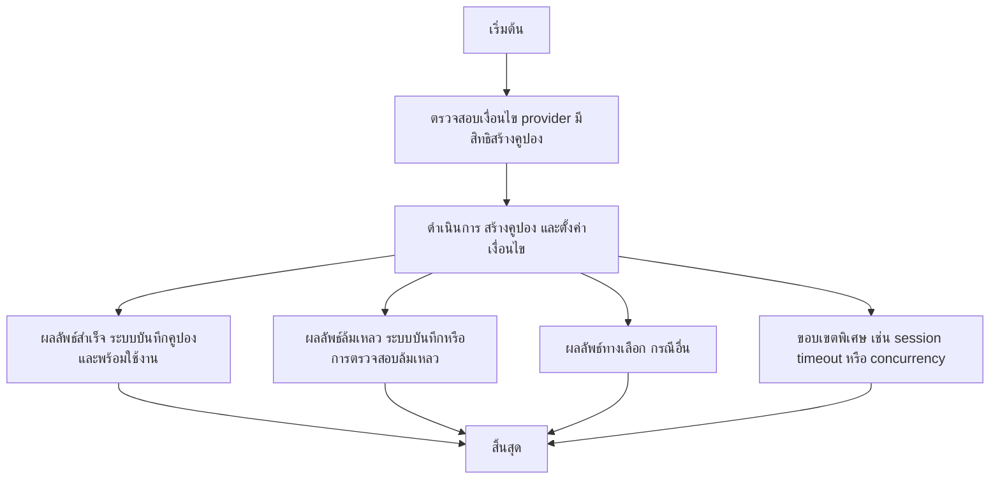

# MCC008 - Create Coupon / Voucher

## 👤 บทบาท
- ผู้ดูแลระบบ

## 🎯 เป้าหมายของเคส
- ในฐานะ ผู้ให้บริการ
- ต้องการ สร้างคูปองประเภทต่างๆ percentage fixed BOGO และตั้งเงื่อนไขการใช้
- เพื่อ เพื่อโปรโมตบริการและขาย voucher

## ⚙️ เงื่อนไขก่อนเริ่ม (Precondition)
- Provider มีสิทธิสร้างคูปอง

## 🧭 ผลลัพธ์และสถานการณ์
- ✅ ผลลัพธ์ที่คาดหวัง (Success Flow): ระบบบันทึก coupon และสามารถใช้ได้ที่ checkout ตามเงื่อนไข
- ❌ ผลลัพธ์ที่ Failure:  
  - ระบบไม่สามารถบันทึกคูปองลงฐานข้อมูลระหว่างขั้นตอนสร้าง
  - Validation error ช่วง validity window ไม่ถูกต้อง start_date end_date เกินระยะเวลาที่กำหนด หรือ end_date น้อยกว่า start_date
  - Validation error min_spend ไม่ถูกต้อง เช่น เป็นลบหรือไม่ใช่ตัวเลข
  - Validation error รายการบริการproviders ที่ระบุไม่มีสิทธิ์หรือไม่ตรงกับสิทธิ์ของผู้ดูแล
  - ข้อผิดพลาดในการคำนวณมูลค่าคูปองหรือการบันทึกเงื่อนไข tipo BOGO
  - Concurrency conflict การ redeem คูปองพร้อมกันเกินขอบเขตการใช้งานที่อนุญาต
- 🔄 ผลลัพธ์ทางเลือก:  
  - คูปองถูกบันทึกในสถานะ Draft/Inactive ให้ Admin ตรวจสอบก่อน activate
  - คูปองถูกสร้างได้แต่เปิดใช้งานเฉพาะบาง Provider/Service ในช่วงโปรโมชั่น
  - คูปองสามารถใช้งานได้ใน checkout แต่ผู้ใช้ต้องกรอกสแกนรหัสคูปอง
  - คูปองถูกสร้างและตั้งเวลาสำหรับการใช้งานจำกัด time bound โดยผู้ดูแลอนุมัติเปิดใช้งานทีละช่วง
  - สร้างสำเร็จด้วย template predefined ที่มีเงื่อนไขพื้นฐานพร้อมใช้งาน
- ⚠️ ผลลัพธ์ขอบเขตพิเศษ:  
  - คูปองถูกบันทึกในสถานะ Draft/Inactive ให้ Admin ตรวจสอบก่อน activate
  - คูปองถูกสร้างได้แต่เปิดใช้งานเฉพาะบาง Provider/Service ในช่วงโปรโมชั่น
  - คูปองสามารถใช้งานได้ใน checkout แต่ผู้ใช้ต้องกรอกสแกนรหัสคูปอง
  - คูปองถูกสร้างและตั้งเวลาสำหรับการใช้งานจำกัด time bound โดยผู้ดูแลอนุมัติเปิดใช้งานทีละช่วง
  - สร้างสำเร็จด้วย template predefined ที่มีเงื่อนไขพื้นฐานพร้อมใช้งาน
- ✅ เกณฑ์การยอมรับ (Acceptance Criteria)
  - Validations: validity window
  - min_spend
  - applicable_services/providers
  - usage_limit per user/global
  - lifecycle states visible
  - concurrency-safe redemption prevention
- ⏱ ลำดับความสำคัญ / SLA
- Priority: P0
- SLA: N/A

---

## 🔁 Sequence Diagram  
> แสดงลำดับเหตุการณ์ระหว่าง "ผู้ดูแลระบบ" กับ "ระบบ"

---

## 🧭 Flowchart Diagram
> แสดงขั้นตอนการทำงานของระบบอย่างเข้าใจง่าย

