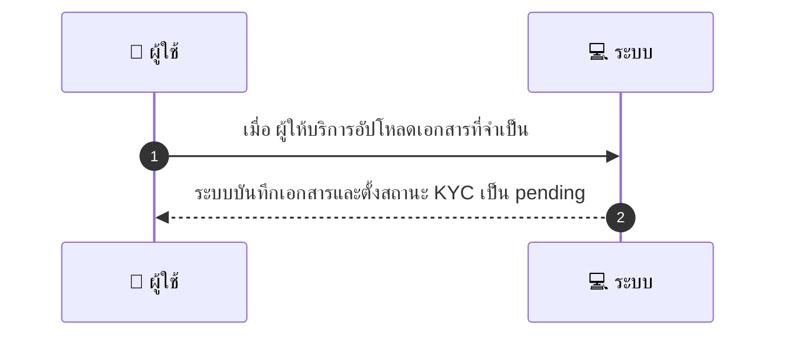
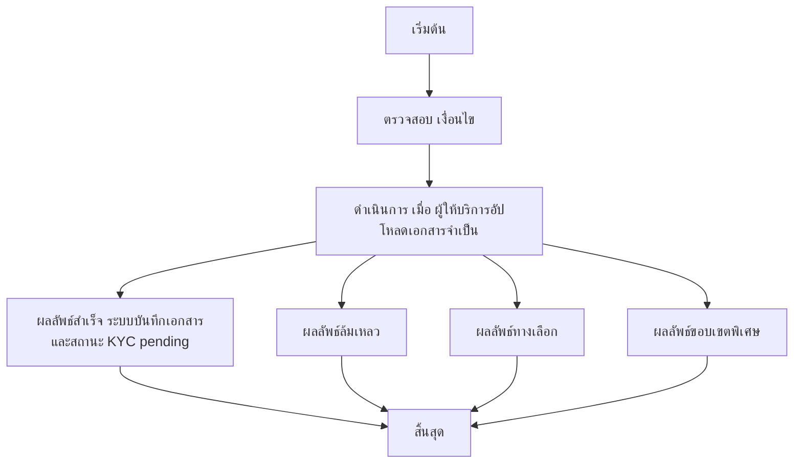

# MCC010 - อัปโหลดเอกสาร KYC สำหรับนิติบุคคล

## 👤 บทบาท
- ผู้ให้บริการ

## 🎯 เป้าหมายของเคส
- ในฐานะ
- ต้องการ
- เพื่อ

## ⚙️ เงื่อนไขก่อนเริ่ม (Precondition)
- ผู้ให้บริการเลือกประเภทเป็นนิติบุคคล

## 🧭 ผลลัพธ์และสถานการณ์
- ✅ ผลลัพธ์ที่คาดหวัง (Success Flow): ระบบบันทึกเอกสารและตั้งสถานะ KYC เป็น pending
- ❌ ผลลัพธ์ที่ Failure:  
  - ไฟล์แนบไม่รองรับประเภทหรือมีนามสกุลที่ไม่ถูกต้อง PDF/JPG/PNG
  - ขนาดไฟล์เกิน 10MB
  - การอัปโหลดล้มเหลว เนื่องจากเครือข่ายหรือบริการภายในล้มเหลว
- 🔄 ผลลัพธ์ทางเลือก:  
  - เอกสารถูกบันทึกสำเร็จและสถานะ KYC ถูกตั้งเป็น pending admin review รอการตรวจสอบจาก Admin
  - ระบบส่งการแจ้งเตือนไปยัง Admin เพื่อให้ตรวจสอบเอกสารเพิ่มเติม
  - ผู้ใช้ได้รับแจ้งว่าเอกสารครบถ้วนแต่ต้องยืนยันตัวตนเพิ่มเติมหรืออัปโหลดเอกสารสำเนาเพิ่มเติม
- ⚠️ ผลลัพธ์ขอบเขตพิเศษ:  
  - เอกสารถูกบันทึกสำเร็จและสถานะ KYC ถูกตั้งเป็น pending admin review รอการตรวจสอบจาก Admin
  - ระบบส่งการแจ้งเตือนไปยัง Admin เพื่อให้ตรวจสอบเอกสารเพิ่มเติม
  - ผู้ใช้ได้รับแจ้งว่าเอกสารครบถ้วนแต่ต้องยืนยันตัวตนเพิ่มเติมหรืออัปโหลดเอกสารสำเนาเพิ่มเติม

## ✅ เกณฑ์การยอมรับ (Acceptance Criteria)
- รองรับ pdf/jpg/png =10MB
- notify admin
- KYC status แสดง

## ⏱ ลำดับความสำคัญ / SLA
- Priority: P0
- SLA: Admin review =48h

---

## 🔁 Sequence Diagram  
> แสดงลำดับเหตุการณ์ระหว่าง "ผู้ใช้" กับ "ระบบ"

---

## 🧭 Flowchart Diagram
> แสดงขั้นตอนการทำงานของระบบอย่างเข้าใจง่าย

