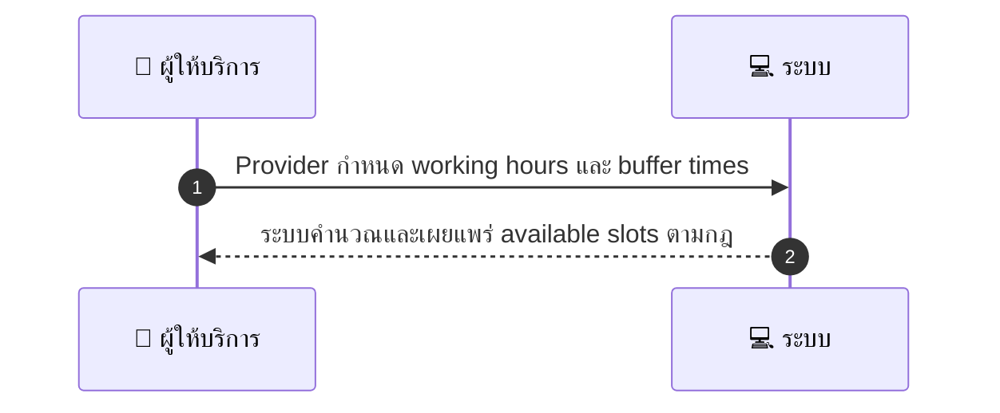
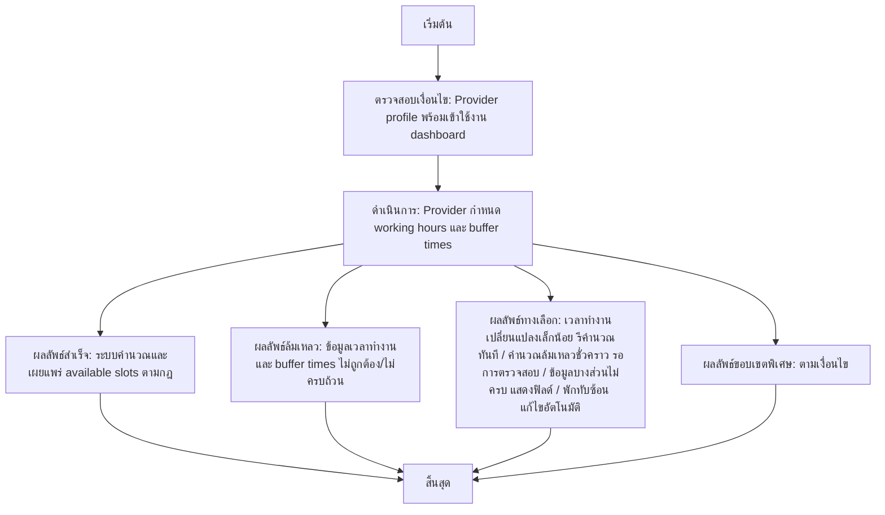

# MCC013 - กำหนดตารางเวลาทำงาน Weekly Schedule

## 👤 บทบาท
- ผู้ให้บริการ

## 🎯 เป้าหมายของเคส
- ในฐานะ ผู้ให้บริการ
- ต้องการ ตั้งเวลาทำงานประจำสัปดาห์และช่วงเวลาพัก
- เพื่อให้ระบบแสดง slot ที่ถูกต้อง

## ⚙️ เงื่อนไขก่อนเริ่ม (Precondition)
- Provider profile พร้อมเข้าใช้งาน dashboard

## 🧭 ผลลัพธ์และสถานการณ์
- ✅ ผลลัพธ์ที่คาดหวัง (Success Flow): ระบบคำนวณและเผยแพร่ available slots ตามกฎ  
- ❌ ผลลัพธ์ที่ Failure:  
  - ข้อมูลเวลาทำงานและ buffer times ไม่ถูกต้อง/ไม่ครบถ้วน
  - ไม่พบโปรไฟล์ผู้ให้บริการในระบบขณะบันทึก
  - ข้อผิดพลาดฐานข้อมูลระหว่างการบันทึกตารางเวลา
  - การคำนวณ available slots ล้มเหลวเนื่องจากเงื่อนไขขัดแย้ง
  - ไม่สามารถเผยแพร่ available slots ที่คำนวณได้
- 🔄 ผลลัพธ์ทางเลือก:  
  - เมื่อเวลาทำงานเปลี่ยนแปลงเล็กน้อย ระบบรีคำนวณใหม่และเผยแพร่ทันที
  - กรณีคำนวณล้มเหลวชั่วคราว ระบบเปหลสถานะเป็นรอการตรวจสอบและแจ้งเตือนผู้ให้บริการ
  - หากข้อมูลบางส่วนไม่ครบ ระบบแสดงฟิลด์ที่ต้องกรอกและรอการยืนยัน
  - หากมีช่วงเวลาพักทับซ้อน ระบบเลือกแนวทางแก้ไขอัตโนมัติโดยไม่กระทบการจองที่มีอยู่
- ⚠️ ผลลัพธ์ขอบเขตพิเศษ:  
  - เมื่อเวลาทำงานเปลี่ยนแปลงเล็กน้อย ระบบรีคำนวณใหม่และเผยแพร่ทันที
  - กรณีคำนวณล้มเหลวชั่วคราว ระบบเปหลสถานะเป็นรอการตรวจสอบและแจ้งเตือนผู้ให้บริการ
  - หากข้อมูลบางส่วนไม่ครบ ระบบแสดงฟิลด์ที่ต้องกรอกและรอการยืนยัน
  - หากมีช่วงเวลาพักทับซ้อน ระบบเลือกแนวทางแก้ไขอัตโนมัติโดยไม่กระทบการจองที่มีอยู่

## ✅ เกณฑ์การยอมรับ (Acceptance Criteria)
- Availability recalculated
- buffer times applied
- future slots updated

## ⏱ ลำดับความสำคัญ / SLA
- Priority: P0
- SLA: Availability update immediate

---

## 🔁 Sequence Diagram  
> แสดงลำดับเหตุการณ์ระหว่าง "ผู้ให้บริการ" กับ "ระบบ"

---

## 🧭 Flowchart Diagram
> แสดงขั้นตอนการทำงานของระบบอย่างเข้าใจง่าย

