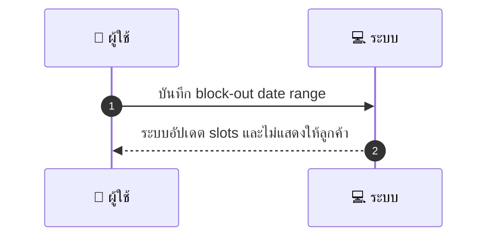
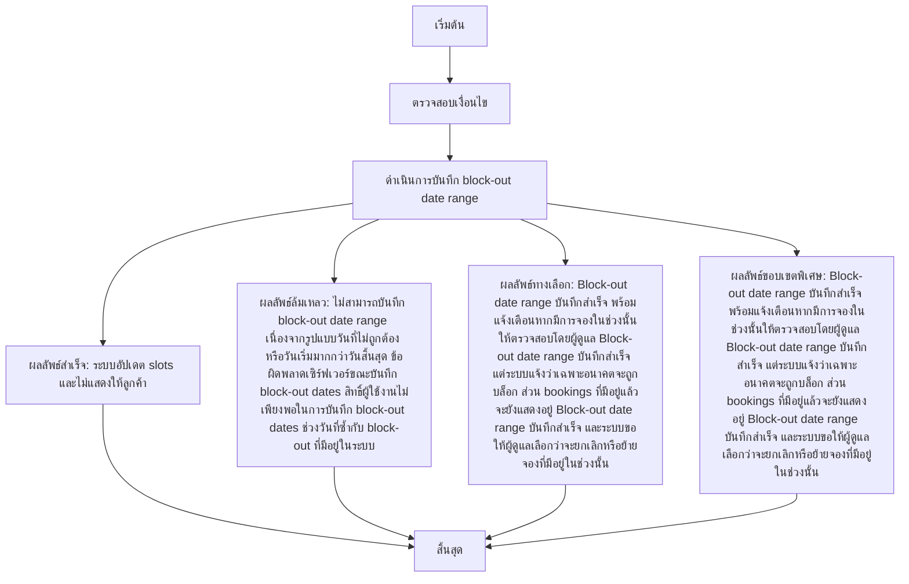

# MCC014 - บล็อกวันหยุด/วันไม่รับงาน Block-out Dates

## 👤 บทบาท
- ผู้ให้บริการ

## 🎯 เป้าหมายของเคส
- ในฐานะ: ผู้ให้บริการ
- ต้องการ: เพิ่มวันหยุดพิเศษหรือช่วงไม่รับงาน
- เพื่อ: เพื่อไม่ให้ลูกค้าจองในช่วงนั้น

## ⚙️ เงื่อนไขก่อนเริ่ม (Precondition)
- Provider ตั้งค่าวันหยุดใน dashboard

## 🧭 ผลลัพธ์และสถานการณ์
- ✅ ผลลัพธ์ที่คาดหวัง (Success Flow): ระบบอัปเดต slots และไม่แสดงให้ลูกค้า  
- ❌ ผลลัพธ์ที่ Failure:  
  - ไม่สามารถบันทึก block-out date range เนื่องจากรูปแบบวันที่ไม่ถูกต้อง หรือวันเริ่มมากกว่าวันสิ้นสุด
  - ข้อผิดพลาดเซิร์ฟเวอร์ขณะบันทึก block-out dates
  - สิทธิ์ผู้ใช้งานไม่เพียงพอในการบันทึก block-out dates
  - ช่วงวันที่ซ้ำกับ block-out ที่มีอยู่ในระบบ
- 🔄 ผลลัพธ์ทางเลือก:  
  - Block-out date range บันทึกสำเร็จ พร้อมแจ้งเตือนหากมีการจองในช่วงนั้นให้ตรวจสอบโดยผู้ดูแล
  - Block-out date range บันทึกสำเร็จ แต่ระบบแจ้งว่าเฉพาะอนาคตจะถูกบล็อก ส่วน bookings ที่มีอยู่แล้วจะยังแสดงอยู่
  - Block-out date range บันทึกสำเร็จ และระบบขอให้ผู้ดูแลเลือกว่าจะยกเลิกหรือย้ายจองที่มีอยู่ในช่วงนั้น
- ⚠️ ผลลัพธ์ขอบเขตพิเศษ:  
  - Block-out date range บันทึกสำเร็จ พร้อมแจ้งเตือนหากมีการจองในช่วงนั้นให้ตรวจสอบโดยผู้ดูแล
  - Block-out date range บันทึกสำเร็จ แต่ระบบแจ้งว่าเฉพาะอนาคตจะถูกบล็อก ส่วน bookings ที่มีอยู่แล้วจะยังแสดงอยู่
  - Block-out date range บันทึกสำเร็จ และระบบขอให้ผู้ดูแลเลือกว่าจะยกเลิกหรือย้ายจองที่มีอยู่ในช่วงนั้น

## ✅ เกณฑ์การยอมรับ (Acceptance Criteria)
- Block-out dates respected
- existing confirmed bookings not auto-cancelled unless chosen

## ⏱ ลำดับความสำคัญ / SLA
- Priority: P0
- SLA: Update immediate

---

## 🔁 Sequence Diagram  
> แสดงลำดับเหตุการณ์ระหว่าง "ผู้ใช้" กับ "ระบบ"

---

## 🧭 Flowchart Diagram
> แสดงขั้นตอนการทำงานของระบบอย่างเข้าใจง่าย

