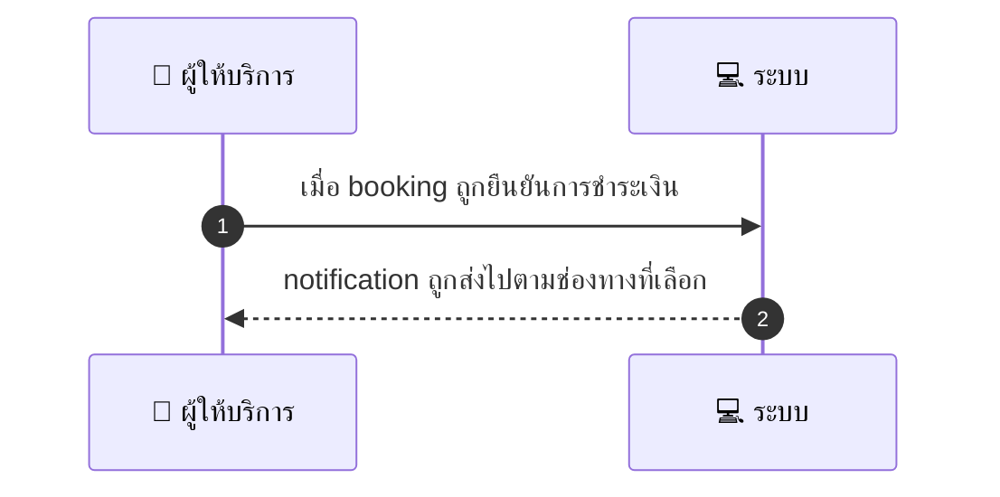
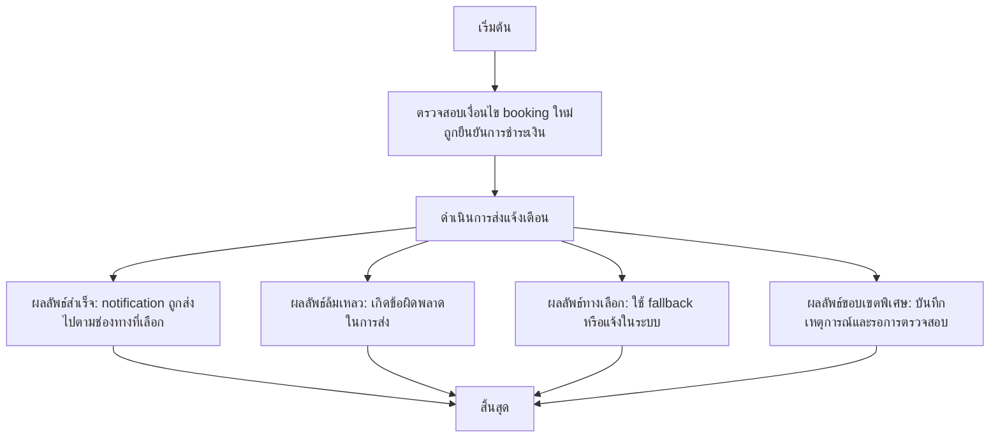

# MCC016 - รับแจ้งเตือนการจองใหม่ Booking Notification

## 👤 บทบาท
- ผู้ให้บริการ

## 🎯 เป้าหมายของเคส
- ในฐานะ ผู้ให้บริการ
- ต้องการ ได้รับ notification เมื่อมี booking ใหม่เข้ามา
- เพื่อ เพื่อให้ตอบรับหรือเตรียมงาน

## ⚙️ เงื่อนไขก่อนเริ่ม (Precondition)
- มี booking ใหม่สร้างในระบบ

## 🧭 ผลลัพธ์และสถานการณ์
- ✅ ผลลัพธ์ที่คาดหวัง (Success Flow): Provider ได้รับ push email/SMS ตาม preference
- ❌ ผลลัพธ์ที่ Failure:
  - ไม่สามารถส่งการแจ้งเตือนไปยัง provider ได้เนื่องจากระบบส่งข้อความล้มเหลว gateway/SMTP/API มีข้อผิดพลาด
  - การส่งผ่านช่องทางที่เลือกไม่สำเร็จหลังจากพยายามส่งหลายครั้งตาม retry policy
  - ข้อมูลการติดต่อของ provider ไม่ครบถ้วน เช่น ไม่มี email/หมายเลขโทรศัพท์ หรือ device token
  - สถานะ booking ไม่ใช่ confirmed by payment ทำให้ไม่เกิดการแจ้งเตือน
  - เทมเพลตแจ้งเตือนไม่สามารถเรนเดอร์ตาม locale ที่กำหนด หรือเทมเพลตมีข้อผิดพลาด
- 🔄 ผลลัพธ์ทางเลือก:
  - ส่งแจ้งเตือนผ่านช่องทางสำรองอัตโนมัติ fallback เช่น Email หรือ SMS แทน Push
  - แจ้งเตือนในระบบแดชบอร์ดผู้ให้บริการเมื่อเข้าสู่ระบบอีกครั้ง
  - ส่งสรุปแจ้งเตือนไปยังผู้ให้บริการในรูปแบบข้อความสั้นถัดไป
  - ใช้ภาษา default ของผู้ให้บริการหาก locale ไม่รองรับ
  - บันทึกเหตุการณ์และรอการตรวจสอบโดยทีมสนับสนุนเมื่อเกิดข้อผิดพลาดระบบ
- ⚠️ ผลลัพธ์ขอบเขตพิเศษ:
  - ส่งแจ้งเตือนผ่านช่องทางสำรองอัตโนมัติ fallback เช่น Email หรือ SMS แทน Push
  - แจ้งเตือนในระบบแดชบอร์ดผู้ให้บริการเมื่อเข้าสู่ระบบอีกครั้ง
  - ส่งสรุปแจ้งเตือนไปยังผู้ให้บริการในรูปแบบข้อความสั้นถัดไป
  - ใช้ภาษา default ของผู้ให้บริการหาก locale ไม่รองรับ
  - บันทึกเหตุการณ์และรอการตรวจสอบโดยทีมสนับสนุนเมื่อเกิดข้อผิดพลาดระบบ

## ✅ เกณฑ์การยอมรับ (Acceptance Criteria)
- Notification templates localized
- delivery logged
- retry policy

## ⏱ ลำดับความสำคัญ / SLA
- Priority: P0
- SLA: Notify immediate 5s enqueuing

---

## 🔁 Sequence Diagram  
> แสดงลำดับเหตุการณ์ระหว่าง "ผู้ให้บริการ" กับ "ระบบ"

---

## 🧭 Flowchart Diagram
> แสดงขั้นตอนการทำงานของระบบอย่างเข้าใจง่าย

