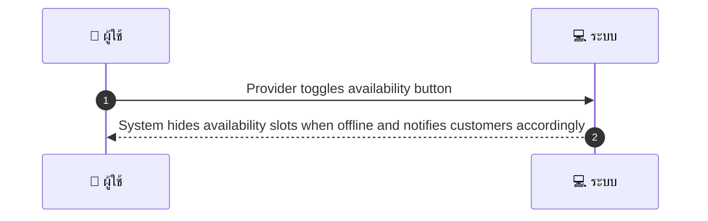
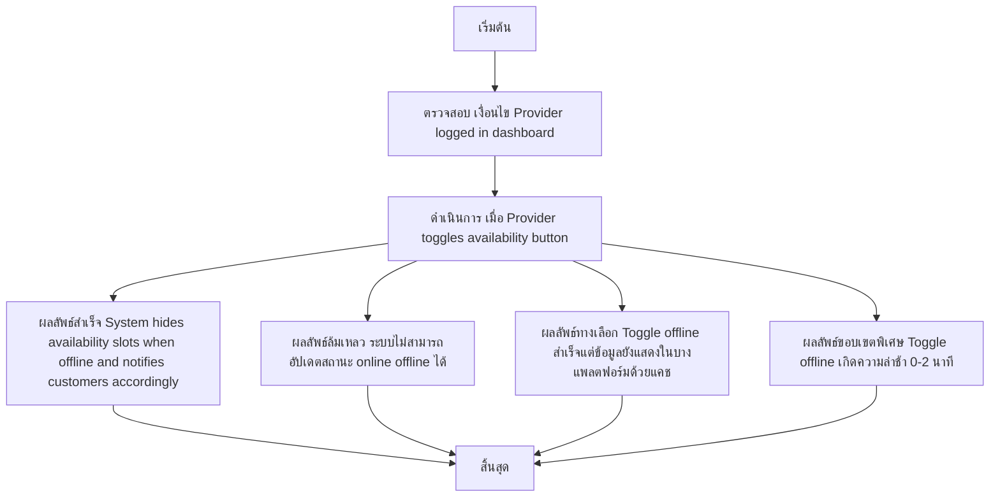

# MCC030 - ตั้งค่าความพร้อมรับงานแบบออน/ออฟไลน์ Toggle Availability

## 👤 บทบาท
- ผู้ให้บริการ

## 🎯 เป้าหมายของเคส
- ในฐานะ ผู้ให้บริการ
- ต้องการ เปลี่ยนสถานะรับงานเป็น online/offline ชั่วคราว
- เพื่อ ควบคุมการรับ booking แบบเร่งด่วน

## ⚙️ เงื่อนไขก่อนเริ่ม (Precondition)
- Provider logged in dashboard

## 🧭 ผลลัพธ์และสถานการณ์
- ✅ ผลลัพธ์ที่คาดหวัง (Success Flow): System hides availability slots when offline and notifies customers accordingly
- ❌ ผลลัพธ์ที่ Failure:
  - ระบบไม่สามารถอัปเดตสถานะ online offline ชั่วคราวได้ ขณะนี้สถานะยังคงออนไลน์
  - ข้อผิดพลาดเครือข่ายระหว่างบันทึกการเปลี่ยนแปลงทำให้การ Toggle ไม่สำเร็จ
  - ข้อผิดพลาดของเซิร์ฟเวอร์ภายในทำให้ไม่สามารถเปลี่ยนสถานะได้
  - การบันทึกการเปลี่ยนแปลงล้มเหลว ผู้ใช้งานได้รับข้อความแสดงข้อผิดพลาดและสถานะยังคงเดิม
- 🔄 ผลลัพธ์ทางเลือก:
  - Toggle offline สำเร็จแต่ระบบยังแสดง slots ที่ถูกจองไว้ในบางแพลตฟอร์มเนื่องจากแคชข้อมูล
  - ระบบส่งการแจ้งเตือนไปยังลูกค้าทางช่องทางที่กำหนดล้มเหลวหรือไม่ครบถ้วนขึ้นอยู่กับการตั้งค่า
  - มีกรณีที่การ toggle offline เกิดความล่าช้าบางส่วน (0-2 นาที) แต่จะไม่มีผลกระทบต่อการจองที่ยืนยันแล้ว
- ⚠️ ผลลัพธ์ขอบเขตพิเศษ:
  - Toggle offline สำเร็จแต่ระบบยังแสดง slots ที่ถูกจองไว้ในบางแพลตฟอร์มเนื่องจากแคชข้อมูล
  - ระบบส่งการแจ้งเตือนไปยังลูกค้าทางช่องทางที่กำหนดล้มเหลวหรือไม่ครบถ้วนขึ้นอยู่กับการตั้งค่า
  - มีกรณีที่การ toggle offline เกิดความล่าช้าบางส่วน (0-2 นาที) แต่จะไม่มีผลกระทบต่อการจองที่ยืนยันแล้ว

## ✅ เกณฑ์การยอมรับ (Acceptance Criteria)
- Toggle immediate
- existing confirmed bookings unaffected

## ⏱ ลำดับความสำคัญ / SLA
- Priority: P0
- SLA: Toggle immediate

---

## 🔁 Sequence Diagram  
> แสดงลำดับเหตุการณ์ระหว่าง "ผู้ใช้" กับ "ระบบ"

---

## 🧭 Flowchart Diagram
> แสดงขั้นตอนการทำงานของระบบอย่างเข้าใจง่าย

