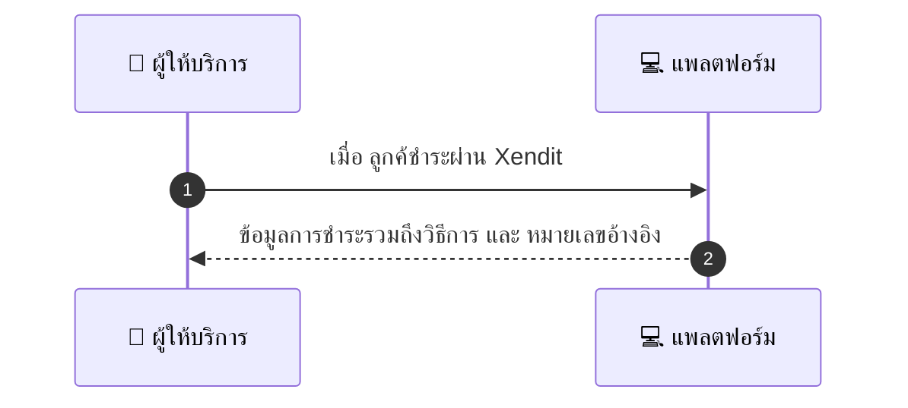
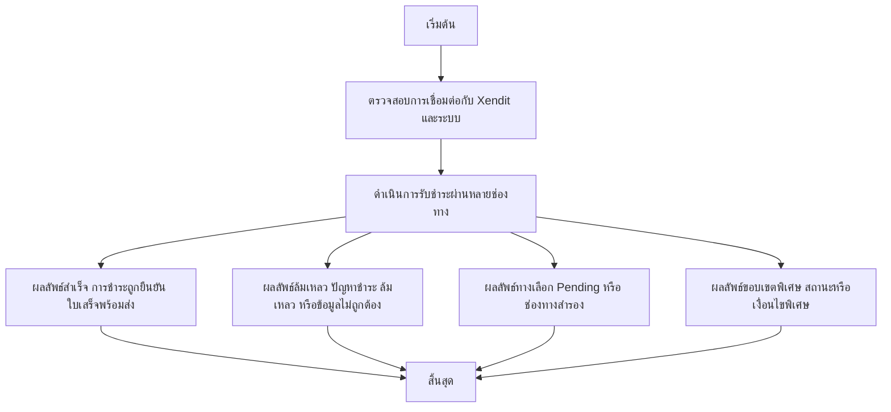

# MCC036 - รับชำระด้วยช่องทางต่าง ๆ ผ่าน Xendit Payment Options

## 👤 บทบาท
- ผู้ให้บริการ

## 🎯 เป้าหมายของเคส
- ในฐานะ ผู้ให้บริการ
- ต้องการ ยืนยันว่าร้านรับการชำระผ่านช่องทางที่ลูกค้าใช้ ewallet VA card
- เพื่อ เพิ่ม conversion และความยืดหยุ่น

## ⚙️ เงื่อนไขก่อนเริ่ม (Precondition)
- แพลตฟอร์มเชื่อมต่อกับ Xendit และผู้ให้บริการใช้การชำระผ่านแพลตฟอร์ม

## 🧭 ผลลัพธ์และสถานการณ์
- ✅ ผลลัพธ์ที่คาดหวัง (Success Flow): การแจ้งเตือนการชำระรวมถึงวิธีการและหมายเลขอ้างอิง พร้อมใบเสร็จ
- ❌ ผลลัพธ์ที่ Failure:
  - การชำระล้มเหลว บัตรถูกปฏิเสธ มีเงินไม่พอ
  - การชำระล้มเหลวจากเครือข่ายหรือปัญหาการสื่อสารระหว่างแพลตฟอร์มกับ Xendit
  - ข้อมูลชำระไม่ถูกต้อง เช่น หมายเลขอ้างอิง หมายเลขกระเป๋าเงินไม่ตรงกับรายการ
  - Webhook ไม่ส่งหรือแจ้งสถานะชำระล้มเหลว ทำให้ระบบไม่รับทราบว่าชำระเสร็จสิ้น
  - Receipt ไม่ถูกสร้างหรือส่งมอบเนื่องจากข้อผิดพลาดภายในระบบ
- 🔄 ผลลัพธ์ทางเลือก:
  - ลูกค้าชำระผ่านช่องทางอื่น เช่น จาก ewallet ไป card แล้วชำระสำเร็จ
  - ลูกค้ายืนยันการชำระใหม่ภายในออเดอร์เดียว
  - สถานะชำระถูกเปลี่ยนเป็น Pending ให้รอการยืนยันจากผู้ใช้
  - ระบบบันทึกการชำระแต่ใบเสร็จถูกจัดส่งผ่านช่องทางอื่น
- ⚠️ ผลลัพธ์ขอบเขตพิเศษ:
  - ลูกค้าชำระผ่านช่องทางอื่น เช่น จาก ewallet ไป card แล้วชำระสำเร็จ
  - ลูกค้ายืนยันการชำระใหม่ภายในออเดอร์เดียว
  - สถานะชำระถูกเปลี่ยนเป็น Pending ให้รอการยืนยันจากผู้ใช้
  - ระบบบันทึกการชำระแต่ใบเสร็จถูกจัดส่งผ่านช่องทางอื่น

## ✅ เกณฑ์การยอมรับ (Acceptance Criteria)
- ข้อมูลการชำระครบถ้วน แสดงวิธีการ อ้างอิง และใบเสร็จพร้อมใช้งาน

## ⏱ ลำดับความสำคัญ / SLA
- Priority: P0
- SLA: webhook ของการชำระภายใน 5 วินาที

---

## 🔁 Sequence Diagram  
> แสดงลำดับเหตุการณ์ระหว่าง "ผู้ให้บริการ" กับ "แพลตฟอร์ม"

---

## 🧭 Flowchart Diagram
> แสดงขั้นตอนการทำงานของระบบอย่างเข้าใจง่าย

