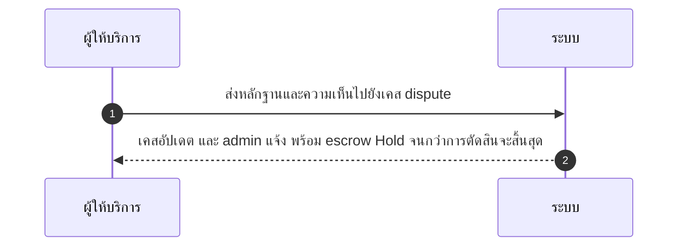
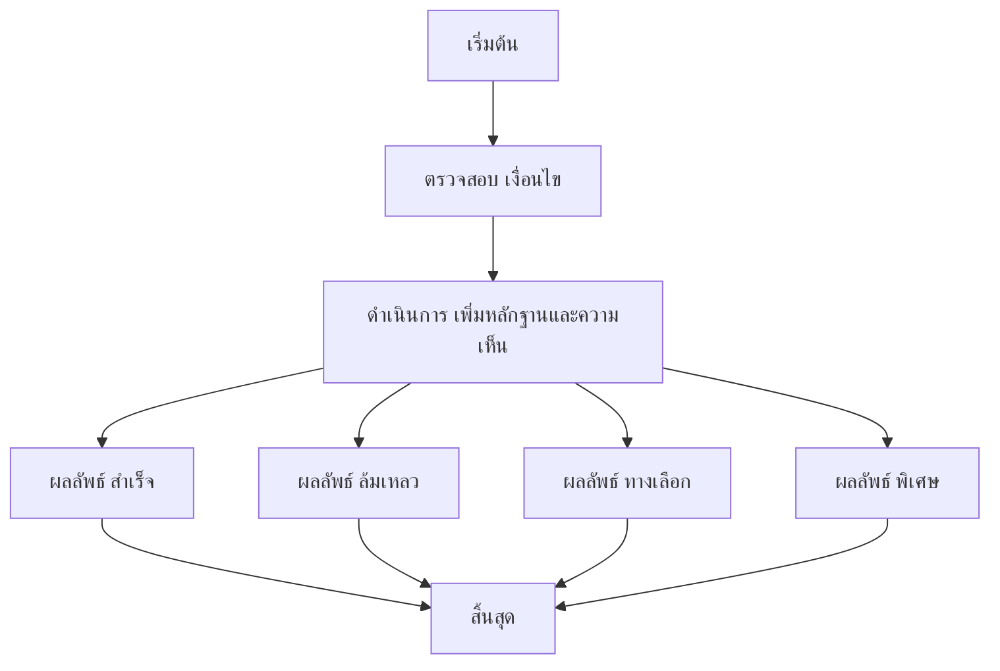

# MCC056 - ดูและจัดการ dispute cases ที่เกี่ยวข้องกับร้าน

## 👤 บทบาท
- ผู้ให้บริการ

## 🎯 เป้าหมายของเคส
- ในฐานะ ผู้ให้บริการ
- ต้องการ เข้าถึงรายการ dispute ที่เกี่ยวกับร้านและตอบเอกสาร/หลักฐาน
- เพื่อ ปกป้องสิทธิ์และเร่งการแก้ไข

## ⚙️ เงื่อนไขก่อนเริ่ม (Precondition)
- Dispute raised by customer for provider booking

## 🧭 ผลลัพธ์และสถานการณ์
- ✅ ผลลัพธ์ที่คาดหวัง (Success Flow): เคสถูกอัปเดต ผู้ดูแลระบบแจ้งเตือน และ escrow ถูก Hold จนกว่าจะมีการตัดสิน
- ❌ ผลลัพธ์ที่ Failure:
  - หลักฐานหรือเอกสารที่ส่งไม่ถูกต้องหรือสมบูรณ์ ทำให้การยืนยัน dispute ล้มเหลว
  - ไม่สามารถบันทึกการอัปเดตสถานะ dispute หรือ audit trail ได้ เนื่องจากข้อผิดพลาดของระบบ
  - ผู้ให้บริการตอบสนองภายใน SLA 48 ชั่วโมงไม่ได้ ทำให้สถานะ dispute ล่าช้าและไม่มีการอัปเดต
- 🔄 ผลลัพธ์ทางเลือก:
  - Admin ขอข้อมูลเพิ่มเติมจากผู้ให้บริการก่อนดำเนินการ
  - หลักฐานบางส่วนได้รับการยอมรับแต่ต้องมีเอกสารเพิ่มเติม
  - สถานะ dispute ปรับเป็น อยู่ระหว่างการพิจารณา และ escrow ยังคงถูก Hold จนกว่าการตัดสินจะสิ้นสุด
- ⚠️ ผลลัพธ์ขอบเขตพิเศษ:
  - Admin ขอข้อมูลเพิ่มเติมจากผู้ให้บริการก่อนดำเนินการ
  - หลักฐานบางส่วนได้รับการยอมรับแต่ต้องมีเอกสารเพิ่มเติม
  - สถานะ dispute ปรับเป็น อยู่ระหว่างการพิจารณา และ escrow ยังคงถูก Hold จนกว่าการตัดสินจะสิ้นสุด

## ✅ เกณฑ์การยอมรับ (Acceptance Criteria)
- Evidence accepted types
- audit trail
- notifications

## ⏱ ลำดับความสำคัญ / SLA
- Priority: P0
- SLA: Provider respond =48h

---

## 🔁 Sequence Diagram  
> แสดงลำดับเหตุการณ์ระหว่าง "ผู้ให้บริการ" กับ "ระบบ"

---

## 🧭 Flowchart Diagram
> แสดงขั้นตอนการทำงานของระบบอย่างเข้าใจง่าย

