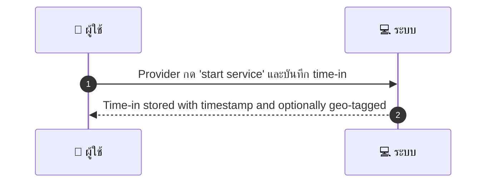
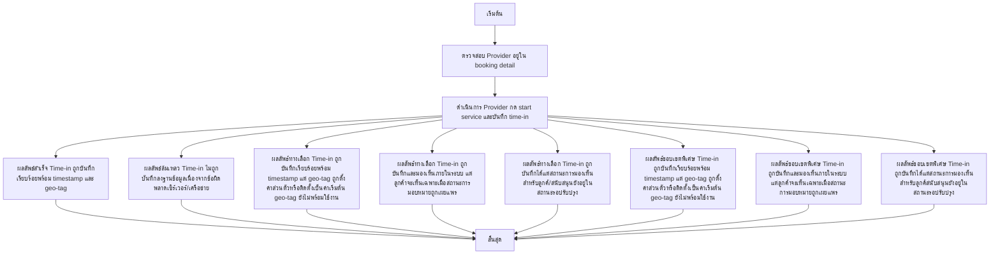

# MCC071 - ตั้งระบบบันทึกเวลาการมาถึง Check-in by Provider

## 👤 บทบาท
- ผู้ให้บริการ

## 🎯 เป้าหมายของเคส
- ในฐานะ
- ต้องการ
- เพื่อ

- ในฐานะ: ผู้ให้บริการ
- ต้องการ: บันทึกเวลาที่เริ่มให้บริการเพื่อเชื่อมกับการตรวจสอบคุณภาพ
- เพื่อ: เพื่อให้มีหลักฐานการให้บริการ

## ⚙️ เงื่อนไขก่อนเริ่ม (Precondition)
- Provider อยู่ใน booking detail

## 🧭 ผลลัพธ์และสถานการณ์
- ✅ ผลลัพธ์ที่คาดหวัง (Success Flow): Time-in stored with timestamp and optionally geo-tagged
- ❌ ผลลัพธ์ที่ Failure:  
  - Time-in ไม่ถูกบันทึกลงฐานข้อมูลเนื่องจากข้อผิดพลาดเซิร์เวอร์/เครือข่าย
  - บันทึก Time-in ซ้ำสำหรับการจองเดิม duplicate entry
  - Provider ไม่อยู่ในสถานะที่อนุญาตให้บันทึก Time-in เช่น booking ปิดหรือถูกยกเลิก
  - เกิดข้อผิดพัติในการตรวจสอบสิทธิ์ผู้ใช้งานระหว่างกระบวนการ start service
- 🔄 ผลลัพธ์ทางเลือก:  
  - Time-in ถูกบันทึกเรียบร้อยพร้อม timestamp แต่ geo-tag ถูกตั้งค่าส่วนตัวหรือติดตั้งเป็นค่าเริ่มต้น geo-tag ยังไม่พร้อมใช้งาน
  - Time-in ถูกบันทึกและมองเห็นภายในระบบ แต่ลูกค้าจะเห็นเฉพาะเมื่อสถานะการมอบหมายถูกเผยแพร่
  - Time-in ถูกบันทึกได้แต่สถานะการมองเห็นสำหรับลูกค้/สนับสนุนยังอยู่ในสถานะรอปรับปรุง
- ⚠️ ผลลัพธ์ขอบเขตพิเศษ:  
  - Time-in ถูกบันทึกเรียบร้อยพร้อม timestamp แต่ geo-tag ถูกตั้งค่าส่วนตัวหรือติดตั้งเป็นค่าเริ่มต้น geo-tag ยังไม่พร้อมใช้งาน
  - Time-in ถูกบันทึกและมองเห็นภายในระบบ แต่ลูกค้าจะเห็นเฉพาะเมื่อสถานะการมอบหมายถูกเผยแพร่
  - Time-in ถูกบันทึกได้แต่สถานะการมองเห็นสำหรับลูกค้สนับสนุนยังอยู่ในสถานะรอปรับปรุง

## ✅ เกณฑ์การยอมรับ (Acceptance Criteria)
- Time-in locked after entry
- visible to customer/support

## ⏱ ลำดับความสำคัญ / SLA
- Priority: P0
- SLA: Action immediate

---

## 🔁 Sequence Diagram  
> แสดงลำดับเหตุการณ์ระหว่าง "ผู้ใช้" กับ "ระบบ"

---

## 🧭 Flowchart Diagram  
> แสดงขั้นตอนการทำงานของระบบอย่างเข้าใจง่าย

