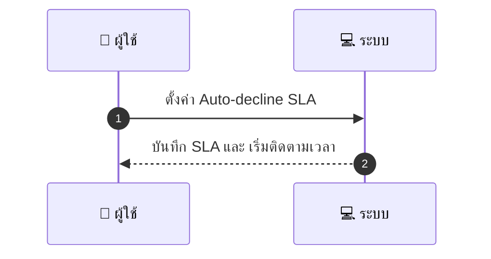
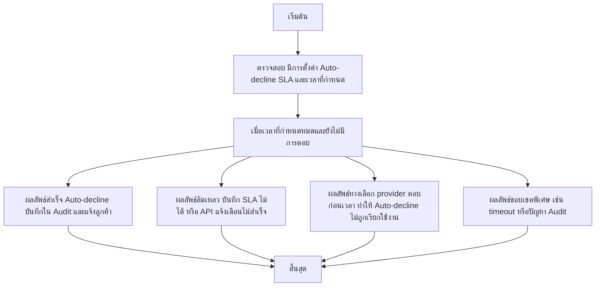

# MCC018 - ตั้งค่าเวลาตอบรับสูงสุด Auto-decline SLA

## 👤 บทบาท
- ผู้ให้บริการ

## 🎯 เป้าหมายของเคส
- ในฐานะ ผู้ให้บริการ
- ต้องการ กำหนดเวลาที่ต้องตอบรับ booking ก่อนระบบ auto-decline
- เพื่อ เพื่อให้การจัดการ booking มีความแน่นอน

## ⚙️ เงื่อนไขก่อนเริ่ม (Precondition)
- Provider ไม่ตอบภายในเวลาที่กำหนด

## 🧭 ผลลัพธ์และสถานการณ์
- ✅ ผลลัพธ์ที่คาดหวัง (Success Flow): Auto-decline respects provider setting and marketplace default
- ❌ ผลลัพธ์ที่ Failure:
  - ไม่สามารถบันทึกการตั้งค่า Auto-decline SLA ลงในฐานข้อมูล ทำให้ระบบไม่รู้เวลาตอบรับสูงสุด
  - เกิดข้อผิดพลาดระหว่างเรียก API แจ้งเตือนไปยังลูกค้าหลัง Auto-decline
  - Auto-decline ถูกบันทึกในระบบแต่ขั้นตอนคืนเงิน/ทวนสอบใน Audit ไม่สำเร็จ
- 🔄 ผลลัพธ์ทางเลือก:
  - ผู้ให้บริการตอบกลับภายในเวลาที่กำหนด ทำให้ Auto-decline ไม่ถูกเรียกใช้งาน และ booking อยู่ในสถานะรอการยืนยันจากผู้ให้บริการ
  - ระบบเลือกใช้ SLA ของ marketplace แทน SLA ผู้ให้บริการและ Auto-decline ถูกเลื่อน/ยกเลิก
  - ลูกค้าทยอยยกเลิก booking ก่อนถึงเวลา auto-decline ทำให้ไม่มีการ Decline โดยระบบ
- ⚠️ ผลลัพธ์ขอบเขตพิเศษ:
  - ผู้ให้บริการตอบกลับภายในเวลาที่กำหนด ทำให้ Auto-decline ไม่ถูกเรียกใช้งาน และ booking อยู่ในสถานะรอการยืนยันจากผู้ให้บริการ
  - ระบบเลือกใช้ SLA ของ marketplace แทน SLA ผู้ให้บริการและ Auto-decline ถูกเลื่อน/ยกเลิก
  - ลูกค้าทยอยยกเลิก booking ก่อนถึงเวลา auto-decline ทำให้ไม่มีการ Decline โดยระบบ

## ✅ เกณฑ์การยอมรับ (Acceptance Criteria)
- Auto-decline recorded in audit
- refunds initiated if necessary

## ⏱ ลำดับความสำคัญ / SLA
- Priority: P1
- SLA: Auto-decline default 24h

---

## 🔁 Sequence Diagram  
> แสดงลำดับเหตุการณ์ระหว่าง "ผู้ใช้" กับ "ระบบ"

---

## 🧭 Flowchart Diagram
> แสดงขั้นตอนการทำงานของระบบอย่างเข้าใจง่าย

