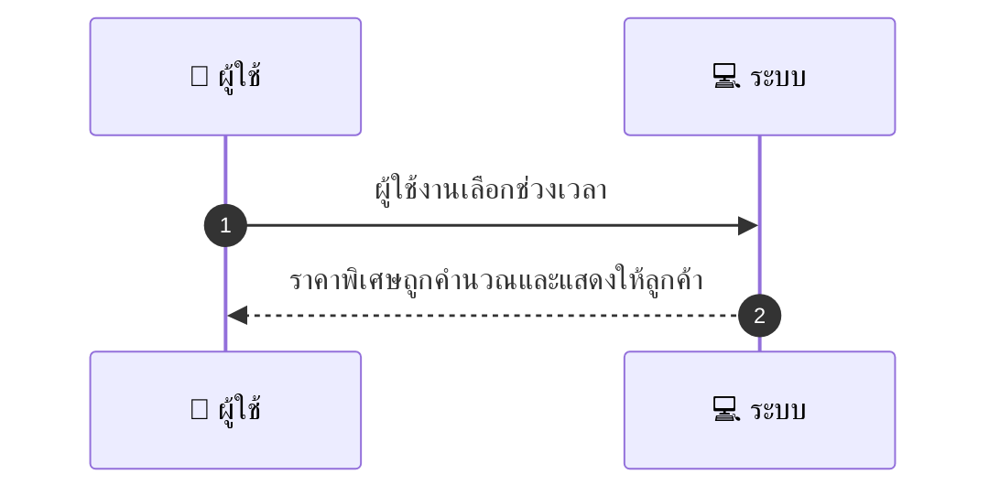
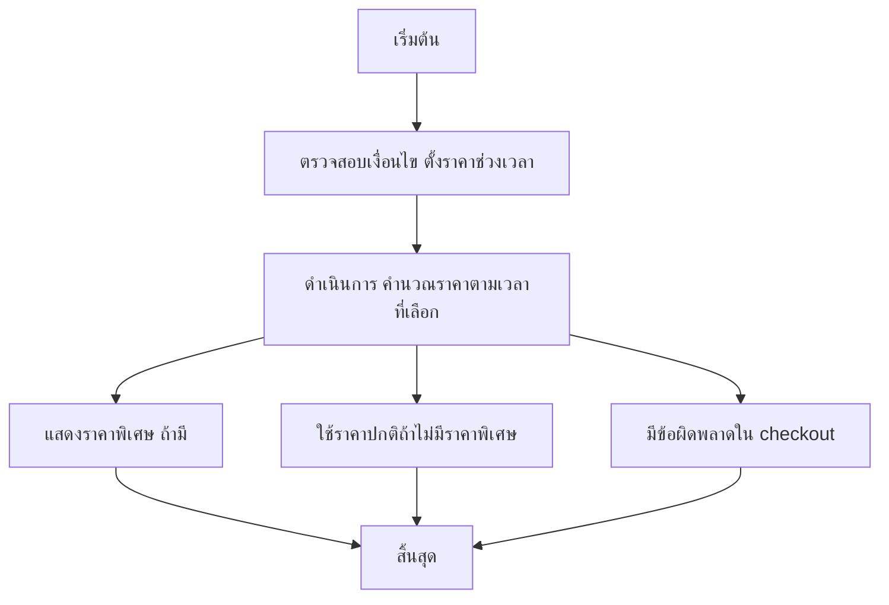

# MCC024 - กำหนดราคาพิเศษสำหรับช่วงเวลา Time-based Pricing

## 👤 บทบาท
- ผู้ให้บริการ

## 🎯 เป้าหมายของเคส
- ในฐานะ ผู้ให้บริการ
- ต้องการ ตั้งราคาหรือส่วนลดเฉพาะช่วงเวลา off peak peak
- เพื่อ บริหารความต้องการ

## ⚙️ เงื่อนไขก่อนเริ่ม Precondition
- ผู้ให้บริการตั้งราคาตารางเวลา

## 🧭 ผลลัพธ์และสถานการณ์
- ✅ ผลลัพธ์ที่คาดหวัง
  - Pricing rules ถูกนำไปใช้อย่างสม่ำเสมอและแสดงให้ลูกค้าทราบ
- ❌ ผลลัพธ์ที่ Failure
  - การคำนวณราคาช่วงเวลานในการ checkout ล้มเหลวจากข้อผิดพลาดภายในระบบ ทำให้ไม่สามารถนำกฎราคาพิเศษมาใช้งาน
  - ไม่พบข้อมูลกฎราคาช่วงเวลา หรือข้อมูลกฎเสียหาย ทำให้ไม่สามารถบังคับใช้อัตราพิเศษได้
  - ดึงข้อมูลราคาช่วงเวลาจาก provider ล้มเหลว API error ราคาที่แสดงกลายเป็นราคาปกติ
  - เวลาเลือกไม่สอดคล้องกับ timezone ของร้านค้าหรือผู้ใช้งาน ทำให้ราคาช่วงเวลาผิดพลาด
  - ข้อผิดพลาดในการประมวลผลราคาขณะ checkout ทำให้ธุรกรรมไม่เสร็จ
- 🔄 ผลลัพธ์ทางเลือก
  - ระบบเลือกใช้กฎราคาช่วงเวลาที่มีการยืนยันในฟิลด์ Priority สูงสุดเมื่อมีหลายกฎทับซ้อน
  - หากไม่มีราคาพิเศษสำหรับช่วงเวลาที่เลือก ระบบจะใช้ราคาปกติและแสดงข้อความว่าไม่มีราคาพิเศษ
  - admin override สามารถกำหนดราคาพิเศษสำหรับช่วงเวลานั้นๆ และราคาที่ลูกค้าเห็นสอดคล้องกับ override
  - ระบบแสดงสัญลักษณ์หรือข้อความ Time-based pricing applied เพื่อยืนยันการใช้งานกฎช่วงเวลา
  - หากลูกค้ากรอกช่วงเวลาที่ไม่สอดคล้องกับกฎช่วงเวลา ระบบจะยืนยันราคาปกติแต่แจ้งเงื่อนไข
- ⚠️ ผลลัพธ์ขอบเขตพิเศษ
  - ระบบเลือกใช้กฎราคาช่วงเวลาที่มีการยืนยันในฟิลด์ Priority สูงสุดเมื่อมีหลายกฎทับซ้อน
  - หากไม่มีราคาพิเศษสำหรับช่วงเวลาที่เลือก ระบบจะใช้ราคาปกติและแสดงข้อความว่าไม่มีราคาพิเศษ
  - admin override สามารถกำหนดราคาพิเศษสำหรับช่วงเวลานั้นๆ และราคาที่ลูกค้าเห็นสอดคล้องกับ override
  - ระบบแสดงสัญลักษณ์หรือข้อความ Time-based pricing applied เพื่อยืนยันการใช้งานกฎช่วงเวลา
  - หากลูกค้ากรอกช่วงเวลาที่ไม่สอดคล้องกับกฎช่วงเวลา ระบบจะยืนยันราคาปกติแต่แจ้งเงื่อนไข

## ✅ เกณฑ์การยอมรับ Acceptance Criteria
- ราคาที่แสดงต้องสอดคล้องกับกฎช่วงเวลาที่บังคับใช้งาน
- การคำนวณราคาช่วงเวลาต้องรวดเร็ว และผลลัพธ์ต้องถูกต้องในทุกกรณี
- เมื่อมีหลายกฎควบซ้อน ให้ใช้กฎที่มี Priority สูงสุด
- เมื่อไม่มีราคาพิเศษสำหรับช่วงเวลาที่เลือก ต้องแสดงราคาปกติและข้อความบอกไม่มีราคาพิเศษ

## ⏱ ลำดับความสำคัญ / SLA
- Priority: P1
- SLA: Pricing calc within 1 second

---

## 🔁 Sequence Diagram  
> แสดงลำดับเหตุการณ์ระหว่าง "ผู้ใช้" กับ "ระบบ"

---

## 🧭 Flowchart Diagram
> แสดงขั้นตอนการทำงานของระบบอย่างเข้าใจง่าย

