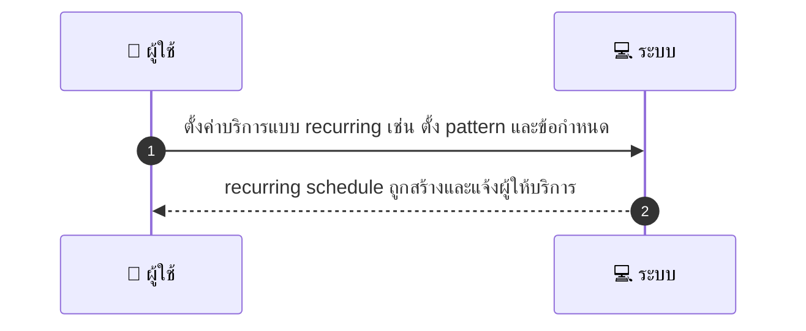
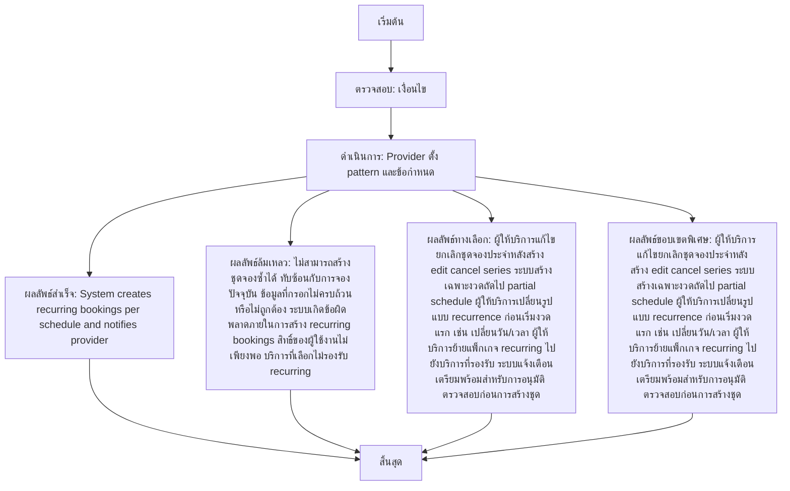

# MCC035 - ตั้งบริการแบบ recurring สำหรับลูกค้าประจำ

## 👤 บทบาท
- ผู้ให้บริการ

## 🎯 เป้าหมายของเคส
- ในฐานะ
- ต้องการ ตั้งตาราง recurring/แพ็กเกจสำหรับลูกค้าที่ต้องการบริการประจำ
- เพื่อ เพื่อรักษาลูกค้าประจำและวางแผนทรัพยากร

## ⚙️ เงื่อนไขก่อนเริ่ม (Precondition)
- Provider เปิด option recurring สำหรับ service

## 🧭 ผลลัพธ์และสถานการณ์
- ✅ ผลลัพธ์ที่คาดหวัง (Success Flow): System creates recurring bookings per schedule and notifies provider
- ❌ ผลลัพธ์ที่ Failure:
  - ไม่สามารถสร้างชุดจองซ้ำได้ ทับซ้อนกับการจองปัจจุบันของผู้ให้บริการ
  - ข้อมูลที่กรอกไม่ครบถ้วนหรือไม่ถูกต้อง ทำให้ระบบไม่สามารถสร้าง recurring booking
  - ระบบเกิดข้อผิดพลาดภายในระหว่างการสร้าง recurring bookings
  - สิทธิ์ของผู้ใช้งานไม่เพียงพอสำหรับตั้งค่าบริการแบบ recurring
  - บริการที่เลือกไม่รองรับการตั้งค่าประจำ/recurring
- 🔄 ผลลัพธ์ทางเลือก:
  - ผู้ให้บริการแก้ไขยกเลิกชุดจองประจำหลังสร้าง edit cancel series
  - ระบบสร้างเฉพาะงวดถัดไปเท่านั้น เนื่องจากข้อจำกัดของทรัพยากร partial schedule
  - ผู้ให้บริการเปลี่ยนรูปแบบ recurrence ก่อนเริ่มงวดแรก เช่น เปลี่ยนวัน/เวลา
  - ผู้ให้บริการย้ายแพ็กเกจ recurring ไปยังบริการที่รองรับ
  - ระบบส่งการแจ้งเตือนเตรียมพร้อมสำหรับการอนุมัติ/ตรวจสอบก่อนการสร้างชุด
- ⚠️ ผลลัพธ์ขอบเขตพิเศษ:
  - ผู้ให้บริการแก้ไขยกเลิกชุดจองประจำหลังสร้าง edit cancel series
  - ระบบสร้างเฉพาะงวดถัดไปเท่านั้น เนื่องจากข้อจำกัดของทรัพยากร partial schedule
  - ผู้ให้บริการเปลี่ยนรูปแบบ recurrence ก่อนเริ่มงวดแรก เช่น เปลี่ยนวัน/เวลา
  - ผู้ให้บริการย้ายแพ็กเกจ recurring ไปยังบริการที่รองรับ
  - ระบบส่งการแจ้งเตือนเตรียมพร้อมสำหรับการอนุมัติ/ตรวจสอบก่อนการสร้างชุด

- ✅ เกณฑ์การยอมรับ (Acceptance Criteria)
  - รองรับการแก้ไขยกเลิกชุดและรับประกันไม่มีการจองทับซ้อน

## ⏱ ลำดับความสำคัญ / SLA
- Priority: P1
- SLA: Recurring schedule creation within 10s

---

## 🔁 Sequence Diagram  
> แสดงลำดับเหตุการณ์ระหว่าง "ผู้ใช้" กับ "ระบบ"

---

## 🧭 Flowchart Diagram
> แสดงขั้นตอนการทำงานของระบบอย่างเข้าใจง่าย

