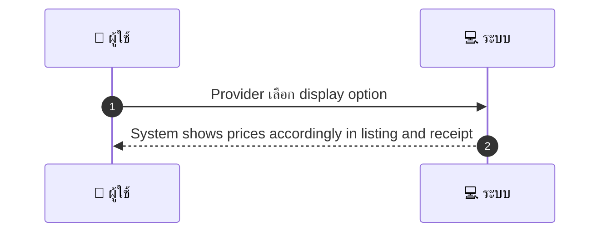
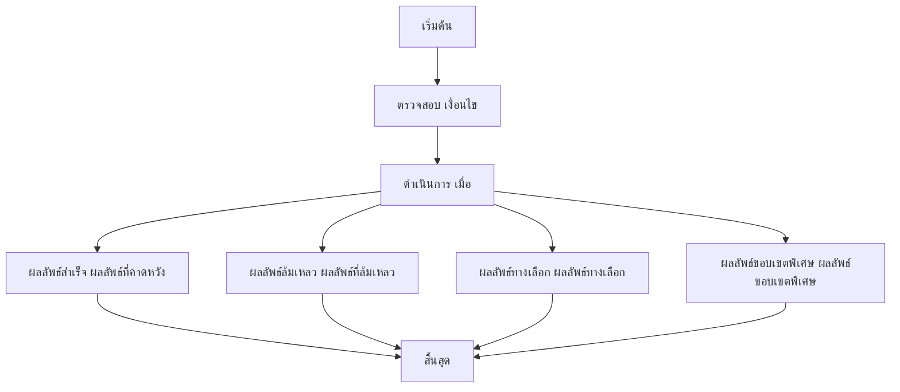

# MCC042 - ตั้งค่าการแสดงราคาแยกส่วนภาษี Tax Display

## 👤 บทบาท
- ผู้ให้บริการ

## 🎯 เป้าหมายของเคส
- ในฐานะ ผู้ให้บริการ
- ต้องการ เลือกวิธีการแสดงราคาว่ารวม VAT หรือแยก VAT
- เพื่อ เพื่อให้สอดคล้องกับข้อกฎหมายภาษีและความโปร่งใส

## ⚙️ เงื่อนไขก่อนเริ่ม (Precondition)
- Provider มี profile และ tax info

## 🧭 ผลลัพธ์และสถานการณ์
- ✅ ผลลัพธ์ที่คาดหวัง (Success Flow): System shows prices accordingly in listing and receipt
- ❌ ผลลัพธ์ที่ Failure:
  - บันทึกการตั้งค่าการแสดงราคาภาษีล้มเหลว เนื่องจากข้อผิดพลาดฐานข้อมูล
  - ข้อมูลภาษีที่ระบุไม่ถูกต้องหรือครบถ้วน ทำให้ไม่สามารถเปิดใช้งานการแสดง VAT ได้
  - สิทธิ์ผู้ใช้งานไม่เพียงพอที่จะเปลี่ยนการตั้งค่าแสดงราคาภาษี
  - ข้อผิดพลาดภายในระบบระหว่างการคำนวณ VAT หรืออัปเดตราคาที่ยึดโยงกับการตั้งค่า
- 🔄 ผลลัพธ์ทางเลือก:
  - การเปลี่ยนแปลงนี้มีผลกับการแสดงราคากระชับในอนาคตเท่านั้น ไม่ส่งผลย้อนหลัง
  - ระบบขอการยืนยันจากผู้ใช้ก่อนนำการตั้งค่าไปใช้งานจริง
  - การแสดงราคาสำหรับรายการบางประเภท เช่นคูปองหรือโปรโมชั่น อาจยังคงเป็นราคาปกติจนกว่าจะนำไปใช้งานจริง
  - หากข้อมูลภาษีไม่พร้อมใช้งานสำหรับบางประเทศ ผู้ใช้อาจเลือกใช้การแสดงราคาที่รวม VAT เท่านั้น
- ⚠️ ผลลัพธ์ขอบเขตพิเศษ:
  - การเปลี่ยนแปลงนี้มีผลกับการแสดงราคากระชับในอนาคตเท่านั้น ไม่ส่งผลย้อนหลัง
  - ระบบขอการยืนยันจากผู้ใช้ก่อนนำการตั้งค่าไปใช้งานจริง
  - การแสดงราคาสำหรับรายการบางประเภท เช่นคูปองหรือโปรโมชั่น อาจยังคงเป็นราคาปกติจนกว่าจะนำไปใช้งานจริง
  - หากข้อมูลภาษีไม่พร้อมใช้งานสำหรับบางประเทศ ผู้ใช้งอาจเลือกใช้การแสดงราคาที่รวม VAT เท่านั้น
- ✅ เกณฑ์การยอมรับ (Acceptance Criteria)
  - Tax settings applied to invoices and receipts

## ⏱ ลำดับความสำคัญ / SLA
- Priority: P1
- SLA: Setting immediate

---

## 🔁 Sequence Diagram  
> แสดงลำดับเหตุการณ์ระหว่าง "ผู้ใช้" กับ "ระบบ"

---

## 🧭 Flowchart Diagram
> แสดงขั้นตอนการทำงานของระบบอย่างเข้าใจง่าย

