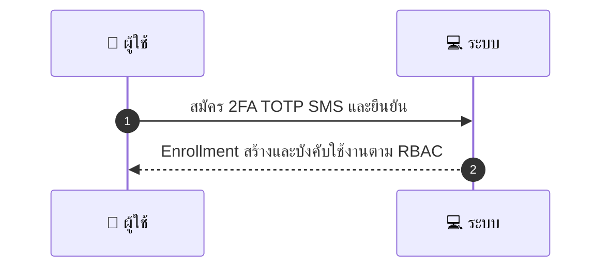
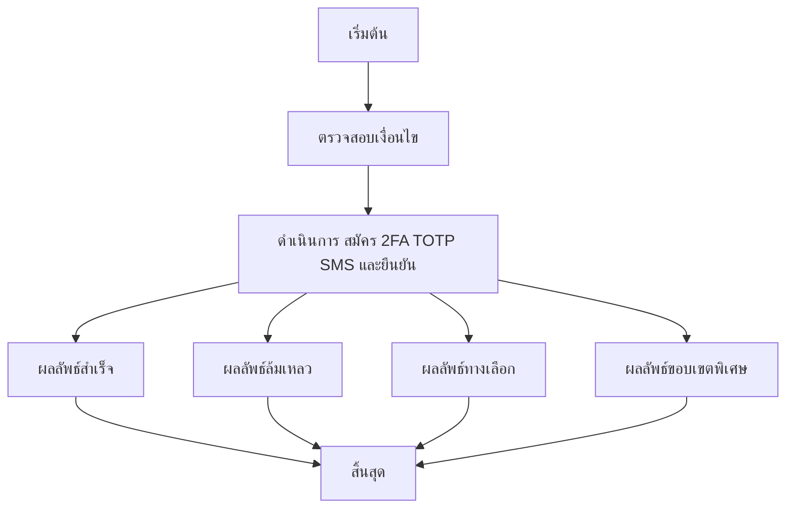

# MCC043 - จัดการความปลอดภัยบัญชี 2FA for Provider

## 👤 บทบาท
- ผู้ให้บริการ

## 🎯 เป้าหมายของเคส
- ในฐานะ ผู้ให้บริการ
- ต้องการ เปิดใช้งาน 2FA เพื่อปกป้องการเข้าถึง dashboard
- เพื่อ เพื่อป้องกันการเข้าถึงโดยไม่ได้รับอนุญาต

## ⚙️ เงื่อนไขก่อนเริ่ม (Precondition)
- Provider เข้าใช้งาน security settings

## 🧭 ผลลัพธ์และสถานการณ์
- ✅ ผลลัพธ์ที่คาดหวัง (Success Flow): 2FA enforced for sensitive ops payout refund  
- ❌ ผลลัพธ์ที่ Failure:  
  - Enrollment 2FA ล้มเหลว ไม่สามารถยืนยัน OTP/SMS ได้หรือรหัสหมดอายุ
  - บันทึกการตั้งค่า 2FA ล้มเหลวจากข้อผิดพลาดของเซิร์ฟเวอร์
  - ผู้ใช้ไม่มีสิทธิ์เปิดใช้งาน 2FA ตาม RBAC
  - ข้อมูลการลงทะเบียน 2FA ไม่ครบถ้วนหรือไม่ถูกต้อง
- 🔄 ผลลัพธ์ทางเลือก:  
  - การเปิดใช้งาน 2FA ต้องรออนุมัติจากผู้ดูแลระบบ approval pending
  - ผู้ใช้เลือกวิธี 2FA เป็น TOTP หรือ SMS ตามความเหมาะสม และระบบบันทึกแต่ยังไม่ enforcement ทันที
  - Enrollment สำเร็จชั่วคราวแต่การบังคับใช้งาน 2FA ในงานที่อ่อนไหวจะถูกนำไปใช้เมื่อ RBAC propagation เสร็จสมบูรณ์
  - ผู้ใช้ยืนยันการกู้คืน recovery codes แล้ว ระบบยังไม่บังคับใช้งานในบางโมดูล
- ⚠️ ผลลัพธ์ขอบเขตพิเศษ:  
  - การเปิดใช้งาน 2FA ต้องรออนุมัติจากผู้ดูแลระบบ approval pending
  - ผู้ใช้เลือกวิธี 2FA เป็น TOTP หรือ SMS ตามความเหมาะสม และระบบบันทึกแต่ยังไม่ enforcement ทันที
  - Enrollment สำเร็จชั่วคราวแต่การบังคับใช้งาน 2FA ในงานที่อ่อนไหวจะถูกนำไปใช้เมื่อ RBAC propagation เสร็จสมบูรณ์
  - ผู้ใช้ยืนยันการกู้คืน recovery codes แล้ว ระบบยังไม่บังคับใช้งานในบางโมดูล

## ✅ เกณฑ์การยอมรับ (Acceptance Criteria)
- 2FA enrollment success
- recovery codes provided
- enforced per RBAC

## ⏱ ลำดับความสำคัญ / SLA
- Priority: P1
- SLA: 2FA activation immediate

---

## 🔁 Sequence Diagram  
> แสดงลำดับเหตุการณ์ระหว่าง "ผู้ใช้" กับ "ระบบ"

---

## 🧭 Flowchart Diagram
> แสดงขั้นตอนการทำงานของระบบอย่างเข้าใจง่าย

