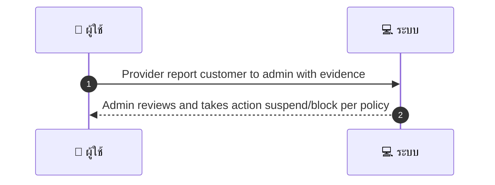
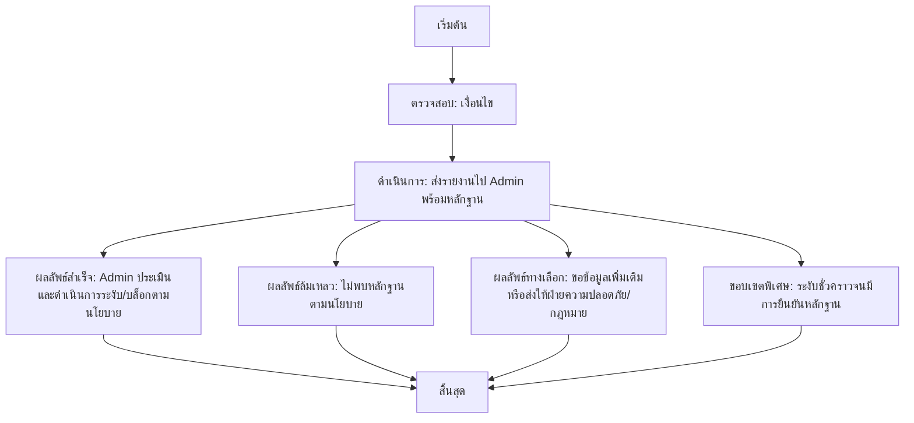

# MCC052 - จัดการการแบน/ระงับ account ของลูกค้า Block Customer

## 👤 บทบาท
- ผู้ให้บริการ

## 🎯 เป้าหมายของเคส
- ในฐานะ ผู้ให้บริการ
- ต้องการ ขอให้ admin block หรือ restrict ลูกค้าที่มีพฤติกรรมไม่เหมาะสม
- เพื่อ ปกป้องร้านและพนักงาน

## ⚙️ เงื่อนไขก่อนเริ่ม (Precondition)
- Provider พบพฤติกรรม abusive จากลูกค้า

## 🧭 ผลลัพธ์และสถานการณ์
- ✅ ผลลัพธ์ที่คาดหวัง (Success Flow): Admin reviews and takes action suspend/block per policy
- ❌ ผลลัพธ์ที่ Failure:
  - ไม่พบหลักฐานการกระทำที่ผิดตามนโยบายที่เพียงพอสำหรับการดำเนินการบล็อก
  - ระบบไม่สามารถส่งรายงานไปยัง Admin ได้เนื่องจากข้อผิดพลาดทางเทคนิคหรือระบบล่ม
  - Admin ปฏิเสธการดำเนินการบล็อกตามนโยบายหลังการตรวจสอบ
  - การบล็อกไม่สำเร็จเนื่องจากข้อจำกัดสิทธิ์ของ Provider หรือบทบาทไม่ครบถ้วน
  - บันทึกผลลัพธ์การดำเนินการไม่ถูกบันทึก/log ไม่ตรงกับเหตุการณ์
- 🔄 ผลลัพธ์ทางเลือก:
  - ขอข้อมูลเพิ่มเติมจาก Provider หรือหลักฐานเพิ่มเติมก่อนดำเนินการบล็อก
  - ส่งเรื่องให้ฝ่ายความปลอดภัย/กฎหมายเพื่อพิจารณาเพิ่มเติม
  - Admin ออกคำสั่งระงับชั่วคราวจนกว่าจะมีการยืนยันหลักฐาน
- ⚠️ ผลลัพธ์ขอบเขตพิเศษ:
  - ขอข้อมูลเพิ่มเติมจาก Provider หรือหลักฐานเพิ่มเติมก่อนดำเนินการบล็อก
  - ส่งเรื่องให้ฝ่ายความปลอดภัย/กฎหมายเพื่อพิจารณาเพิ่มเติม
  - Admin ออกคำสั่งระงับชั่วคราวจนกว่าจะมีการยืนยันหลักฐาน

## ✅ เกณฑ์การยอมรับ (Acceptance Criteria)
- Report includes evidence
- action logged
- provider notified outcome

## ⏱ ลำดับความสำคัญ / SLA
- Priority: P1
- SLA: Admin initial response =48h

---

## 🔁 Sequence Diagram  
> แสดงลำดับเหตุการณ์ระหว่าง "ผู้ใช้" กับ "ระบบ"

---

## 🧭 Flowchart Diagram
> แสดงขั้นตอนการทำงานของระบบอย่างเข้าใจง่าย

