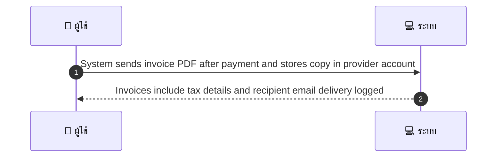
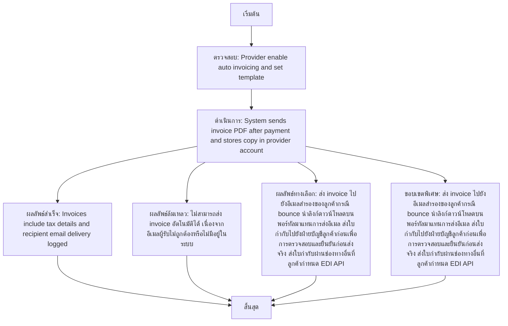

# MCC053 - กำหนดช่องทางส่ง invoice อัตโนมัติให้ลูกค้าองค์กร

## 👤 บทบาท
- ผู้ให้บริการ

## 🎯 เป้าหมายของเคส
- ในฐานะ: ผู้ให้บริการ
- ต้องการ: ตั้งค่าให้จัดส่ง invoice อัตโนมัติให้ลูกค้าที่เป็นนิติบุคคลหลังชำระ
- เพื่อ: เพื่อให้ลูกค้าองค์กรรับเอกสารภาษีทันที

## ⚙️ เงื่อนไขก่อนเริ่ม (Precondition)
- Provider enable auto invoicing and set template

## 🧭 ผลลัพธ์และสถานการณ์
- ✅ ผลลัพธ์ที่คาดหวัง (Success Flow): Invoices include tax details and recipient email delivery logged
- ❌ ผลลัพธ์ที่ Failure:
  - ไม่สามารถส่ง invoice อัตโนมัติได้ เนื่องจากอีเมลผู้รับไม่ถูกต้องหรือไม่มีอยู่ในระบบ
  - ข้อมูลภาษีหรือรายละเอียดบนใบกำกับไม่ครบถ้วน ทำให้สร้าง PDF ใบแจ้งหนี้สำเร็จไม่ได้
  - ไฟล์ PDF ใบแจ้งหนี้เสียหายหรือแนบไฟล์ไม่สำเร็จ
  - ไม่สามารถบันทึกสำเนาการส่งมอบใบกำกับลงในบัญชีผู้ให้บริการ
  - การชำระเงินที่เกี่ยวข้องกับใบกำกับถูกบันทึกไม่ถูกต้อง ทำให้ไม่ออกใบกำกับได้
- 🔄 ผลลัพธ์ทางเลือก:
  - ส่ง invoice ไปยังอีเมลสำรองของลูกค้าหากอีเมลหลัก bounce
  - นำลิงก์ดาวน์โหลดบนพอร์ทัลมาแทนการส่งอีเมลเพื่อให้ลูกค้าดาวน์โหลด
  - ส่งใบกำกับไปยังฝ่ายบัญชีลูกค้าก่อนเพื่อการตรวจสอบและยืนยันก่อนส่งจริง
  - ส่งใบกำกับผ่านช่องทางอื่นที่ลูกค้ากำหนด เช่น EDI API แทนการส่งอีเมล
- ⚠️ ผลลัพธ์ขอบเขตพิเศษ:
  - ส่ง invoice ไปยังอีเมลสำรองของลูกค้าหากอีเมลหลัก bounce
  - นำลิงก์ดาวน์โหลดบนพอร์ทัลมาแทนการส่งอีเมลเพื่อให้ลูกค้าดาวน์โหลด
  - ส่งใบกำกับไปยังฝ่ายบัญชีลูกค้าก่อนเพื่อการตรวจสอบและยืนยันก่อนส่งจริง
  - ส่งใบกำกับผ่านช่องทางอื่นที่ลูกค้ากำหนด เช่น EDI API แทนการส่งอีเมล

- ✅ เกณฑ์การยอมรับ (Acceptance Criteria)
  - ใบแจ้งหนี้ถูกส่งอัตโนมัติเมื่อชำระเงินสำเร็จ
  - ใบแจ้งหนี้มีรายละเอียดภาษีและอีเมลผู้รับ
  - มีการบันทึกการส่งมอบใบกำกับในบัญชีผู้ให้บริการ

- ⏱ ลำดับความสำคัญ / SLA
  - Priority: P1
  - SLA: Send within 1h of payment

---

## 🔁 Sequence Diagram  
> แสดงลำดับเหตุการณ์ระหว่าง "ผู้ใช้" กับ "ระบบ"

---

## 🧭 Flowchart Diagram
> แสดงขั้นตอนการทำงานของระบบอย่างเข้าใจง่าย

