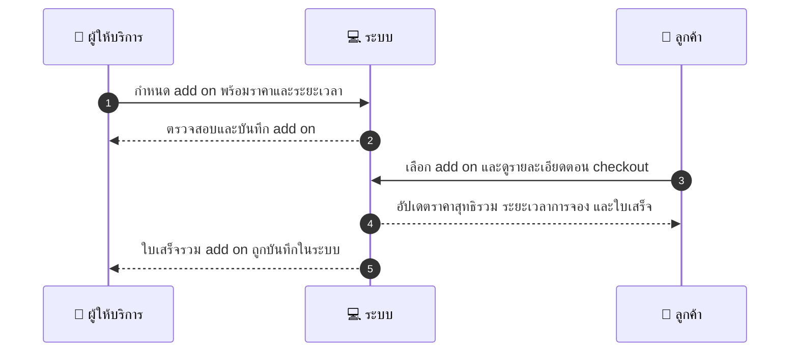
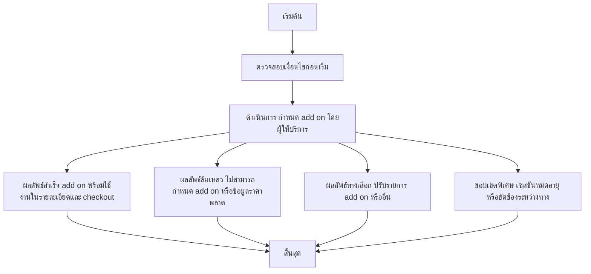

# MCC055 - ตั้งค่าการใช้งานบริการแบบ on-site/add-on

## 👤 บทบาท
- ผู้ให้บริการ

## 🎯 เป้าหมายของเคส
- ในฐานะ ผู้ให้บริการ
- ต้องการ เพิ่ม option on-site service fees หรือ add-on services
- เพื่อ เพื่อให้ลูกค้เลือกบริการเพิ่มเติมตอน checkout

## ⚙️ เงื่อนไขก่อนเริ่ม (Precondition)
- ผู้ให้บริการกำหนดรายการ add-on พร้อมราคาและระยะเวลา

## 🧭 ผลลัพธ์และสถานการณ์
- ✅ ผลลัพธ์ที่คาดหวัง (Success Flow): การเลือก add-on จะอัปเดตรวมค่าบริการและระยะเวลาการจอง และปรับสถานะความพร้อมใช้งาน
- ❌ ผลลัพธ์ที่ Failure:  
  - ไม่สามารถคำนวณรวมค่าบริการเมื่อเพิ่ม add-on ได้ เนื่องจากข้อมูลราคาหรือรายละเอียด add-on ไม่พบในระบบ
  - Add-on ที่เลือกไม่สามารถจองได้ในวัน/ช่วงเวลาที่ลูกค้าต้องการ
  - ระบบชำระเงินล้มเหลว ไม่สามารถเรียกเก็บค่า add-on ในใบเสร็จ
- 🔄 ผลลัพธ์ทางเลือก:  
  - ลูกค้าปรับจำนวน add-on ลดลง และระบบคำนวณค่าบริการใหม่ทันที
  - ลูกค้าลบ add-on ที่เลือกออกจากการจองโดยไม่กระทบบริการหลัก ระบบปรับยอดรวมและใบเสร็จใหม่
  - Add-on ที่มีโปรโมชั่นถูกเลือก ระบบคำนวณส่วนลดตามเงื่อนไขโปรโมชั่น
- ⚠️ ผลลัพธ์ขอบเขตพิเศษ:  
  - ลูกค้าปรับจำนวน add-on ลดลง และระบบคำนวณค่าบริการใหม่ทันที
  - ลูกค้าลบ add-on ที่เลือกออกจากการจองโดยไม่กระทบบริการหลัก ระบบปรับยอดรวมและใบเสร็จใหม่
  - Add-on ที่มีโปรโมชั่นถูกเลือก ระบบคำนวณส่วนลดตามเงื่อนไขโปรโมชั่น

## ✅ เกณฑ์การยอมรับ (Acceptance Criteria)
- การเลือก add-on ต้องอัปเดตราคาสุทธิรวมและระยะเวลาการจอง
- รายการ add-on ปรากฏในหน้ารายละเอียดบริการและหน้าชำระเงิน และรวมในใบเสร็จ
- สามารถปรับเพิ่มลด add-on ได้โดยไม่กระทบบริการหลัก และระบบจะอัปเดตยอดรวมทันที
- หากมีโปรโมชั่น Add-on จะคำนวณส่วนลดตามเงื่อนไขโปรโมชั่น

## ⏱ ลำดับความสำคัญ / SLA
- Priority: P1
- SLA: Selection immediate

---

## 🔁 Sequence Diagram  
> แสดงลำดับเหตุการณ์ระหว่าง "ผู้ให้บริการ", "ระบบ" และ "ลูกค้า"

---

## 🧭 Flowchart Diagram  
> แสดงขั้นตอนการทำงานของระบบอย่างเข้าใจง่าย

