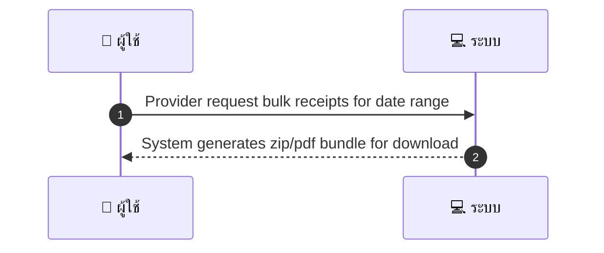
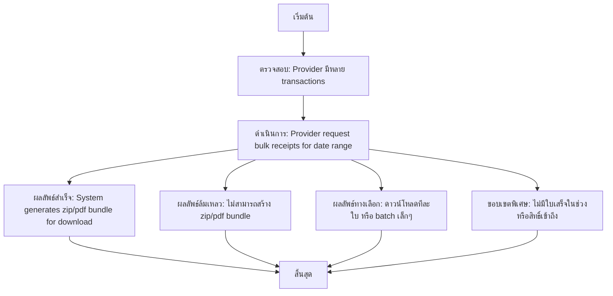

# MCC062 - สั่งพิมพ์รายงานใบเสร็จ/receipts จำนวนมาก Bulk receipts

## 👤 บทบาท
- ผู้ให้บริการ

## 🎯 เป้าหมายของเคส
- ในฐานะ: ผู้ให้บริการ
- ต้องการ: ดาวน์โหลดหรือพิมพ์ใบเสร็จสำหรับช่วงเวลาที่ต้องการแบบ batch
- เพื่อ: เพื่อการบัญชีและการยื่นภาษี

## ⚙️ เงื่อนไขก่อนเริ่ม (Precondition)
- Provider มีหลาย transactions

## 🧭 ผลลัพธ์และสถานการณ์
- ✅ ผลลัพธ์ที่คาดหวัง (Success Flow): System generates zip/pdf bundle for download
- ❌ ผลลัพธ์ที่ Failure:
  - ไม่สามารถสร้าง zip/pdf bundle ได้เนื่องจากข้อมูลใบเสร็จเสียหายหรือไม่มีข้อมูลในช่วงที่เลือก
  - ข้อมูลช่วงเวลาที่เลือกไม่ถูกต้องหรือไม่มีใบเสร็จให้ประมวลผล
  - เกิดข้อผิดพลาดฐานข้อมูล/ระบบประมวลผลใบเสร็จ ล้มเหลวในการเข้าถึงรายการใบเสร็จ
  - ไม่สามารถบันทึกไฟล์ zip/pdf ลงบนเซิร์ฟเวอร์เนื่องจากสิทธิ์เข้าถึงระบบไฟล์
  - เกิดข้อผิดพลาดในการส่งอีเมลแจ้งเมื่อไฟพร้อม
  - ไฟล์ใบเสร็จรวมมีขนาดใหญ่เกินขีดจำกัดและไม่สามารถสร้างได้
  - ผู้ให้บริการไม่มีสิทธิ์เข้าถึงข้อมูลใบเสร็จของช่วงที่ร้องขอ
- 🔄 ผลลัพธ์ทางเลือก:
  - หากไม่มีใบเสร็จในช่วงวันที่เลือก ระบบจะแจ้งเพื่อเลือกช่วงใหม่
  - ให้ดาวน์โหลดใบเสร็จเป็นไฟล์ทีละใบแทน zip
  - สร้างชุดดาวน์โหลดแบบ batch เล็กๆ แทน zip ใหญ่
  - ส่งออกเมทาดาทาใบเสร็จในรูปแบบ CSV/JSON พร้อมลิงก์ดาวน์โหลดใบเสร็จ
  - ให้ผู้ใช้งานเลือกพิมพ์ใบเสร็จที่ต้องการทีละรายการ
  - แสดงสรุปรายการใบเสร็จที่พบและข้อผิดพลาดถ้ามี
- ⚠️ ผลลัพธ์ขอบเขตพิเศษ:
  - หากไม่มีใบเสร็จในช่วงวันที่เลือก ระบบจะแจ้งเพื่อเลือกช่วงใหม่
  - ให้ดาวน์โหลดใบเสร็จเป็นไฟล์ทีละใบแทน zip
  - สร้างชุดดาวน์โหลดแบบ batch เล็กๆ แทน zip ใหญ่
  - ส่งออกเมทาดาทาใบเสร็จในรูปแบบ CSV/JSON พร้อมลิงก์ดาวน์โหลดใบเสร็จ
  - ให้ผู้ใช้งานเลือกพิมพ์ใบเสร็จที่ต้องการทีละรายการ
  - แสดงสรุปรายการใบเสร็จที่พบและข้อผิดพลาดถ้ามี

## ✅ เกณฑ์การยอมรับ (Acceptance Criteria)
- Batch job with progress
- email when ready
- include invoice metadata

## ⏱ ลำดับความสำคัญ / SLA
- Priority: P1
- SLA: Prepare within background job; notify when ready

---

## 🔁 Sequence Diagram  
> แสดงลำดับเหตุการณ์ระหว่าง "ผู้ใช้" กับ "ระบบ"

---

## 🧭 Flowchart Diagram
> แสดงขั้นตอนการทำงานของระบบอย่างเข้าใจง่าย

