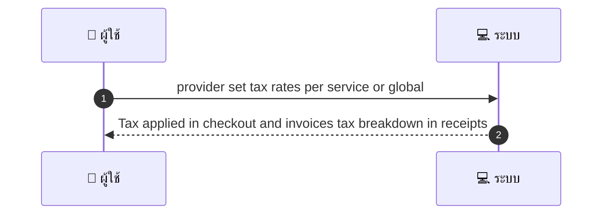
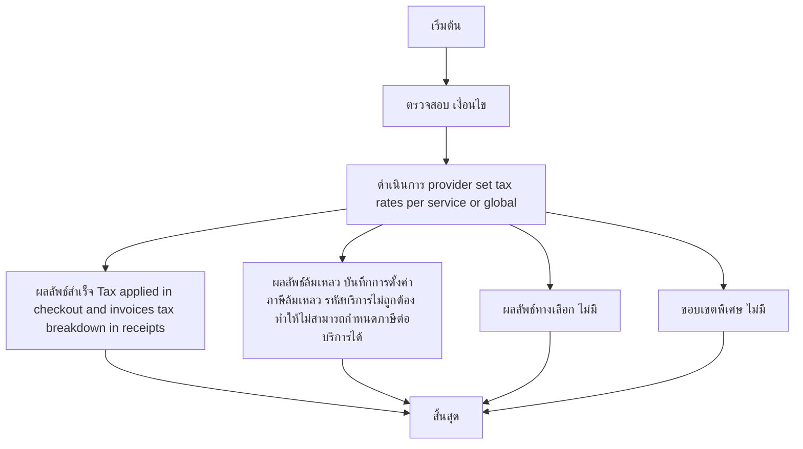

# MCC065 - กำหนดภาษีท้องถิ่น/อัตราภาษีต่อบริการ

## 👤 บทบาท
- ผู้ให้บริการ

## 🎯 เป้าหมายของเคส
- ในฐานะ ผู้ให้บริการ
- ต้องการ ตั้งค่าภาษีสำหรับบริการแต่ละรายการตามกฎท้องถิ่น
- เพื่อ ใบเสร็จถูกต้องตามกฎหมาย

## ⚙️ เงื่อนไขก่อนเริ่ม (Precondition)
- Provider มี tax settings option

## 🧭 ผลลัพธ์และสถานการณ์
- ✅ ผลลัพธ์ที่คาดหวัง (Success Flow): Tax applied in checkout and invoices tax breakdown in receipts
- ❌ ผลลัพธ์ที่ Failure:  
  - บันทึกการตั้งค่าภาษีล้มเหลว รหัสบริการไม่ถูกต้อง ทำให้ไม่สามารถกำหนดภาษีต่อบริการได้
  - คำนวณภาษีล้มเหลว ณ จุดชำระ ระบบไม่สามารถคำนวณภาษีสำหรับรายการในใบเสร็จ
  - สิทธิ์ไม่เพียงพอ ผู้ใช้งานไม่มีสิทธิ์แก้ไข tax settings และไม่สามารถบันทึกการเปลี่ยนแลงได้
  - ฐานข้อมูลไม่พร้อมใช้งาน ไม่สามารถบันทึกการตั้งค่าภาษีลงในฐานข้อมูล
  - การ override ภาษีผิดกฎหมายท้องถิ่น ระบบปฏิเสธการ override เนื่องจากกรอบกฎหมาย
- 🔄 ผลลัพธ์ทางเลือก:  
  - ไม่มี
- ⚠️ ผลลัพธ์ขอบเขตพิเศษ:  
  - ไม่มี

## ✅ เกณฑ์การยอมรับ (Acceptance Criteria)
- Tax override supported for special cases
- admin audit

## ⏱ ลำดับความสำคัญ / SLA
- Priority: P1
- SLA: Apply immediate

---

## 🔁 Sequence Diagram  
> แสดงลำดับเหตุการณ์ระหว่าง "ผู้ใช้" กับ "ระบบ"

---

## 🧭 Flowchart Diagram
> แสดงขั้นตอนการทำงานของระบบอย่างเข้าใจง่าย

