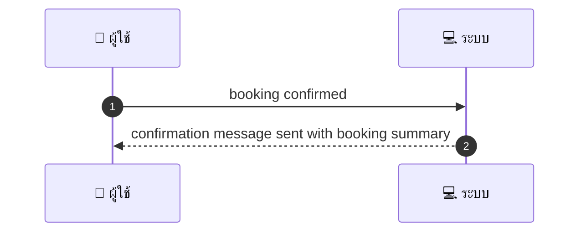
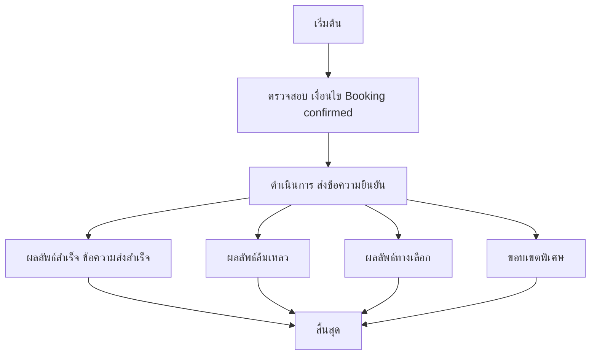

# MCC080 - สร้าง template ข้อความตอบรับอัตโนมัติหลังจอง

## 👤 บทบาท
- ผู้ให้บริการ

## 🎯 เป้าหมายของเคส
- ในฐานะ ผู้ให้บริการ
- ต้องการ ตั้ง template ข้อความยืนยันสำหรับการส่งทันทีหลัง booking confirm
- เพื่อ ให้ลูกค้าได้รับข้อมูลครบถ้วนทันที

## ⚙️ เงื่อนไขก่อนเริ่ม (Precondition)
- Booking confirmed

## 🧭 ผลลัพธ์และสถานการณ์
- ✅ ผลลัพธ์ที่คาดหวัง (Success Flow): Template variables supported; preview available; localized
- ❌ ผลลัพธ์ที่ Failure:
  - ไม่สามารถเรนเดอร์ template ได้เนื่องจากตัวแปรที่ต้องการหายไปหรือไม่ครบถ้วน
  - ระบบส่งข้อความล้มเหลวจากบริการส่งข้อความภายนอก เช่น API ไม่ตอบสนองหรือคืน error
  - ข้อมูลสรุปการจองที่แทรกในข้อความไม่ถูกต้อง หรือมีความขัดแย้งกับ booking summary
  - ส่งข้อความล่าช้ากว่า SLA เนื่องจากปัญหาด้านเครือข่ายหรือระบบ
- 🔄 ผลลัพธ์ทางเลือก:
  - ใช้ template สำรองเมื่อ template หลักไม่พร้อมหรือมีข้อผิดพลาดในการ render
  - แสดงตัวอย่างข้อความ Preview ให้ผู้ดูแล QA ตรวจสอบและอนุมัติก่อนส่งจริง
  - เปลี่ยนช่องทางส่งเป็น Channel สำรองตามที่ provider กำหนด เช่น LINE Email
  - ระบบจะพยายามส่งซ้ำอัตโนมัติ 1-2 ครั้งหากการส่งล้มเหลวครั้งแรก
  - หากข้อมูลการจองมีการอัปเดตหลังการยืนยัน ระบบจะส่งข้อความอัปเดตสรุปให้ลูกค้าทันที
- ⚠️ ผลลัพธ์ขอบเขตพิเศษ:
  - ใช้ template สำรองเมื่อ template หลักไม่พร้อมหรือมีข้อผิดพลาดในการ render
  - แสดงตัวอย่างข้อความ Preview ให้ผู้ดูแล QA ตรวจสอบและอนุมัติก่อนส่งจริง
  - เปลี่ยนช่องทางส่งเป็น Channel สำรองตามที่ provider กำหนด เช่น LINE Email
  - ระบบจะพยายามส่งซ้ำอัตโนมัติ 1-2 ครั้งหากการส่งล้มเหลวครั้งแรก
  - หากข้อมูลการจองมีการอัปเดตหลังการยืนยัน ระบบจะส่งข้อความอัปเดตสรุปให้ลูกค้าทันที

## ✅ เกณฑ์การยอมรับ (Acceptance Criteria)
- Template สามารถ render ได้เมื่อข้อมูลครบถ้วน
- Preview พร้อมใช้งาน และสามารถอนุมัติก่อนส่งจริง
- ข้อความที่ส่งสอดคล้องกับข้อมูลสรุปการจอง และรองรับการ localization
- ส่งข้อความทันทีตามการยืนยันการจอง (หากไม่มีข้อผิดพลาด)

## ⏱ ลำดับความสำคัญ / SLA
- Priority: P1
- SLA: Send immediate after booking confirm

---

## 🔁 Sequence Diagram  
> แสดงลำดับเหตุการณ์ระหว่าง "ผู้ใช้" กับ "ระบบ"

---

## 🧭 Flowchart Diagram
> แสดงขั้นตอนการทำงานของระบบอย่างเข้าใจง่าย

