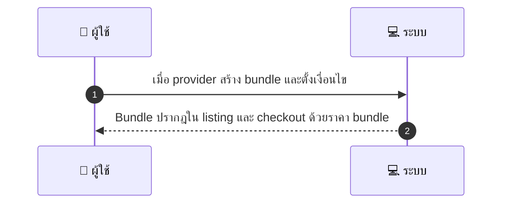
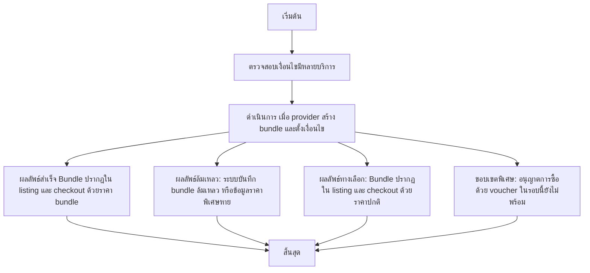

# MCC025 - สร้างแพ็กเกจ/Bundle services

## 👤 บทบาท
- ผู้ให้บริการ

## 🎯 เป้าหมายของเคส
- ในฐานะ ผู้ให้บริการ
- ต้องการ รวมหลาย services เป็นแพ็กเกจด้วยราคาพิเศษ
- เพื่อ เพื่อเสนอ value และเพิ่ม ARPU

## ⚙️ เงื่อนไขก่อนเริ่ม (Precondition)
- Provider มีหลายรายการบริการ

## 🧭 ผลลัพธ์และสถานการณ์
- ✅ ผลลัพธ์ที่คาดหวัง (Success Flow): Bundle ปรากฎใน listing และ checkout ด้วยราคา bundle  
- ❌ ผลลัพธ์ที่ Failure:  
  - ระบบล้มเหลวในการบันทึก bundle หลังคลิกสร้าง  
  - ไม่พบข้อมูลราคาพิเศษของ bundle ในฐานข้อมูล  
  - Bundle ไม่ปรากฏใน listing หรือขั้นตอน checkout หลังการบันทึก  
  - การตรวจสอบคูปอง/ voucher ล้มเหลวในขั้นตอน checkout  
- 🔄 ผลลัพธ์ทางเลือก:  
  - Bundle ปรากฏใน listing และ checkout ด้วยราคาปกติ เนื่องจากเงื่อนไข bundle ยังไม่ถูกเปิดใช้งาน  
  - ดูรายละเอียด bundle ได้ครบถ้วน แต่ไม่สามารถซื้อด้วย voucher ในรอบนี้  
  - Booking slots ไม่ว่าง ทำให้ผู้ใช้งานต้องเลือกเวลาถัดไปหรือใช้แพ็กเกจที่ไม่มีการจองล่วงหน้า  
  - โปรโมชั่น bundle ถูกระงับชั่วคราว แต่การซื้อด้วยบัตรปกติยังทำได้  
- ⚠️ ผลลัพธ์ขอบเขตพิเศษ:  
  - Bundle ปรากฏใน listing และ checkout ด้วยราคาปกติ เนื่องจากเงื่อนไข bundle ยังไม่ถูกเปิดใช้งาน  
  - ดูรายละเอียด bundle ได้ครบถ้วน แต่ไม่สามารถซื้อด้วย voucher ในรอบนี้  
  - Booking slots ไม่ว่าง ทำให้ผู้ใช้งานต้องเลือกเวลาถัดไปหรือใช้แพ็กเกจที่ไม่มีการจองล่วงหน้า  
  - โปรโมชั่น bundle ถูกระงับชั่วคราว แต่การซื้อด้วยบัตรปกติยังทำได้

## ✅ เกณฑ์การยอมรับ (Acceptance Criteria)
- กระบวนการซื้อ Bundle รองรับ voucher และการจองคิว

## ⏱ ลำดับความสำคัญ / SLA
- Priority: P2
- SLA: การสร้างทันที

---

## 🔁 Sequence Diagram  
> แสดงลำดับเหตุการณ์ระหว่าง "ผู้ใช้" กับ "ระบบ"

---

## 🧭 Flowchart Diagram
> แสดงขั้นตอนการทำงานของระบบอย่างเข้าใจง่าย

