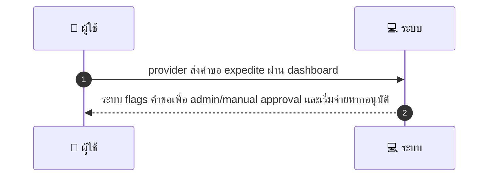
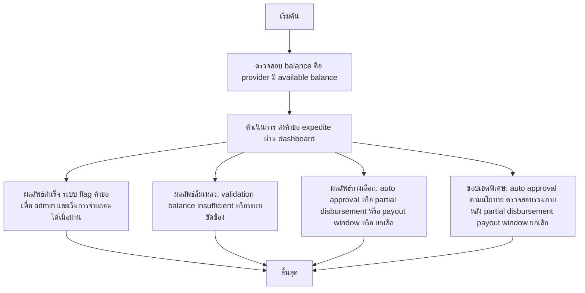

# MCC029 - ร้องขอ payout เร่งด่วน Expedite Payout

## 👤 บทบาท
- ผู้ให้บริการ

## 🎯 เป้าหมายของเคส
- ในฐานะ ผู้ให้บริการ
- ต้องการ ส่งคำขอ payout แบบเร่งด่วน subject to fees approval
- เพื่อ รับเงินเร็วในกรณีจำเป็น

## ⚙️ เงื่อนไขก่อนเริ่ม (Precondition)
- Provider มี available balance

## 🧭 ผลลัพธ์และสถานการณ์
- ✅ ผลลัพธ์ที่คาดหวัง (Success Flow): System flags request for admin/manual approval and initiates disbursement if approved
- ❌ ผลลัพธ์ที่ Failure:
  - Validation ล้มเหลว: ข้อมูลคำขอ expedite ไม่ครบถ้วน เช่น เหตุผลของ expedite หรือจำนวนเงิน payout ไม่ถูกต้อง
  - ยอด available balance ไม่พอเมื่อพิจารณาคำขอ expedite และค่าธรรมเนียม
  - เกิดข้อผิดพลาดระบบระหว่างบันทึกคำขอ expedite หรือสร้าง audit trail
  - ไม่สามารถเรียกสร้างคำสั่งอนุมัติหรือลงนามจากฝั่ง admin เนื่องจากปัญหาการเชื่อมต่อ
- 🔄 ผลลัพธ์ทางเลือก:
  - การอนุมัติอัตโนมัติ auto-approval ตามนโยบาย โดยยังมีการตรวจสอบอย่างรวมในภายหลัง
  - อนุมัติแต่จ่ายบางส่วน partial disbursement เมื่อส่วนที่เหลือรอรอบจ่ายถัดไป
  - คำขอ expedite ได้รับการอนุมัติ แต่ต้องรอรอบการจ่าย payout window ก่อนดำเนินการ
  - ผู้ให้บริการยกเลิกคำขอ expedite ระหว่างรออนุมัติ
- ⚠️ ผลลัพธ์ขอบเขตพิเศษ:
  - การอนุมัติอัตโนมัติ auto-approval ตามนโยบาย โดยยังมีการตรวจสอบอย่างรวมในภายหลัง
  - อนุมัติแต่จ่ายบางส่วน partial disbursement เมื่อส่วนที่เหลือรอรอบจ่ายถัดไป
  - คำขอ expedite ได้รับการอนุมัติ แต่ต้องรอรอบการจ่าย payout window ก่อนดำเนินการ
  - ผู้ให้บริการยกเลิกคำขอ expedite ระหว่างรออนุมัติ

## ✅ เกณฑ์การยอมรับ (Acceptance Criteria)
- Expedite fees shown
- audit trail
- admin approval workflow

## ⏱ ลำดับความสำคัญ / SLA
- Priority: P2
- SLA: Admin decision 3 business days

---

## 🔁 Sequence Diagram  
> แสดงลำดับเหตุการณ์ระหว่าง "ผู้ใช้" กับ "ระบบ"

---

## 🧭 Flowchart Diagram
> แสดงขั้นตอนการทำงานของระบบอย่างเข้าใจง่าย

