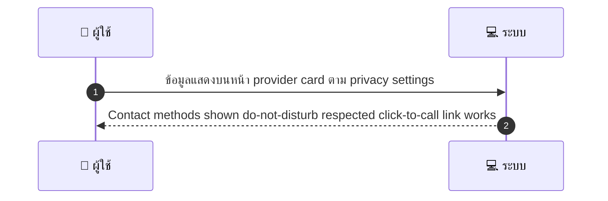
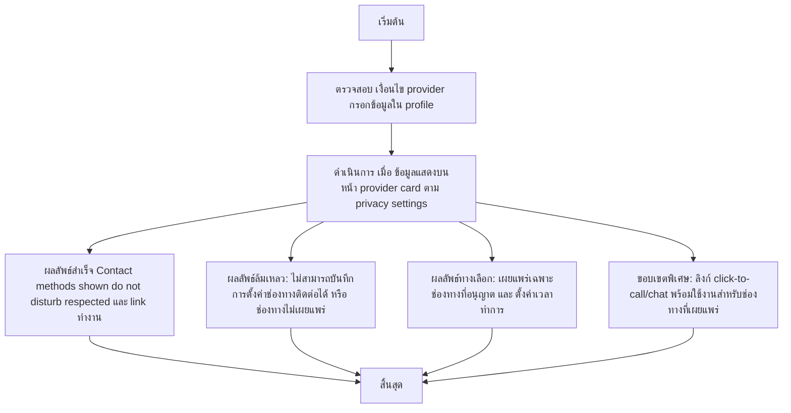

# MCC032 - ตั้งค่าช่องทางติดต่อและเวลาติดต่อ Contact & Lead Settings

## 👤 บทบาท
- ผู้ให้บริการ

## 🎯 เป้าหมายของเคส
- ในฐานะ
- ต้องการ
- เพื่อ

- ในฐานะ: ผู้ให้บริการ
- ต้องการ: ระบุช่องทางโทร/line/whatsapp และเวลาที่พร้อมติดต่อ
- เพื่อ: เพื่อให้ลูกค้าติดต่อได้เมื่อจำเป็น

## ⚙️ เงื่อนไขก่อนเริ่ม (Precondition)
- Provider กรอกข้อมูลใน profile

## 🧭 ผลลัพธ์และสถานการณ์
- ✅ ผลลัพธ์ที่คาดหวัง (Success Flow): Contact methods shown do-not-disturb respected click-to-call link works
- ❌ ผลลัพธ์ที่ Failure:
  - ไม่สามารถบันทึกการตั้งค่าช่องทางติดต่อได้ เนื่องจากข้อมูลไม่ครบถ้วนหรือรูปแบบข้อมูลไม่ถูกต้อง เช่น หมายเลขโทรศัพท์, ID LINE, หรือ WhatsApp ไม่ถูกต้อง
  - ไม่สามารถแสดงช่องทางติดต่อบน provider card เนื่องจาก privacy settings ปิดการเผยแพร่ข้อมูลนี้
  - เกิดข้อผิดพลาดเครือข่าย/ฐานข้อมูลระหว่างบันทึก ทำให้การตั้งค่าหายเมื่อบันทึก และต้องลองทำอีกครั้ง
- 🔄 ผลลัพธ์ทางเลือก:
  - เผยแพร่เฉพาะช่องทางที่อนุญาตตาม privacy settings ผู้ใช้งานเลือกให้แสดง (ตัวอย่าง: แสดง Line และ WhatsApp เท่านั้น)
  - เวลาติดต่อถูกตั้งค่าเป็นช่วงเวลาทำการทั่วไป (เช่น 09:00-18:00) หรือ 24 ชั่วโมง ตามที่ผู้ใช้กำหนด
  - ลิงก์ click-to-call / click-to-chat พร้อมใช้งานสำหรับช่องทางที่เผยแพร่ทั้งหมด และหากมีช่องทางที่ไม่เผยแพร่ จะไม่มีลิงก์นั้นแสดง
- ⚠️ ผลลัพธ์ขอบเขตพิเศษ:
  - เผยแพร่เฉพาะช่องทางที่อนุญาตตาม privacy settings ผู้ใช้งานเลือกให้แสดง (ตัวอย่าง: แสดง Line และ WhatsApp เท่านั้น)
  - เวลาติดต่อถูกตั้งค่าเป็นช่วงเวลาทำการทั่วไป (เช่น 09:00-18:00) หรือ 24 ชั่วโมง ตามที่ผู้ใช้กำหนด
  - ลิงก์ click-to-call / click-to-chat พร้อมใช้งานสำหรับช่องทางที่เผยแพร่ทั้งหมด และหากมีช่องทางที่ไม่เผยแพร่ จะไม่มีลิงก์นั้นแสดง

## ✅ เกณฑ์การยอมรับ (Acceptance Criteria)
- ช่องทางติดต่อถูกบันทึกและแสดงบน provider card ตาม privacy settings
- ลิงก์ click-to-call และ click-to-chat ทำงานสำหรับช่องทางที่เผยแพร่ทั้งหมด
- เวลาในการติดต่อและ do-not-disturb ถูกบังคับใช้งานตามการตั้งค่า
- ระบบไม่บันทึกหายระหว่างการบันทึกหากข้อมูลครบถ้วน

## ⏱ ลำดับความสำคัญ / SLA
- Priority: P2
- SLA: Update immediate

---

## 🔁 Sequence Diagram  
> แสดงลำดับเหตุการณ์ระหว่าง "ผู้ใช้" กับ "ระบบ"

---

## 🧭 Flowchart Diagram
> แสดงขั้นตอนการทำงานของระบบอย่างเข้าใจง่าย

