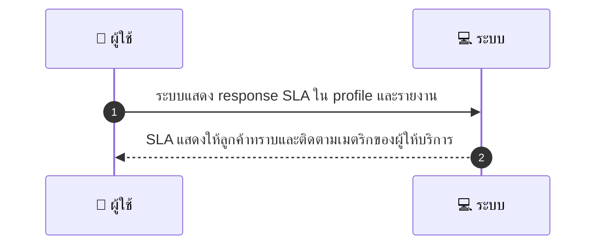
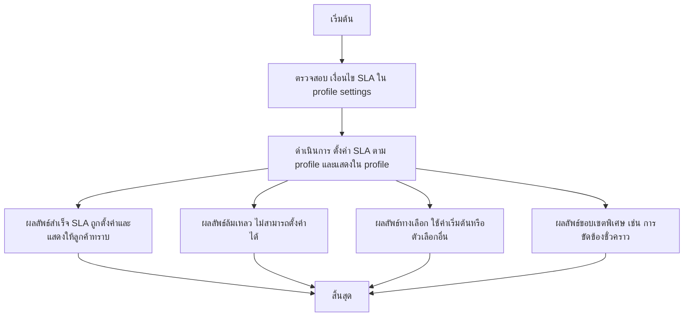

# MCC040 - ตั้งค่าเวลาตอบกลับข้อความลูกค้า Response SLA

## 👤 บทบาท
- ผู้ให้บริการ

## 🎯 เป้าหมายของเคส
- ในฐานะ: ผู้ให้บริการ
- ต้องการ: ตั้ง expected response time เพื่อลด dispute
- เพื่อ: เพื่อให้ลูกค้าคาดหวังเวลาตอบกลับ

## ⚙️ เงื่อนไขก่อนเริ่ม (Precondition)
- Provider กำหนด SLA ใน profile settings

## 🧭 ผลลัพธ์และสถานการณ์
- ✅ ผลลัพธ์ที่คาดหวัง (Success Flow): SLA ถูกตั้งค่าใน profile และแสดงให้ลูกค้าทราบ พร้อมติดตามเมตริกผู้ให้บริการ
- ❌ ผลลัพธ์ที่ Failure:
  - ไม่สำเร็จ
- 🔄 ผลลัพธ์ทางเลือก:
  - ใช้ค่า SLA เริ่มต้นจาก profile หรือเลือกค่า SLA อื่นที่ผู้ใช้สามารถเลือกได้
- ⚠️ ผลลัพธ์ขอบเขตพิเศษ:
  - ไม่มีเงื่อนไขพิเศษ

## ✅ เกณฑ์การยอมรับ (Acceptance Criteria)
- SLA แสดงให้ลูกค้าทราบใน profile
- บันทึกเมตริกของผู้ให้บริการเกี่ยวกับ SLA

## ⏱ ลำดับความสำคัญ / SLA
- Priority: P2
- SLA: Setting immediate

---

## 🔁 Sequence Diagram  
> แสดงลำดับเหตุการณ์ระหว่าง "ผู้ใช้" กับ "ระบบ"

---

## 🧭 Flowchart Diagram
> แสดงขั้นตอนการทำงานของระบบอย่างเข้าใจง่าย

