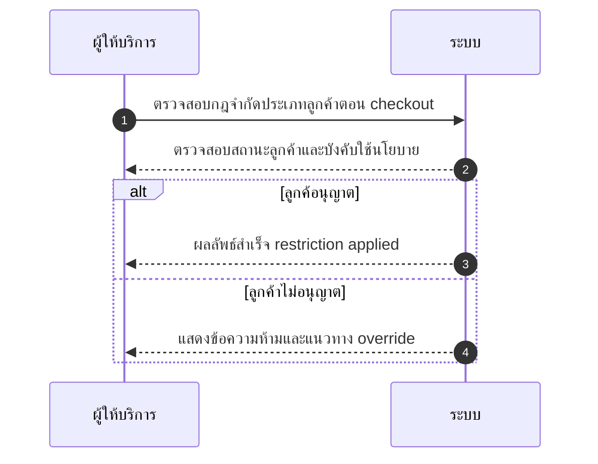
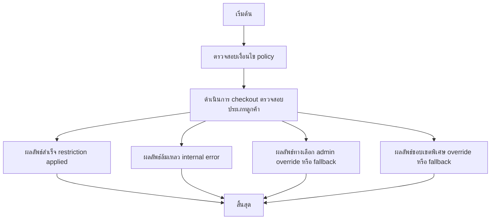

# MCC049 - ตั้งค่าบริการเป็น เฉพาะบุคคล หรือ นิติบุคคลเท่านั้น

## 👤 บทบาท
- ผู้ให้บริการ

## 🎯 เป้าหมายของเคส
- ในฐานะ ผู้ให้บริการ
- ต้องการ กำหนดประเภทลูกค้าที่สามารถใช้บริการ B2C B2B
- เพื่อ เพื่อให้เหมาะกับนโยบาย/การคิดภาษี

## ⚙️ เงื่อนไขก่อนเริ่ม (Precondition)
- Provider เลือก customer type restriction

## 🧭 ผลลัพธ์และสถานการณ์
- ✅ ผลลัพธ์ที่คาดหวัง (Success Flow): Restriction applied; messages shown if blocked; admin override possible
- ❌ ผลลัพธ์ที่ Failure:
  - ระบบเกิดข้อผิดพลาดภายในไม่สามารถบังคับใช้นโยบายจำกัดประเภทลูกค้า ณ checkout ได้
  - ไม่สามารถบันทึกการตั้งค่าการจำกัดลูกค้าไปยังฐานข้อมูล
  - การตรวจสอบประเภทลูกค้าจากบริการภายนอกล้มเหลว ทำให้ไม่ทราบสถานะอนุมัติ/ปฏิเสธ
  - สิทธิ์ผู้ดูแลระบบไม่เพียงพอในการปรับตั้งค่า จึงไม่สามารถบันทึกหรือตรวจสอบการจำกัด
- 🔄 ผลลัพธ์ทางเลือก:
  - Admin override สำเร็จและการตั้งค่าการจำกัดถูกบันทึกชั่วคราว
  - ระบบแจ้งเตือนผู้ดูแลระบบเพื่อยืนยันการ Override ก่อนดำเนินการ
  - ลูกค้าปรับประเภทเป็นที่อนุญาต (B2C/B2B) แล้วทำ checkout ใหม่โดยอัตโนมัติ
  - ระบบ fallback เป็นค่า default ตาม config หากไม่พบข้อมูลหรือการตรวจสอบล้มเหลว
- ⚠️ ผลลัพธ์ขอบเขตพิเศษ:
  - Admin override สำเร็จและการตั้งค่าการจำกัดถูกบันทึกชั่วคราว
  - ระบบแจ้งเตือนผู้ดูแลระบบเพื่อยืนยันการ Override ก่อนดำเนินการ
  - ลูกค้าปรับประเภทเป็นที่อนุญาต (B2C/B2B) แล้วทำ checkout ใหม่โดยอัตโนมัติ
  - ระบบ fallback เป็นค่า default ตาม config หากไม่พบข้อมูลหรือการตรวจสอบล้มเหลว

## ✅ เกณฑ์การยอมรับ (Acceptance Criteria)
- ระบบต้องบังคับใช้นโยบายจำกัดประเภทลูกค้า ณ ช่วง checkout ได้อย่างถูกต้อง
- หากลูกค้าไม่ผ่านเงื่อนไขจะแสดงข้อความแจ้งสถานะการจำกัด
- ผู้ดูแลระบบสามารถทำ Admin override ได้และบันทึกการตั้งค่าไว้ชั่วคราว
- หากข้อมูลไม่พบหรือการตรวจสอบล้มเหลว ระบบต้อง fallback ตาม config ที่กำหนด

## ⏱ ลำดับความสำคัญ / SLA
- Priority: P2
- SLA: Setting immediate

---

## 🔁 Sequence Diagram  
> แสดงลำดับเหตุการณ์ระหว่าง ผู้ให้บริการ กับ ระบบ

---

## 🧭 Flowchart Diagram  
> แสดงขั้นตอนการทำงานของระบบอย่างเข้าใจง่าย

