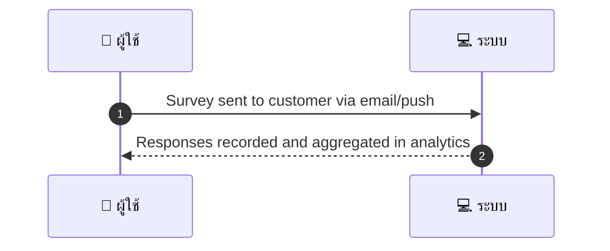
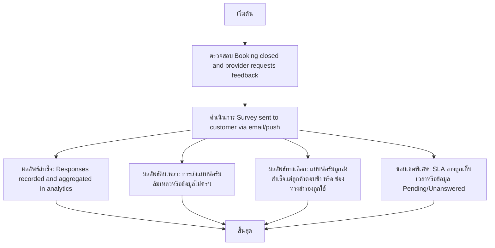

# MCC050 - ส่งแบบฟอร์มหลังบริการ Post-service Survey

## 👤 บทบาท
- ผู้ให้บริการ

## 🎯 เป้าหมายของเคส
- ในฐานะ ผู้ให้บริการ
- ต้องการ ส่งแบบฟอร์ม feedback เฉพาะ custom questions หลังบริการ
- เพื่อ เพื่อเก็บข้อมูลปรับปรุงคุณภาพ

## ⚙️ เงื่อนไขก่อนเริ่ม (Precondition)
- Booking closed and provider requests feedback

## 🧭 ผลลัพธ์และสถานการณ์
- ✅ ผลลัพธ์ที่คาดหวัง (Success Flow): Responses recorded and aggregated in analytics  
- ❌ ผลลัพธ์ที่ Failure:  
  - การส่งแบบฟอร์มล้มเหลวเนื่องจากอีเมล/Push notification ส่งไม่สำเร็จ bounce, token ไม่ถูกต้อง, หรือโดเมนถูกบล็อก
  - ข้อมูลลูกค้าไม่ครบถ้วน ทำให้ระบุช่องทางการส่งหรือที่อยู่ติดต่อไม่ถูกต้อง
  - เทมเพลตแบบฟอร์มไม่พบหรือไม่ได้ถูกตั้งค่าในระบบทำให้ไม่สามารถสร้างแบบฟอร์มได้
  - ข้อผิดพลาดระหว่างการเรียก API ส่งแบบฟอร์ม timeout, 500 error, หรือการเชื่อมต่อกับบริการภายนอกล้มเหลว
  - ไม่สามารถบันทึกผลลัพธ์ลง analytics หรือ data warehouse ได้
  - Booking ปิดแล้วแต่สถานะไม่ตรงกับเงื่อนไขการส่ง ทำให้ไม่สามารถส่งแบบฟอร์มได้
- 🔄 ผลลัพธ์ทางเลือก:  
  - แบบฟอร์มถูกส่งสำเร็จแต่ลูกค้ายังไม่ได้ตอบกลับภายใน SLA ข้อมูลถูกบันทึกใน analytics เป็น Pending/Unanswered
  - ระบบใช้ช่องทางสำรองอีเมล/Push ตามการตั้งค่าของลูกค้าเมื่อช่องทางหลักไม่พร้อม
  - หากไม่มี template เฉพาะบริการ ระบบจะใช้ template ทั่วไปสำหรับแบบฟอร์มและบันทึกส่วนของคำถามแบบกำหนดเอง
  - ผู้ให้บริการอาจเปลี่ยนคำถามแบบฟอร์ม custom questions และส่งรอบใหม่เมื่อจำเป็น
  - อัตราการตอบกลับถูกติดตามและแสดงในแดชบอร์ดของ provider เพื่อการติดตามประสิทธิภาพ
- ⚠️ ผลลัพธ์ขอบเขตพิเศษ:  
  - แบบฟอร์มถูกส่งสำเร็จแต่ลูกค้ายังไม่ได้ตอบกลับภายใน SLA ข้อมูลถูกบันทึกใน analytics เป็น Pending/Unanswered
  - ระบบใช้ช่องทางสำรองอีเมล/Push ตามการตั้งค่าของลูกค้าเมื่อช่องทางหลักไม่พร้อม
  - หากไม่มี template เฉพาะบริการ ระบบจะใช้ template ทั่วไปสำหรับแบบฟอร์มและบันทึกส่วนของคำถามแบบกำหนดเอง
  - ผู้ให้บริการอาจเปลี่ยนคำถามแบบฟอร์ม custom questions และส่งรอบใหม่เมื่อจำเป็น
  - อัตราการตอบกลับถูกติดตามและแสดงในแดชบอร์ดของ provider เพื่อการติดตามประสิทธิภาพ

## ✅ เกณฑ์การยอมรับ (Acceptance Criteria)
- Opt-in per provider
- templates and response rates tracked

## ⏱ ลำดับความสำคัญ / SLA
- Priority: P2
- SLA: - Survey send within 24h after completion

---

## 🔁 Sequence Diagram  
> แสดงลำดับเหตุการณ์ระหว่าง "ผู้ใช้" กับ "ระบบ"

---

## 🧭 Flowchart Diagram
> แสดงขั้นตอนการทำงานของระบบอย่างเข้าใจง่าย

