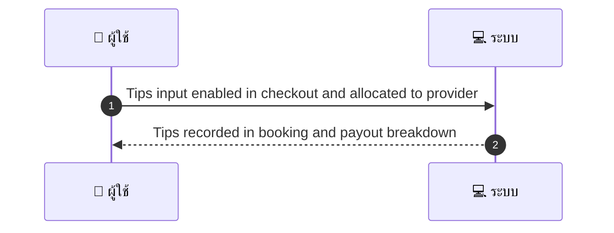
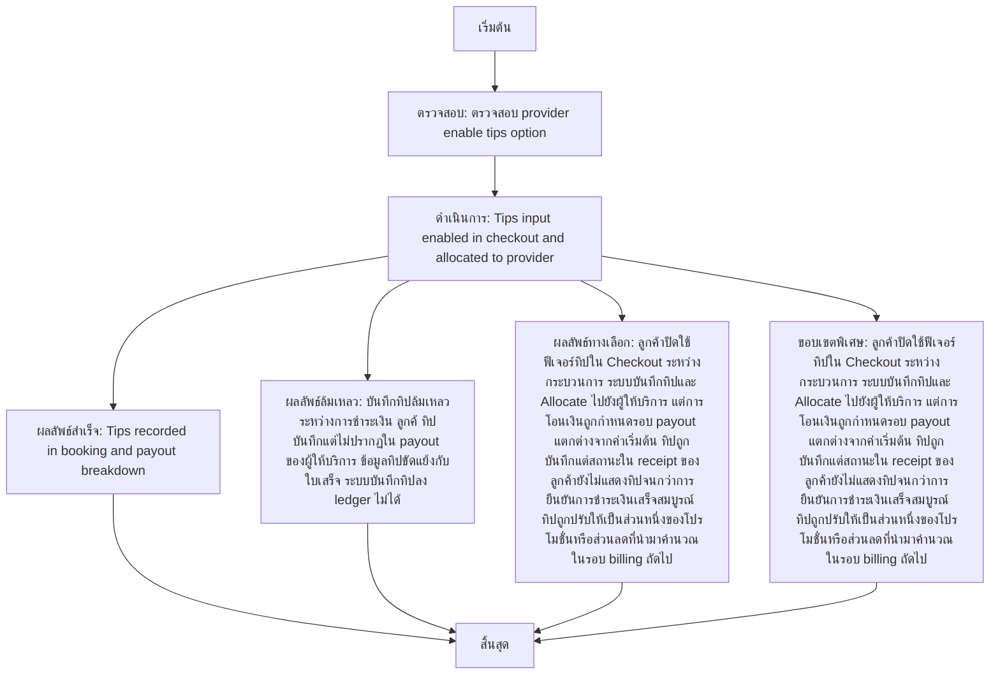

# MCC051 - ตั้งค่าการยอมรับ tips Allow Tips

## 👤 บทบาท
- ผู้ให้บริการ

## 🎯 เป้าหมายของเคส
- ในฐานะ ผู้ให้บริการ
- ต้องการ เปิดปิดให้ลูกค้ให้ทิปใน checkout
- เพื่อ เพื่อรับรายได้เสริมจากลูกค้าที่พอใจ

## ⚙️ เงื่อนไขก่อนเริ่ม (Precondition)
- Provider enable tips option

## 🧭 ผลลัพธ์และสถานการณ์
- ✅ ผลลัพธ์ที่คาดหวัง (Success Flow): Tips recorded in booking and payout breakdown
- ❌ ผลลัพธ์ที่ Failure:
  - บันทึกทิปล้มเหลวในระหว่างการชำระเงินของลูกค้า
  - ทิปถูกบันทึกแต่ไม่ปรากฏในรายการการจ่าย payout ของผู้ให้บริการ
  - ข้อมูลทิปขัดแย้งกับข้อมูลการเรียกเก็บเงินบนใบเสร็จ
  - ระบบไม่สามารถบันทึกทิปลง ledger ของ Booking ได้
- 🔄 ผลลัพธ์ทางเลือก:
  - ลูกค้าปิดใช้ฟีเจอร์ทิปใน Checkout ระหว่างกระบวนการ
  - ระบบบันทึกทิปและ Allocate ไปยังผู้ให้บริการ แต่การโอนเงินถูกกำหนดรอบ payout แตกต่างจากค่าเริ่มต้น
  - ทิปถูกบันทึกแต่สถานะใน receipt ของลูกค้ายังไม่แสดงทิปจนกว่าการยืนยันการชำระเงินเสร็จสมบูรณ์
  - ทิปถูกปรับให้เป็นส่วนหนึ่งของโปรโมชั่นหรือส่วนลดที่นำมาคำนวณในรอบ billing ถถไป
- ⚠️ ผลลัพธ์ขอบเขตพิเศษ:
  - ลูกค้าปิดใช้ฟีเจอร์ทิปใน Checkout ระหว่างกระบวนการ
  - ระบบบันทึกทิปและ Allocate ไปยังผู้ให้บริการ แต่การโอนเงินถูกกำหนดรอบ payout แตกต่างจากค่าเริ่มต้น
  - ทิปถูกบันทึกแต่สถานะใน receipt ของลูกค้ายังไม่แสดงทิปจนกว่าการยืนยันการชำระเงินเสร็จสมบูณณ์
  - ทิปถูกปรับให้เป็นส่วนหนึ่งของโปรโมชั่นหรือส่วนลดที่นำมาคำนวณในรอบ billing ถัดไป

## ✅ เกณฑ์การยอมรับ (Acceptance Criteria)
- ไม่ระบุ

## ⏱ ลำดับความสำคัญ / SLA
- Priority: P2
- SLA: Setting immediate

---

## 🔁 Sequence Diagram  
> แสดงลำดับเหตุการณ์ระหว่าง "ผู้ใช้" กับ "ระบบ"

---

## 🧭 Flowchart Diagram
> แสดงขั้นตอนการทำงานของระบบอย่างเข้าใจง่าย

