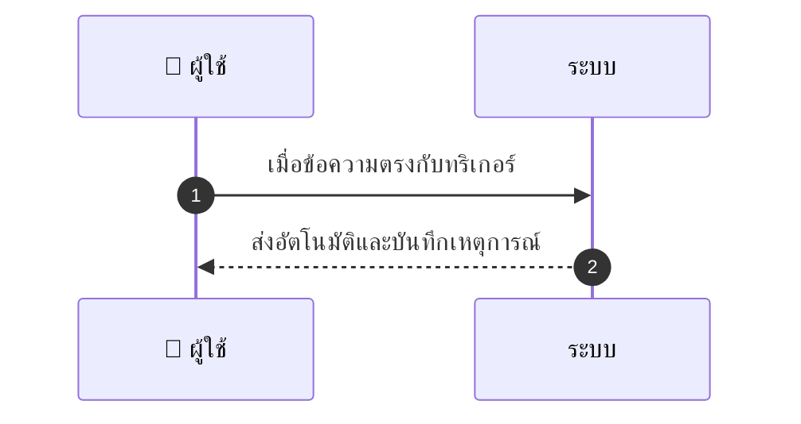
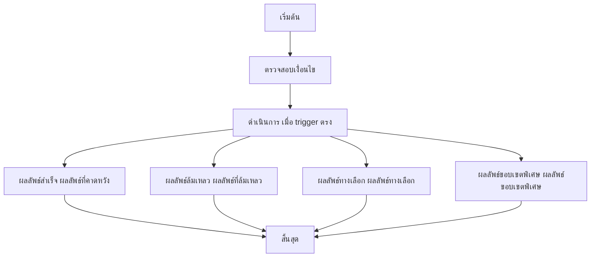

# MCC058 - สร้างระบบตอบกลับอัตโนมัติสำหรับ FAQs Auto-reply

## 👤 บทบาท
- ผู้ให้บริการ

## 🎯 เป้าหมายของเคส
- ในฐานะ ผู้ให้บริการ
- ต้องการ ตั้งข้อความตอบกลับอัตโนมัติสำหรับคำถามทั่วไปที่ inbox
- เพื่อ ช่วยลดภาระการตอบข้อความ

## ⚙️ เงื่อนไขก่อนเริ่ม (Precondition)
- Provider define canned responses and triggers

## 🧭 ผลลัพธ์และสถานการณ์
- ✅ ผลลัพธ์ที่คาดหวัง (Success Flow): การตอบกลับอัตโนมัติที่แก้ไขได้ ถูกจำกัดอัตรา และผู้ให้บริการสามารถปิดใช้งานต่อช่องทางได้
- ❌ ผลลัพธ์ที่ Failure:
  - ไม่สามารถส่ง auto reply ได้เนื่องจากข้อผิดพลาดเครือข่าย API
  - ไม่สามารถบันทึกเหตุการณ์ log ของ auto reply ได้
  - การส่งข้อความล้มเหลวหลังจากผ่านขั้นตอน rate limit
  - ช่องทางถูกปิดใช้งานหรือมีการ Disable auto reply โดยผู้ให้บริการ
  - ข้อความตอบกลับหลักไม่ถูกต้อง เทมเพลตมีข้อผิดพลาดทำให้ไม่สามารถส่งได้
- 🔄 ผลลัพธ์ทางเลือก:
  - ระบบใช้เทมเพลตสำรอง fallback เมื่อข้อความไม่ตรงกับเทมเพลตหลัก
  - auto reply ส่งข้อความสั้นๆ พร้อมลิงก์ไปยัง FAQ ก่อน จากนั้นส่งเนื้อหาครบถ้วนเมื่อข้อมูลพร้อม
  - หาก trigger ตรงกับหลายคำตอบ ระบบเลือกคำตอบที่เกี่ยวข้องสูงสุดโดยอัตโนมัติและบันทึกเหตุผล
  - ระบบรอคิวส่งเมื่อ rate limit สูงและส่งเมื่อสถานะดีขึ้น
  - ผู้ดูแลสามารถปรับแก้ข้อความตอบกลับได้ก่อนส่ง editable content และบันทึกเวอร์ชันใหม่
- ⚠️ ผลลัพธ์ขอบเขตพิเศษ:
  - ระบบใช้เทมเพลตสำรอง fallback เมื่อข้อความไม่ตรงกับเทมเพลตหลัก
  - auto reply ส่งข้อความสั้นๆ พร้อมลิงก์ไปยัง FAQ ก่อน จากนั้นส่งเนื้อหาครบถ้วนเมื่อข้อมูลพร้อม
  - หาก trigger ตรงกับหลายคำตอบ ระบบเลือกคำตอบที่เกี่ยวข้องสูงสุดโดยอัตโนมัติและบันทึกเหตุผล
  - ระบบรอคิวส่งเมื่อ rate limit สูงและส่งเมื่อสถานะดีขึ้น
  - ผู้ดูแลสามารถปรับแก้ข้อความตอบกลับได้ก่อนส่ง editable content และบันทึกเวอร์ชันใหม่
- ✅ เกณฑ์การยอมรับ (Acceptance Criteria)
  - Auto reply ต้องส่งทันทีเมื่อมี trigger
  - ผู้ดูแลสามารถแก้ไขข้อความตอบกลับก่อนส่งได้
  - ระบบต้องมีการบันทึกเหตุการณ์การส่งข้อความ
  - รองรับการจำกัดอัตราและคิวส่ง
  - สามารถปิดใช้งานต่อช่องทางได้
- ⏱ ลำดับความสำคัญ / SLA
  - Priority: P2
  - SLA: Auto reply immediate

---

## 🔁 Sequence Diagram  
> แสดงลำดับเหตุการณ์ระหว่าง "ผู้ใช้" กับ "ระบบ"

---

## 🧭 Flowchart Diagram
> แสดงขั้นตอนการทำงานของระบบอย่างเข้าใจง่าย

