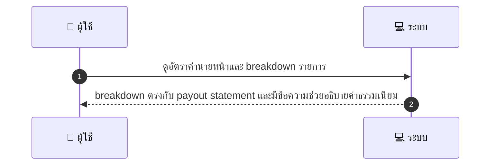
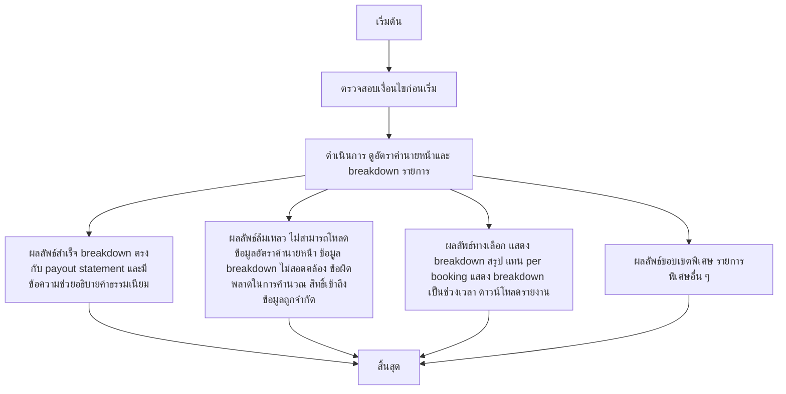

# MCC060 - จัดการอัตราส่วนค่านายหน้า

## 👤 บทบาท
- ผู้ให้บริการ

## 🎯 เป้าหมายของเคส
- ในฐานะ: ผู้ให้บริการ
- ต้องการ: ดูค่า commission ที่แพลตฟอร์มเรียกเก็บและ breakdown รายการ
- เพื่อ: เพื่อให้เข้าใจการคำนวณ payout

## ⚙️ เงื่อนไขก่อนเริ่ม (Precondition)
- Platform stores commission rules and applies them

## 🧭 ผลลัพธ์และสถานการณ์
- ✅ ผลลัพธ์ที่คาดหวัง (Success Flow): breakdown ตรงกับ payout statement และมีข้อความช่วยอธิบายค่าธรรมเนียม
- ❌ ผลลัพธ์ที่ Failure:
  - ไม่สามารถโหลดข้อมูลอัตราค่านายหน้าได้เนื่องจากระบบฐานข้อมูลล่ม
  - ข้อมูล breakdown ไม่สอดคล้องกับ payout statement ที่ปรากฏ
  - ข้อผิดพลาดในการคำนวณ payout จากข้อมูล booking
  - สิทธิ์เข้าถึงข้อมูลถูกจำกัด ผู้ใช้งานไม่มีสิทธิ์ดูข้อมูลค่านายหน้า
- 🔄 ผลลัพธ์ทางเลือก:
  - แสดง breakdown ในรูปแบบสรุป แทน per booking เมื่อข้อมูลรายการไม่พร้อมใช้งาน
  - แสดง breakdown เป็นช่วงเวลา รายวัน/รายสัปดาห์ ก่อนยืนยัน payout
  - ให้ผู้ใช้งานดาวน์โหลดรายงานเป็น CSV/Excel พร้อมรายละเอียด breakdown
- ⚠️ ผลลัพธ์ขอบเขตพิเศษ:
  - แสดง breakdown ในรูปแบบสรุป แทน per booking เมื่อข้อมูลรายการไม่พร้อมใช้งาน
  - แสดง breakdown เป็นช่วงเวลา รายวัน/รายสัปดาห์ ก่อนยืนยัน payout
  - ให้ผู้ใช้งานดาวน์โหลด CSV/Excel พร้อมรายละเอียด breakdown

## ✅ เกณฑ์การยอมรับ (Acceptance Criteria)
- Breakdown ตรงกับ payout statement
- โหลดข้อมูลได้เร็วและถูกต้อง
- ผู้ใช้งานที่มีสิทธิ์เท่านั้นเข้าถึงข้อมูล
- ดาวน์โหลด CSV/Excel พร้อมรายละเอียด breakdown
- มีข้อความช่วยอธิบายค่าธรรมเนียม

## ⏱ ลำดับความสำคัญ / SLA
- Priority: P2
- SLA: View immediate

---

## 🔁 Sequence Diagram  
> แสดงลำดับเหตุการณ์ระหว่าง "ผู้ใช้" กับ "ระบบ"

---

## 🧭 Flowchart Diagram
> แสดงขั้นตอนการทำงานของระบบอย่างเข้าใจง่าย

