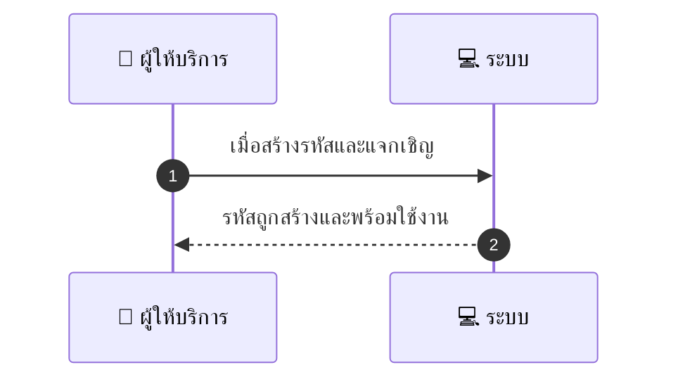
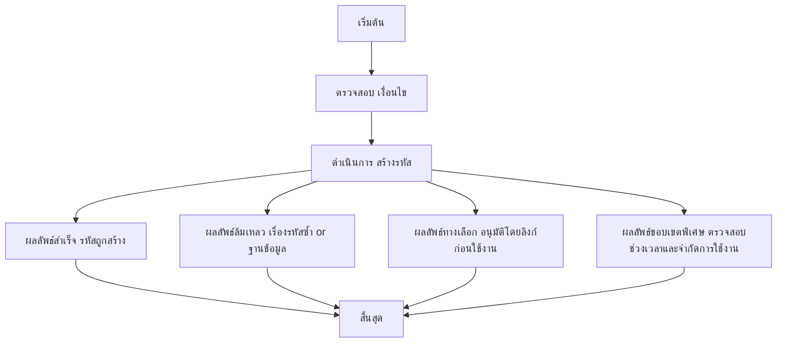

# MCC061 - ตั้งระบบรหัสลดราคาส่วนบุคคล Private Promo Code

## 👤 บทบาท
- ผู้ให้บริการ

## 🎯 เป้าหมายของเคส
- ในฐานะ ผู้ให้บริการ
- ต้องการ สร้างโค้ดส่วนตัวให้ลูกค้าเฉพาะกลุ่ม
- เพื่อ เพื่อมอบสิทธิพิเศษให้ลูกค้าประจำ

## ⚙️ เงื่อนไขก่อนเริ่ม (Precondition)
- Provider defines private code and usage rules

## 🧭 ผลลัพธ์และสถานการณ์
- ✅ ผลลัพธ์ที่คาดหวัง (Success Flow): Private code usage controlled; redemption logs available
- ❌ ผลลัพธ์ที่ Failure:  
  - ไม่สามารถสร้างรหัสได้เนื่องจากมีรหัสซ้ำในระบบ
  - เกิดข้อผิดพลาดฐานข้อมูลขณะบันทึกเงื่อนไขการใช้งาน
  - ไม่สามารถยืนยันตัวตนผู้รับรหัสได้จากระบบ
  - รูปแบบรหัสหรือความยาวไม่ตรงตามนโยบาย
- 🔄 ผลลัพธ์ทางเลือก:  
  - โค้ดถูกสร้างและส่งถึงกลุ่มที่ได้รับเชิญเรียบร้อย แต่การใช้งานต้องยืนยันตัวตนผ่านลิงก์ยืนยันก่อนใช้งาน
  - โค้ดมีข้อจำกัดการใช้งาน เช่น ใช้ได้กับสินค้ากลุ่ม A หรือจำกัดการใช้งานสูงสุด 3 ครั้ง
  - โค้ดถูกสร้างเพื่อใช้งานในช่วงเวลาพิเศษ โดยเริ่มใช้งานเมื่อถึงวันที่ระบุ
  - ระบบบันทึกการใช้งานสร้าง logs สำหรับการตรวจสอบภายใน แต่การใช้งานจริงยังไม่แสดงส่วนลดทันที
  - โค้ดถูกสร้างเพื่อกลุ่มลูกค้าประจำเท่านั้น ไม่ใช่ลูกค้าทั่วไป
- ⚠️ ผลลัพธ์ขอบเขตพิเศษ:  
  - โค้ดถูกสร้างและส่งถึงกลุ่มที่ได้รับเชิญเรียบร้อย แต่การใช้งานต้องยืนยันตัวตนผ่านลิงก์ยืนยันก่อนใช้งาน
  - โค้ดมีข้อจำกัดการใช้งาน เช่น ใช้ได้กับสินค้ากลุ่ม A หรือจำกัดการใช้งานสูงสุด 3 ครั้ง
  - โค้ดถูกสร้างเพื่อใช้งานในช่วงเวลาพิเศษ โดยเริ่มใช้งานเมื่อถึงวันที่ระบุ
  - ระบบบันทึกการใช้งานสร้าง logs สำหรับการตรวจสอบภายใน แต่การใช้งานจริงยังไม่แสดงส่วนลดทันที
  - โค้ดถูกสร้างเพื่อกลุ่มลูกค้าประจำเท่านั้น ไม่ใช่ลูกค้าทั่วไป

## ✅ เกณฑ์การยอมรับ (Acceptance Criteria)
- รหัสถูกสร้างสำเร็จและแจกเฉพาะกลุ่มผู้เชิญ
- ระบบบันทึก logs การใช้งานอย่างครบถ้วน
- การใช้งานรหัสดำเนินการเฉพาะโดยผู้เชิญเท่านั้น
- สอดคล้องกับเงื่อนไขที่กำหนด และ SLA Creation immediate

## ⏱ ลำดับความสำคัญ / SLA
- Priority: P2
- SLA: Creation immediate

---

## 🔁 Sequence Diagram  
> แสดงลำดับเหตุการณ์ระหว่าง ผู้ให้บริการ กับ ระบบ

---

## 🧭 Flowchart Diagram
> แสดงขั้นตอนการทำงานของระบบอย่างเข้าใจง่าย

