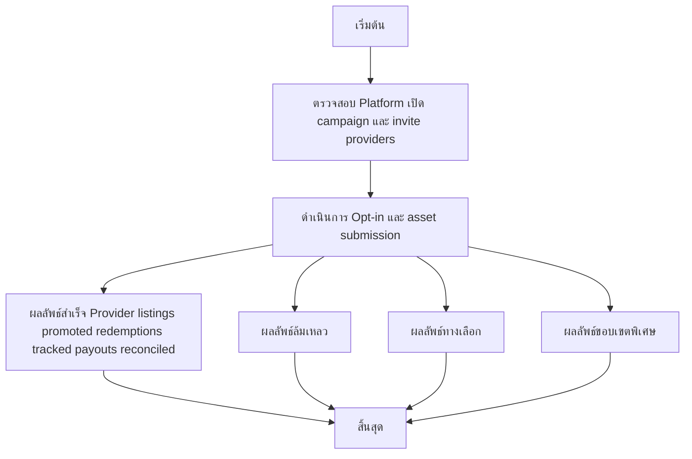

# MCC067 - จัดการโปรโมชั่นร่วมกับแพลตฟอร์ม Co-marketing

## 👤 บทบาท
- ผู้ให้บริการ

## 🎯 เป้าหมายของเคส
- ในฐานะ: ผู้ให้บริการ
- ต้องการ: เข้าร่วมโปรโมชั่น/แคมเปญที่แพลตฟอร์มจัดให้
- เพื่อ: เพื่อเพิ่มการมองเห็นและยอดขาย

## ⚙️ เงื่อนไขก่อนเริ่ม (Precondition)
- Platformเปิดcampaign และ invite providers

## 🧭 ผลลัพธ์และสถานการณ์
- ✅ ผลลัพธ์ที่คาดหวัง (Success Flow): Provider listings promoted; redemptions tracked; payouts reconciled
- ❌ ผลลัพธ์ที่ Failure:  
  - การ opt-in ล้มเหลวเนื่องจาก SLA ของแพลตฟอร์มหมดระยะเวลาตอบรับ
  - Assets ที่ Providers ส่งผ่านการตรวจสอบไม่ผ่าน quality branding ไม่ถูกต้อง ทำให้ไม่สามารถใช้งานโปรโมชัน
  - ระบบติดตามการ Redeem ไม่สามารถบันทึกข้อมูลได้ ส่งผลให้การคอนเฟิร์มการใช้งานล่าช้า
  - payout ไม่สำเร็จหรือไม่ตรงกับยอดที่คอนเฟิร์ม reconciliation ล้มเหลว
  - โปรโมชันถูกยกเลิกโดยแพลตฟอร์มก่อนเริ่มใช้งาน เนื่องจากเหตุความเสี่ยง/ข้อกำหนดไม่ครบ
- 🔄 ผลลัพธ์ทางเลือก:  
  - Provider ตอบรับโปรโมชันแต่ส่ง assets ที่จำกัด ทำให้โปรโมชั่นจำกัดการใช้งาน
  - แพลตฟอร์มขยายเวลาโปรโมชั่นหรือปรับเงื่อนไข ทำให้ Provider ต้องปรับ asset หรือแผนการสื่อสาร
  - Promotion เผยแพร่เฉพาะรายการที่ผ่านการตรวจสอบแล้ว ทำให้บางรายการไม่ปรากฏใน listing
  - Provider ยืนยันเข้าร่วมแต่จะใช้ discount ที่ต่างจากที่ตกลง ทำให้ต้องปรับสัญญาและคำนวณใหม่
  - Provider ได้รับการอนุมัติแต่ต้องรอการยืนยันลายละเอียดการจ่ายเงินก่อนเริ่มใช้งานจริง
- ⚠️ ผลลัพธ์ขอบเขตพิเศษ:  
  - Provider ตอบรับโปรโมชันแต่ส่ง assets ที่จำกัด ทำให้โปรโมชั่นจำกัดการใช้งาน
  - แพลตฟอร์มขยายเวลาโปรโมชั่นหรือปรับเงื่อนไข ทำให้ Provider ต้องปรับ asset หรือแผนการสื่อสาร
  - Promotion เผยแพร่เฉพาะรายการที่ผ่านการตรวจสอบแล้ว ทำให้บางรายการไม่ปรากฏใน listing
  - Provider ยืนยันเข้าร่วมแต่จะใช้ discount ที่ต่างจากที่ตกลง ทำให้ต้องปรับสัญญาและคำนวณใหม่
  - Provider ได้รับการอนุมัติแต่ต้องรอการยืนยันลายละเอียดการจ่ายเงินก่อนเริ่มใช้งานจริง

## ✅ เกณฑ์การยอมรับ (Acceptance Criteria)
- Participation confirmation and reporting available

## ⏱ ลำดับความสำคัญ / SLA
- Priority: P2
- SLA: Opt-in immediate

---

## 🔁 Sequence Diagram  
> แสดงลำดับเหตุการณ์ระหว่าง "ผู้ใช้" กับ "ระบบ"

```mermaid
sequenceDiagram
  autonumber
  participant U as 🧑 ผู้ใช้
  participant S as 💻 ระบบ
  U->>S: Provider opt-in and provide assets discounts banners
  S-->>U: Provider listings promoted; redemptions tracked; payouts reconciled
```

---

## 🧭 Flowchart Diagram
> แสดงขั้นตอนการทำงานของระบบอย่างเข้าใจง่าย



