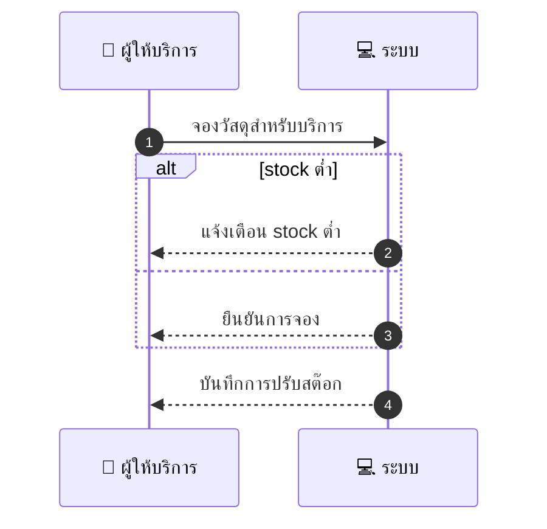
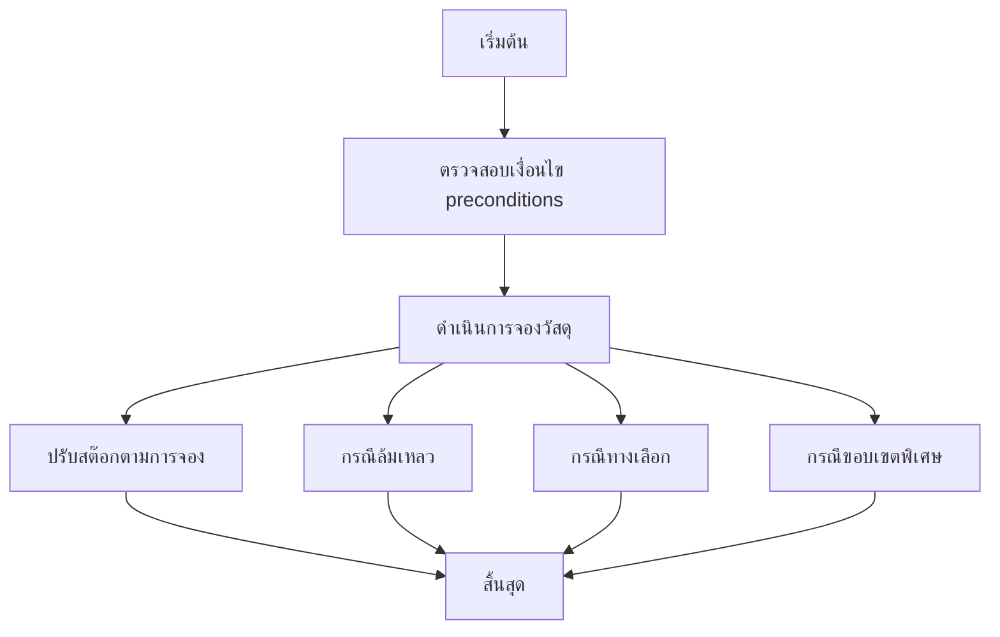

# MCC076 - จัดการรายการสินค้าหรือวัสดุ Inventory for services

## 👤 บทบาท
- ผู้ให้บริการ

## 🎯 เป้าหมายของเคส
- ในฐานะ ผู้ให้บริการ
- ต้องการ บันทึกและตรวจสอบสถานะวัสดุที่ใช้ในบริการ
- เพื่อ เพื่อจัดการต้นทุนและแจ้งลูกค้าถ้ามีค่าใช้จ่ายเพิ่ม

## ⚙️ เงื่อนไขก่อนเริ่ม (Precondition)
- Provider defines inventory items and thresholds

## 🧭 ผลลัพธ์และสถานการณ์
- ✅ ผลลัพธ์ที่คาดหวัง (Success Flow): Inventory adjustments on booking, returns on cancel, logs kept
- ❌ ผลลัพธ์ที่ Failure:
  - ปรับยอดสต๊อกหลังการจองล้มเหลว เนื่องจากข้อผิดพลาดฐานข้อมูล
  - ไม่สามารถสำรองวัสดุเมื่อมีการจองซ้ำ เนื่องจากข้อผิดพลาดระบบ
  - การคืนสต๊อกหลังยกเลิกการจองล้มเหลว
- 🔄 ผลลัพธ์ทางเลือก:
  - เลือกวัสดุทดแทนจากรายการที่มีในคลังตามเงื่อนไขคุณภาพและราคาที่กำหนด
  - แบ่งการจองออกเป็นส่วนย่อยเมื่อวัสดุบางรายการไม่พร้อม เพื่อให้บริการต่อไปได้
  - เรียกใช้คลังสำรองเพื่อสำรองวัสดุเพิ่มเติมอัตโนมัติ
  - แจ้งลูกค้าและปรับค่าใช้จ่ายหากจำเป็นเมื่อวัสดุไม่ครบ
- ⚠️ ผลลัพธ์ขอบเขตพิเศษ:
  - เลือกวัสดุทดแทนจากรายการที่มีในคลังตามเงื่อนไขคุณภาพและราคาที่กำหนด
  - แบ่งการจองออกเป็นส่วนย่อยเมื่อวัสดุบางรายการไม่พร้อม เพื่อให้บริการต่อไปได้
  - เรียกใช้คลังสำรองเพื่อสำรองวัสดุเพิ่มเติมอัตโนมัติ
  - แจ้งลูกค้าและปรับค่าใช้จ่ายหากจำเป็นเมื่อวัสดุไม่ครบ

## ✅ เกณฑ์การยอมรับ (Acceptance Criteria)
- การปรับสต๊อกถูกต้องเมื่อมีการจอง
- สถานะสต๊อกอัปเดตเมื่อมีการคืนหรือยกเลิก
- มีการบันทึกล็อกกิจกรรมสต๊อกทั้งหมด
- แจ้งเตือนไวเมื่อสต๊อกต่ำ

## ⏱ ลำดับความสำคัญ / SLA
- Priority: P2
- SLA: Alerts immediate

---

## 🔁 Sequence Diagram  
> แสดงลำดับเหตุการณ์ระหว่าง "ผู้ใช้" กับ "ระบบ"

---

## 🧭 Flowchart Diagram
> แสดงขั้นตอนการทำงานของระบบอย่างเข้าใจง่าย

