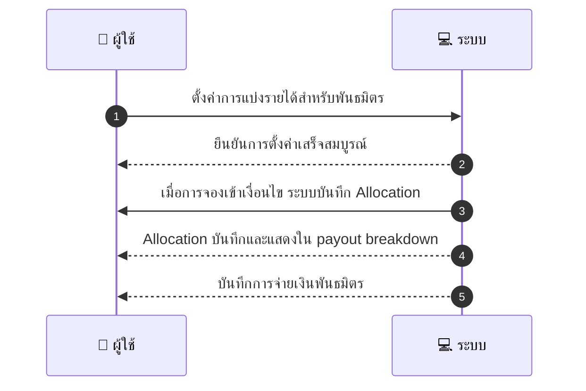
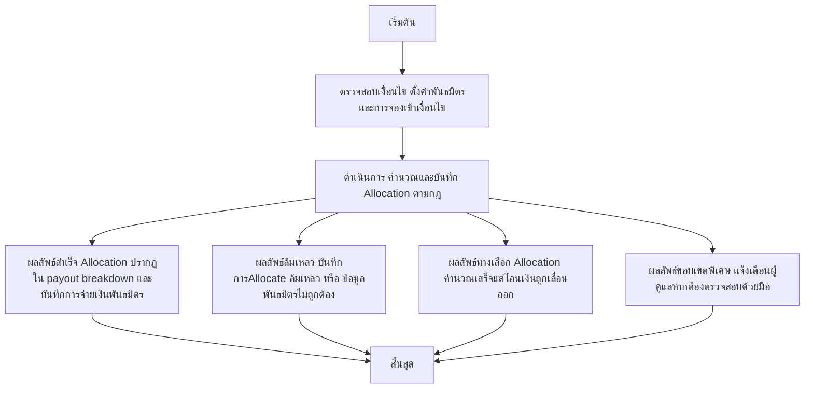

# MCC081 - ตั้งการแบ่งปันรายได้กับพันธมิตร Revenue share

## 👤 บทบาท
- ผู้ให้บริการ

## 🎯 เป้าหมายของเคส
- ในฐานะ ผู้ให้บริการ
- ต้องการ ตั้งกฎแบ่งรายได้ถ้ามี partner affiliate
- เพื่อ เพื่อจัดการกรณีร่วมมือกับ third-party

## ⚙️ เงื่อนไขก่อนเริ่ม (Precondition)
- ผู้ให้บริการกำหนดค่าการแบ่งส่วนรายได้สำหรับพันธมิตร

## 🧭 ผลลัพธ์และสถานการณ์
- ✅ ผลลัพธ์ที่คาดหวัง (Success Flow): Allocation ปรากฏใน payout breakdown และบันทึกการจ่ายเงินพันธมิตร
- ❌ ผลลัพธ์ที่ Failure:
  - ไม่สามารถบันทึกการ Allocate เนื่องจากข้อมูลพันธมิตรไม่ถูกต้องหรือหาย ขาด Partner ID หรือสถานะพันธมิตรผิดปกติ
  - การคำนวณส่วนแบ่งผิดพลาด ทำให้จำนวน payout ไม่สอดคล้องกับอัตราส่วนที่ตั้งค่า
  - เกิดข้อผิดพลาดในการบันทึกการจ่ายเงินพันธมิตรในระบบบัญชี payout
  - การเรียก API ภายนอกของพันธมิตรล้มเหลว ทำให้ไม่สามารถยืนยันการจ่ายเงินได้
  - ความผิดพลาดด้านสกุลเงิน/อัตราแลกเปลี่ยน ทำให้ไม่สามารถบันทึกส่วนแบ่งได้
- 🔄 ผลลัพธ์ทางเลือก:
  - Allocation คำนวณเสร็จ แต่การโอนเงินถูกเลื่อนออกไปจนกว่าจะตรวจสอบข้อมูลเพิ่มเติม
  - ปรับส่วนแบ่งเล็กน้อยเนื่องจากค่าธรรมเนียมธนาคาร/ผู้ให้บริการ
  - พันธมิตรสถานะ inactive หรือ paused ทำให้บันทึก Allocation แต่ไม่สร้างการจ่ายเงินทันที
  - มีการสลับส่วนแบ่งระหว่างพันธมิตรหลายราย ต้องรอการอนุมัติขั้นสูง
  - ระบบส่งการแจ้งเตือนไปยังผู้ดูแลและต้องตรวจสอบด้วยมือก่อนดำเนินการต่อ
- ⚠️ ผลลัพธ์ขอบเขตพิเศษ:
  - Allocation คำนวณเสร็จ แต่การโอนเงินถูกเลื่อนออกไปจนกว่าจะตรวจสอบข้อมูลเพิ่มเติม
  - ปรับส่วนแบ่งเล็กน้อยเนื่องจากค่าธรรมเนียมธนาคาร/ผู้ให้บริการ
  - พันธมิตรสถานะ inactive หรือ paused ทำให้บันทึก Allocation แต่ไม่สร้างการจ่ายเงินทันที
  - มีการสลับส่วนแบ่งระหว่างพันธมิตรหลายราย ต้องรอการอนุมัติขั้นสูง
  - ระบบส่งการแจ้งเตือนไปยังผู้ดูแลและต้องตรวจสอบด้วยมือก่อนดำเนินการต่อ

## ✅ เกณฑ์การยอมรับ (Acceptance Criteria)
- Allocation ถูกคำนวณและบันทึกถูกต้องตามกฎที่ตั้งไว้
- Allocation ปรากฏใน payout breakdown
- การจ่ายเงินพันธมิตรถูกบันทึกในระบบ payout
- รองรับสถานการณ์หลายพันธมิตรและการสลับส่วนแบ่ง

## ⏱ ลำดับความสำคัญ / SLA
- Priority: P2
- SLA: Apply immediate

---

## 🔁 Sequence Diagram  
> แสดงลำดับเหตุการณ์ระหว่าง "ผู้ใช้" กับ "ระบบ"

---

## 🧭 Flowchart Diagram
> แสดงขั้นตอนการทำงานของระบบอย่างเข้าใจง่าย

