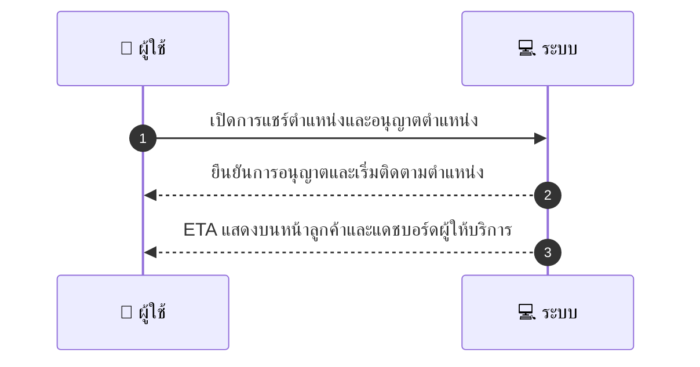
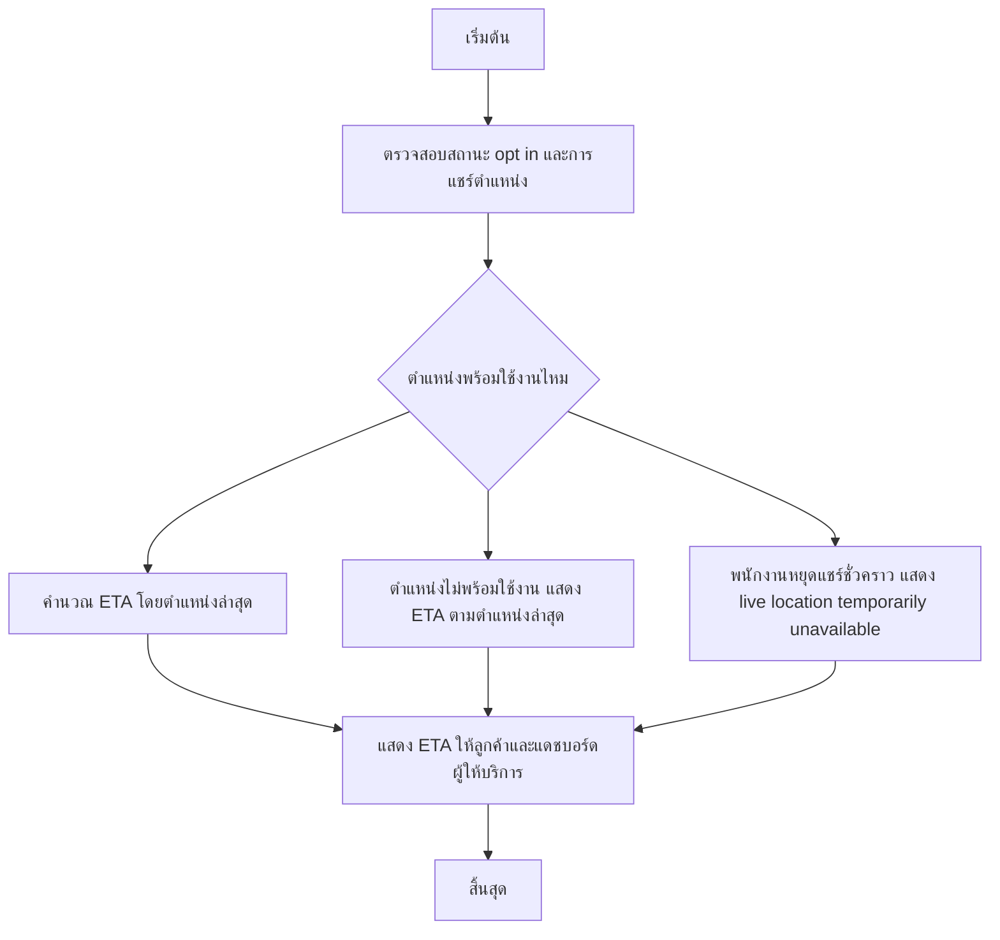

# MCC082 - จัดการการแสดงเวลาจริงของพนักงาน Live staff location optional

## 👤 บทบาท
- ผู้ให้บริการ

## 🎯 เป้าหมายของเคส
- ในฐานะ ผู้ให้บริการ
- ต้องการ เลือกแชร์ตำแหน่งพนักงานขณะเดินทางไปให้บริการ opt-in
- เพื่อ เพื่อให้ลูกค้าทราบ ETA ที่แม่นยำ

## ⚙️ เงื่อนไขก่อนเริ่ม (Precondition)
- พนักงานยืนยัน opt-in และให้สิทธิ์การเข้าถึงตำแหน่ง

## 🧭 ผลลัพธ์และสถานการณ์
- ✅ ผลลัพธ์ที่คาดหวัง (Success Flow): Privacy เคารพ opt-in logs and revoke option
- ❌ ผลลัพธ์ที่ Failure:
  - ระบบไม่สามารถรับตำแหน่งพนักงานได้เนื่องจากการอนุญาตตำแหน่งถูกปฏิเสธจากอุปกรณ์
  - เครือข่ายระหว่างแอปและเซิร์ฟเวอร์ ETA ล้มเหลว ทำให้ไม่สามารถส่งข้อมูล ETA ไปยังลูกค้าหรือแดชบอร์ดผู้ให้บริการ
  - ข้อมูลตำแหน่งที่แชร์ไม่ทันสมัยหรือผิดพลาด ส่งผลให้ ETA ที่แสดงไม่ถูกต้อง
  - คำนวณ ETA ล้มเหลวหรือไม่สอดคล้องกับเส้นทางจริง เกิดข้อผิดพลาดในระหว่างการคำนวณ
- 🔄 ผลลัพธ์ทางเลือก:
  - หากตำแหน่งไม่พร้อมใช้งาน ระบบแสดง ETA ตามตำแหน่งล่าสุดที่ได้รับและระบุว่าเป็นข้อมูลหน่วงเวลา
  - ETA แสดงจากระยะทางและความเร็วโดยประมาณเมื่อการแชร์ตำแหน่งมีความไม่สม่ำเสมอ
  - ลูกค้าสามารถดู ETA แบบทั่วไปโดยไม่เปิดตำแหน่ง non-live พร้อมข้อความอธิบายว่า Location sharing opt-in
  - หากพนักงานหยุดแชร์ชั่วคราว ระบบยังคงคำนวณ ETA จากข้อมูลที่มีอยู่และแจ้งสถานะเป็น live location temporarily unavailable
- ⚠️ ผลลัพธ์ขอบเขตพิเศษ:
  - หากตำแหน่งไม่พร้อมใช้งาน ระบบแสดง ETA ตามตำแหน่งล่าสุดที่ได้รับและระบุว่าเป็นข้อมูลหน่วงเวลา
  - ETA แสดงจากระยะทางและความเร็วโดยประมาณเมื่อการแชร์ตำแหน่งมีความไม่สม่ำเสมอ
  - ลูกค้าสามารถดู ETA แบบทั่วไปโดยไม่เปิดตำแหน่ง non-live พร้อมข้อความอธิบายว่า Location sharing opt-in
  - หากพนักงานหยุดแชร์ชั่วคราว ระบบยังคงคำนวณ ETA จากข้อมูลที่มีอยู่และแจ้งสถานะเป็น live location temporarily unavailable

## ✅ เกณฑ์การยอมรับ (Acceptance Criteria)
- ต้องมีการอัปเดตตำแหน่งที่ถูกต้องและรวดเร็วเมื่อมีการแชร์ตำแหน่ง
- ETA ที่แสดงต้องสอดคล้องกับสถานะ live หรือ non-live ตามการแชร์ตำแหน่ง
- การ opt-in ต้องถูกบันทึกและสามารถยกเลิกได้
- ความเป็นส่วนตัวของพนักงานต้องถูกเคารพ

## ⏱ ลำดับความสำคัญ / SLA
- Priority: P2
- SLA: Location updates within seconds

---

## 🔁 Sequence Diagram  
> แสดงลำดับเหตุการณ์ระหว่าง "ผู้ใช้" กับ "ระบบ"

---

## 🧭 Flowchart Diagram
> แสดงขั้นตอนการทำงานของระบบอย่างเข้าใจง่าย

