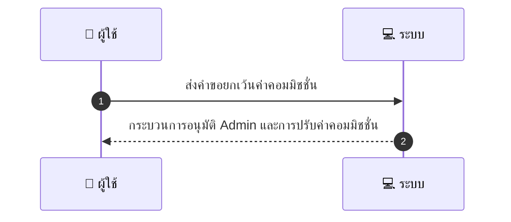
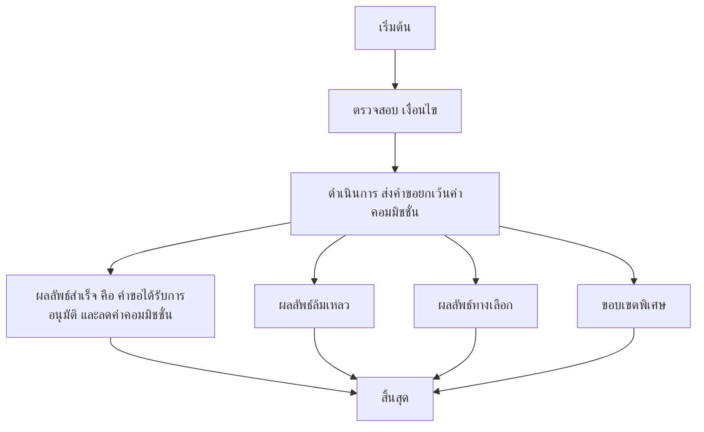

# MCC083 - ตั้งการยกเว้นการจ่ายค่าคอมมิชชั่นในโปรโมชันพิเศษ

## 👤 บทบาท
- ผู้ให้บริการ

## 🎯 เป้าหมายของเคส
- ในฐานะ ผู้ให้บริการ
- ต้องการ ขอให้ platform ยกเว้นหรือลด commission ในช่วงแคมเปญพิเศษ
- เพื่อ ทำโปรโมชั่นร่วมกับ platform

## ⚙️ เงื่อนไขก่อนเริ่ม (Precondition)
- Provider applies promo code/requests exemption

## 🧭 ผลลัพธ์และสถานการณ์
- ✅ ผลลัพธ์ที่คาดหวัง (Success Flow): Approval workflow with admin; reporting on revenue impact
- ❌ ผลลัพธ์ที่ Failure:
  - คำขอยกเว้นค่าคอมมิชชั่นถูกปฏิเสธโดย Admin เนื่องจากไม่ตรงกับนโยบายโปรโมชั่นหรือขอบเขตสิทธิ์
  - ข้อมูลคำขอไม่ครบถ้วน เช่น ไม่มีรหัสโปรโมชัน ระบุช่วงเวลาโปรโมชั่น หรือยอดขั้นต่ำที่ต้องการ
  - เกิดข้อผิดพลาดทางเทคนิคระหว่างบันทึกคำขอหรือคำนวณค่าคอมมิชชั่น ทำให้คำขอไม่สามารถดำเนินการได้
  - การบังคับใช่การลดค่าคอมมิชชั่นล้มเหลวหลังจากการอนุมัติ เพราะระบบอัปเดตค่าคอมมิชชันไม่ถูกต้อง
- 🔄 ผลลัพธ์ทางเลือก:
  - อนุมัติบางส่วน: ลดค่าคอมมิชชั่นเฉพาะสำหรับรายการจองที่เข้าข่ายตามเงื่อนไข Admin กำหนด
  - อนุมัติแต่ไม่ใช้งานทันที: รอการยืนยันข้อมูลหรือการตรวจสอบเพิ่มเติมก่อนบังคับใช้งาน
  - คำขอผ่านการอนุมัติแต่มีข้อจำกัด เช่น ใช้ได้เฉพาะผู้ให้บริการที่มีสถานะเครดิต/ประวัติการใช้งานที่ดี
- ⚠️ ผลลัพธ์ขอบเขตพิเศษ:
  - อนุมัติบางส่วน: ลดค่าคอมมิชชั่นเฉพาะสำหรับรายการจองที่เข้าข่ายตามเงื่อนไข Admin กำหนด
  - อนุมัติแต่ไม่ใช้งานทันที: รอการยืนยันข้อมูลหรือการตรวจสอบเพิ่มเติมก่อนบังคับใช้งาน
  - คำขอผ่านการอนุมัติแต่มีข้อจำกัด เช่น ใช้ได้เฉพาะผู้ให้บริการที่มีสถานะเครดิต/ประวัติการใช้งานที่ดี

## ✅ เกณฑ์การยอมรับ (Acceptance Criteria)
- ต้องผ่านกระบวนการอนุมัติของ Admin
- ระบุช่วงโปรโมชั่นและลดอัตราคอมมิชชั่นตรงตามเงื่อนไข
- ระบบบันทึกสถานะ และรายงานผลกระทบต่อรายได้

## ⏱ ลำดับความสำคัญ / SLA
- Priority: P2
- SLA: Approval <=7 business days

---

## 🔁 Sequence Diagram  
> แสดงลำดับเหตุการณ์ระหว่าง "ผู้ใช้" กับ "ระบบ"

---

## 🧭 Flowchart Diagram
> แสดงขั้นตอนการทำงานของระบบอย่างเข้าใจง่าย

