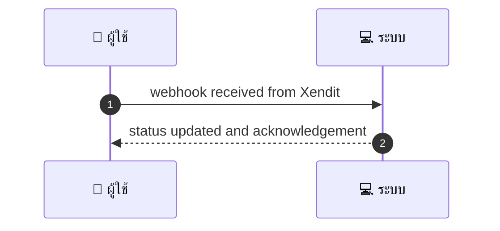
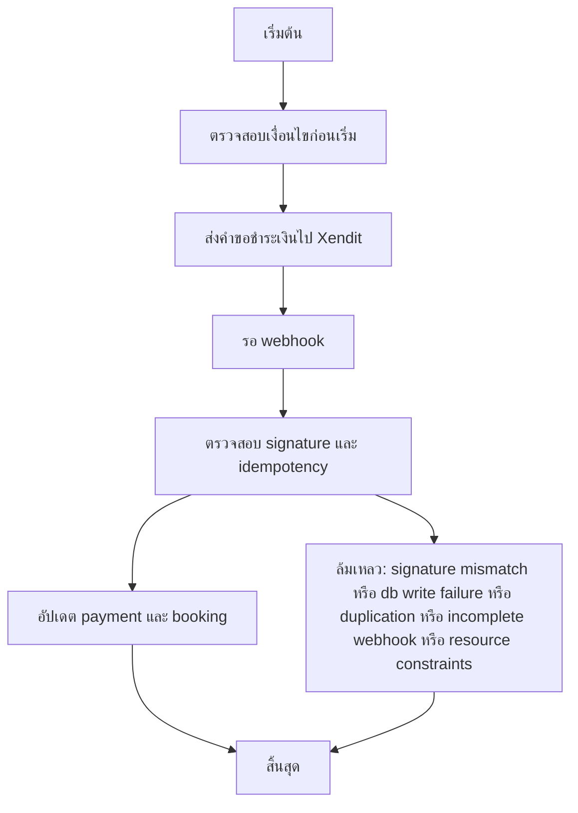

# SYS001 - Payment Initiation & Webhook Handling

## 👤 บทบาท
- ระบบ

## 🎯 เป้าหมายของเคส
- ในฐานะ: ระบบ
- ต้องการ: ส่งคำขอชำระเงินไปยัง Xendit รอ webhook และอัปเดตสถานะแบบ idempotent
- เพื่อ: เพื่อให้สถานะการชำระเงินตรงกับระบบ

## ⚙️ เงื่อนไขก่อนเริ่ม (Precondition)
- System สร้าง payment request กับ metadata booking_id user_id

## 🧭 ผลลัพธ์และสถานการณ์
- ✅ ผลลัพธ์ที่คาดหวัง (Success Flow): System ตรวจสอบ signature และ idempotency และอัปเดต payment และ booking status
- ❌ ผลลัพธ์ที่ Failure:
  - ล้มเหลว: ตรวจสอบ signature ไม่ผ่าน ทำให้ไม่อัปเดต payment_id และ booking_id
  - ล้มเหลว: เกิดข้อผิดพลาดในการบันทึกสถานะลงฐานข้อมูล DB write failure ส่งผลให้สถานะไม่เปลี่ยน
  - ล้มเหลว: idempotency key ซ้ำแต่ payload แตกต่างกัน ทำให้ไม่ดำเนินการซ้ำและบันทึกเหตุผล duplication
  - ล้มเหลว: webhook ส่งข้อมูลไม่ครบถ้วนหรือ event_type ไม่รองรับ ทำให้ไม่สามารถอัปเดตสถานะได้
  - ล้มเหลว: ความผิดพลาดระหว่างอัปเดตสถานะ payment หรือ booking เนื่องจากข้อจำกัดทรัพยากร
- 🔄 ผลลัพธ์ทางเลือก:
  - ไม่มี
- ⚠️ ผลลัพธ์ขอบเขตพิเศษ:
  - ไม่มี

- ✅ เกณฑ์การยอมรับ (Acceptance Criteria)
  - Include idempotency keys
  - verify webhook signature
  - repeated webhooks ignored
  - webhook handler <5s processing
  - retry policies

- ⏱ ลำดับความสำคัญ / SLA
  - Priority: P0
  - SLA: Webhook process <5s; retry up to 5

---

## 🔁 Sequence Diagram  
> แสดงลำดับเหตุการณ์ระหว่าง "ผู้ใช้" กับ "ระบบ"

---

## 🧭 Flowchart Diagram
> แสดงขั้นตอนการทำงานของระบบอย่างเข้าใจง่าย

