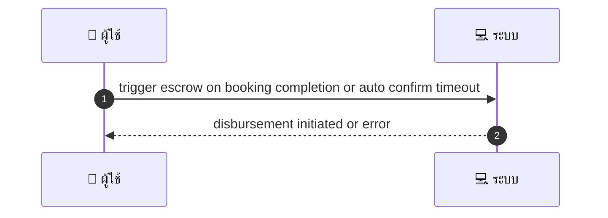
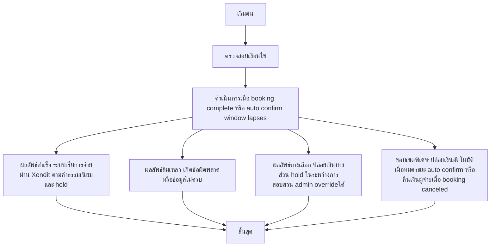

# SYS002 - Escrow Creation & Release Logic

## 👤 บทบาท
- ระบบ

## 🎯 เป้าหมายของเคส
- ในฐานะ: ระบบ
- ต้องการ: สร้าง escrow record ต่อ booking hold funds และปล่อย fund ให้ provider เมื่อเป็นไปตาม policy
- เพื่อ: เพื่อให้เงินปลอดภัยจนกว่า service จะเสร็จ

## ⚙️ เงื่อนไขก่อนเริ่ม (Precondition)
- Payment succeeded for booking

## 🧭 ผลลัพธ์และสถานการณ์
- ✅ ผลลัพธ์ที่คาดหวัง (Success Flow): System initiates disbursement via Xendit subject to fees hold rules
- ❌ ผลลัพธ์ที่ Failure:
  - ไม่สามารถสร้าง escrow record ได้เนื่องจาก booking_id ไม่พบ หรือข้อมูล booking สำคัญหายไป
  - สถานะ payment ไม่ใช่ succeeded ทำให้ไม่สามารถ initiate escrow hold ได้
  - ไม่สามารถล็อก funds ใน escrow hold เนื่องจากข้อผิดพลาดด้านฐานข้อมูลระบบล็อคข้อมูล
  - การเรียก Xendit disbursement ล้มเหลวด้วย API error timeout หรือคำตอบไม่ใช่ success
  - ไม่สามารถปล่อย funds ภายใน SLA 3 วันทำการ ทำให้ต้องมีการ escalate
- 🔄 ผลลัพธ์ทางเลือก:
  - ปล่อยเงินส่วนหนึ่งตาม Milestones เมื่อ milestone สำเร็จ
  - Hold funds ต่อในระหว่างการสอบสวน dispute จนกว่าการตัดสินจะเสร็จสิ้น
  - Admin override เพื่อปล่อยเงินทั้งหมดหรือส่วนหนึ่งตามการพิจารณา
  - ปล่อยเงินอัตโนมัติเมื่อหมดระยะ auto-confirm window
  - คืนเงินให้ผู้จ่ายหาก booking ถูกยกเลิกก่อน service เสร็จ
- ⚠️ ผลลัพธ์ขอบเขตพิเศษ:
  - ปล่อยเงินส่วนหนึ่งตาม Milestones เมื่อ milestone สำเร็จ
  - Hold funds ต่อในระหว่างการสอบสวน dispute จนกว่าการตัดสินจะเสร็จสิ้น
  - Admin override เพื่อปล่อยเงินทั้งหมดหรือส่วนหนึ่งตามการพิจารณา
  - ปล่อยเงินอัตโนมัติเมื่อหมดระยะ auto-confirm window
  - คืนเงินให้ผู้จ่ายหาก booking ถูกยกเลิกก่อน service เสร็จ

## ✅ เกณฑ์การยอมรับ (Acceptance Criteria)
- Escrow record: gross_amount, platform_commission, payment_fee, net_amount, status
- release only after completion/admin decision
- release initiated within SLA
- holds during disputes

## ⏱ ลำดับความสำคัญ / SLA
- Priority: P0
- SLA: Release initiated within 3 business days after trigger

---

## 🔁 Sequence Diagram  
> แสดงลำดับเหตุการณ์ระหว่าง "ผู้ใช้" กับ "ระบบ"

---

## 🧭 Flowchart Diagram
> แสดงขั้นตอนการทำงานของระบบอย่างเข้าใจง่าย

