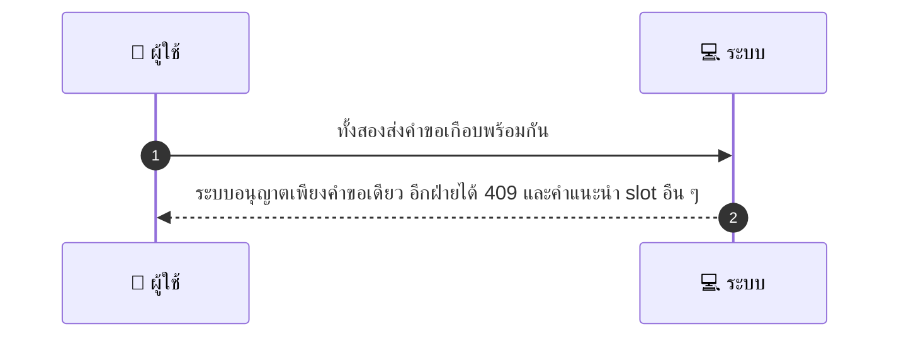
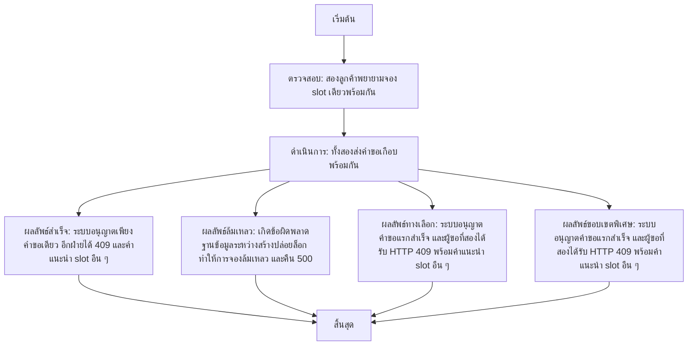

# SYS004 - Concurrency / Double Booking Handling

## 👤 บทบาท
- ระบบ

## 🎯 เป้าหมายของเคส
- ในฐานะ ระบบ
- ต้องการ ป้องกัน double booking ผ่าน atomic lock และให้ feedback ชัดเจน
- เพื่อ เพื่อให้มีเพียง booking เดียวต่อ slot

## ⚙️ เงื่อนไขก่อนเริ่ม (Precondition)
- สองลูกค้าพยายามจอง slot เดียวพร้อมกัน

## 🧭 ผลลัพธ์และสถานการณ์
- ✅ ผลลัพธ์ที่คาดหวัง (Success Flow): ระบบอนุญาตเพียงคำขอเดียว อีกฝ่ายได้ 409 และคำแนะนำ slot อืน
- ❌ ผลลัพธ์ที่ Failure:
  - เกิดข้อผิดพลาดฐานข้อมูลระหว่างสร้างปล่อยล็อก ทำให้การจองล้มเหลวและคืน 500 Internal Server Error
  - ข้อผิดพลาดเครือข่ายระหว่างบริการล็อกกับระบบจอง ทำให้ไม่สามารถยืนยันสถานะการจองได้
  - deadlock หรือ constraint violation ขณะบันทึกข้อมูลการจอง ทำให้การจองล้มเหลว
  - การตรวจสอบ TTL ล้มเหลว ล็อก TTL ไม่สามารถใช้งานได้ชั่วคราว ระบบคืน 500 และบันทึกเหตุการณ์
  - ข้อผิดพลาดการเขียนข้อมูลแจ้งเตือน/ลิสต์ slot ถัดไป ทำให้ไม่สามารถส่ง 409/ข้อเสนอได้
- 🔄 ผลลัพธ์ทางเลือก:
  - ระบบอนุญาตคำขอแรกสำเร็จ และผู้ขอที่สองได้รับ HTTP 409 พร้อมคำแนะนำ slot อืน ๆ
  - ระบบคืน 409 พร้อมรายการ next available slots ที่ว่างอยู่
  - ผู้ใช้ที่ได้รับ 409 สามารถเลือก slot ที่ว่างถัดไปและจองต่อได้
  - ระบบแสดงข้อความแนะนำให้ลองจอง slot ใกล้เคียงหรือในรอบถัดไปเมื่อไม่ได้รับ slot เดิม
- ⚠️ ผลลัพธ์ขอบเขตพิเศษ:
  - ระบบอนุญาตคำขอแรกสำเร็จ และผู้ขอที่สองได้รับ HTTP 409 พร้อมคำแนะนำ slot อืน ๆ
  - ระบบคืน 409 พร้อมรายการ next available slots ที่ว่างอยู่
  - ผู้ใช้ที่ได้รับ 409 สามารถเลือก slot ที่ว่างถัดไปและจองต่อได้
  - ระบบแสดงข้อความแนะนำให้ลองจอง slot ใกล้เคียงหรือในรอบถัดไปเมื่อไม่ได้รับ slot เดิม

## ✅ เกณฑ์การยอมรับ (Acceptance Criteria)
- ใช้ SELECT FOR UPDATE หรือ advisory locks
- Lock TTL enforced
- failed attempts return HTTP 409 + next available slots

## ⏱ ลำดับความสำคัญ / SLA
- Priority: P0
- SLA:
  - Lock op 1s
  - Lock TTL 10m

---

## 🔁 Sequence Diagram  
> แสดงลำดับเหตุการณ์ระหว่าง "ผู้ใช้" กับ "ระบบ"

---

## 🧭 Flowchart Diagram
> แสดงขั้นตอนการทำงานของระบบอย่างเข้าใจง่าย

